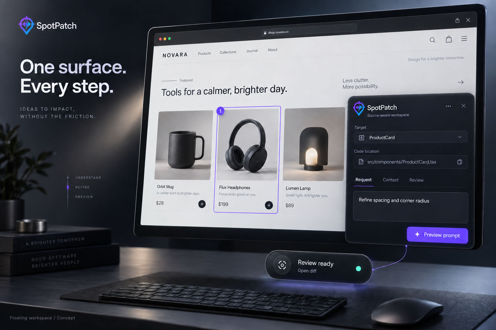
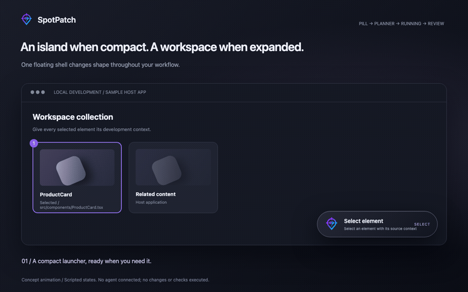
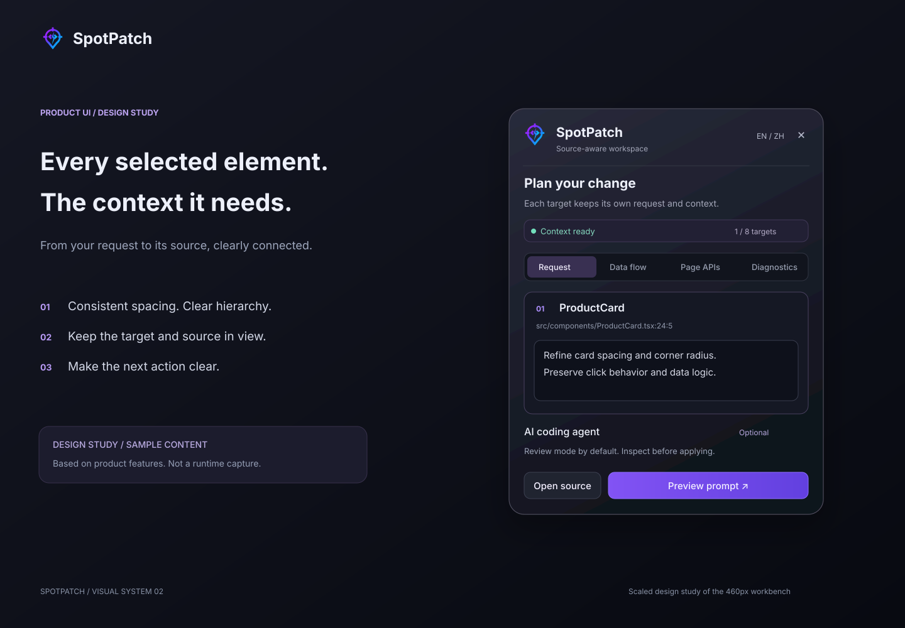
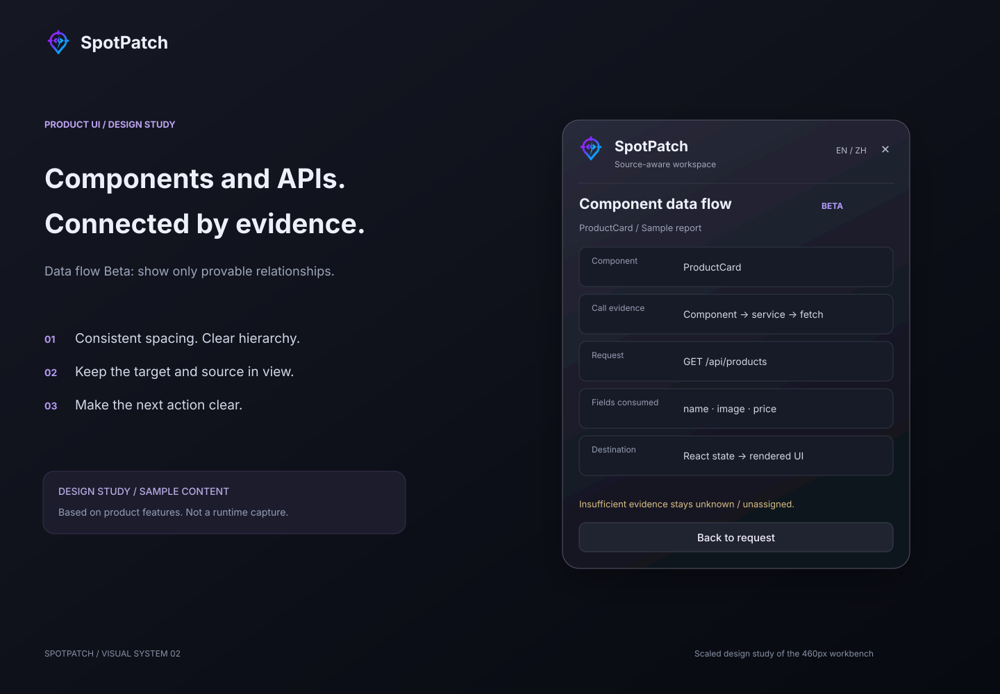
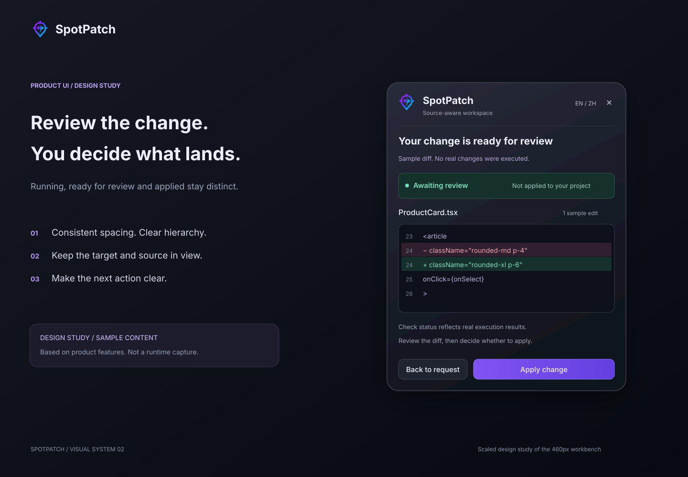

<h1 align="center">
  <a href="https://github.com/huanglvjing/spotpatch"></a><br />SpotPatch
</h1>

<p align="center"><strong>Click the UI. Reach the source. Review the patch.</strong></p>
<p align="center">A local-first, development-only workspace for page context and source changes.</p>
<p align="center"><a href="./README.md">English</a> · <a href="./README.zh-CN.md">简体中文</a></p>
<p align="center">
  <a href="https://www.npmjs.com/package/@spotpatch/vite"></a>
  <a href="https://www.npmjs.com/package/@spotpatch/astro"></a>
  <a href="https://www.npmjs.com/package/@spotpatch/next"></a>
  <a href="https://github.com/huanglvjing/spotpatch/actions/workflows/ci.yml"></a>
  <a href="./LICENSE"></a>
</p>

<p align="center"></p>

> Images are product concept illustrations; the animation uses scripted states. They are not current-version screenshots, recordings, or validation evidence. Feature and support boundaries are documented below.

SpotPatch starts with a real page element and collects bounded DOM, CSS and source context. Select one or more targets, describe each request, open the source in Cursor / VS Code, copy a structured prompt, or opt into read-only questions and reviewed AI changes. A draggable floating workspace connects the launcher, planner and execution feedback.

**Start here:** [Vite](#quick-start-vite) · [Astro](#astro) · [Next.js preview](#nextjs-public-preview) · [Floating island](#floating-workspace-and-island) · [Architecture](#packages) · [Docs](#documentation)

## Current capabilities and supported scope

| Capability / entry                    | Current scope                                               | Boundary                                                                                                                   |
| ------------------------------------- | ----------------------------------------------------------- | -------------------------------------------------------------------------------------------------------------------------- |
| React + Vite                          | Supported public entry `@spotpatch/vite`                    | React 18.2–18.3; Vite 5/6/7; Node.js 20.19+                                                                                |
| Astro                                 | Published `@spotpatch/astro` integration                    | Validated fixtures: Astro 5.18.2 / 6.4.8 / 7.2.8, Node.js 22.12+; native templates do not require React                    |
| Next.js                               | `@spotpatch/next` 0.x public preview                        | Installable does not mean fully compatible; the complete router / bundler / OS matrix is unfinished                        |
| Selection, source navigation, prompts | Core features                                               | No AI configuration required; source coordinates and component semantics carry separate evidence                           |
| Floating workspace and island         | Implemented                                                 | One shell, dragging, snapping and session restoration; dedicated browser visual/performance gates still have pending items |
| Component data flow                   | Opt-in Beta                                                 | Evidence-based attribution only; browsers cannot observe server execution                                                  |
| Contextual Ask                        | Implemented, explicit opt-in; topic status remains internal | Single-turn read-only questions; this audit does not promote it to cross-platform Beta                                     |
| External agents / Managed Codex       | `local-validation`                                          | Local installation and protocol gates apply; not stable support for every host                                             |

Chromium is the browser automation baseline. React 19 is outside the Vite support commitment. Astro, Next.js and external agents retain their own boundaries; see the [product definition](./docs/技术方案/01-产品定义与边界.md) (Chinese).

> Repository `main` and npm `latest` can differ. On 2026-09-09, source version bumps were merged while npm still pointed to the previous release. New artwork and source fixes do not establish that `@latest` includes them. See the [documentation audit](./docs/技术方案/24-文档与素材事实核对.md) for the checked snapshot.

## Why SpotPatch

- **Carry context with the target.** Locate authorized source coordinates and retain DOM, CSS, component information and confidence.
- **Describe each target independently.** Up to eight targets by default, each with its own request rather than one ambiguous global note.
- **Choose the right handoff.** Open your editor, copy a prompt, ask a read-only question or use an optional change workflow.
- **Follow work from the page.** The compact island and expanded planner share a position; switching targets does not move the panel to each element.
- **Keep the review decision.** Built-in AI prepares isolated changes and a diff for review by default. Core features remain available without AI.

## Quick start: Vite

From an existing Vite + React project root:

```bash
npx --yes @spotpatch/vite@latest setup
```

Start the project with its existing development command, for example:

```bash
pnpm dev
```

Click **Select element** at the bottom right, or press `Mod+Shift+S`, then select a target and describe your request.

The initializer detects npm / pnpm, installs the matching adapter and updates statically analyzable Vite configuration. In current source, it enables `dataFlow: {}` and `externalAgent: true`, plus `trustedFastMode: true` when a safe local TypeScript check is discoverable. Review remains the default UI mode. `init` also creates a private, revocable Managed Codex grant for the current user and project; it does not install, authenticate or connect Codex, or configure a model provider.

<details>
<summary>Manual integration: core selection, source navigation and prompts</summary>

```bash
pnpm add -D @spotpatch/vite
```

Place SpotPatch before the React plugin:

```ts
import { spotPatch } from "@spotpatch/vite";
import react from "@vitejs/plugin-react-swc";
import { defineConfig } from "vite";

export default defineConfig({
  plugins: [spotPatch({ ai: false }), react()],
});
```

Without running the initializer, this command does not create a Managed Codex project grant. Enable advanced features individually through configuration. pnpm release-age protections remain in force; use a verified version or wait for the cooldown instead of disabling supply-chain policy globally.

</details>

See the [Vite package guide](./packages/vite/README.md) for full options and constraints.

## Floating workspace and island

<p align="center"></p>

One persistent shell hosts the launcher, context capture, planner and execution island. It starts at the bottom right and supports dragging, edge snapping and position restoration within the current development session. Expansion and collapse share an anchor; narrow viewports use constrained layouts, and reduced-motion preferences preserve state information.

The real product updates from Runtime, Agent Job and external-handoff events. Animation timing never decides completion or invents progress percentages. **Ready for review is not applied**: review-required results keep their entry point rather than disappearing through automatic collapse. See the [positioning contract](./docs/技术方案/21-浮动工作台与灵动岛交互方案.md) and [persistent-shell motion specification](./docs/技术方案/22-持续Shell与灵动岛动效系统方案.md) for implementation and pending validation.

## Visual workflow

1. **Select and describe.** Each target retains its own request and numbered highlight.
2. **Check context.** Inspect source coordinates, component semantics, DOM/CSS and confidence.
3. **Choose a path.** Open source or copy a prompt; explicitly use Ask / Change after configuration.
4. **Review changes.** Optional AI shows a diff in default review mode. Applied changes can be reverted when conflict-safety conditions hold.

<p align="center"></p>

## Component data flow (Beta)

Enable it explicitly when integrating manually:

```ts
spotPatch({ dataFlow: {} });
```

**Data flow** shows a provable report for the current business component. **Page APIs** also retains requests not attributed to a component. Reports include method/path, parameter keys, source-consumed response fields and provable destinations such as state, storage or callbacks.

<p align="center"></p>

Static analysis and runtime evidence jointly constrain attribution. Runtime observation records dispatch only: it does not read or clone response bodies or retain query values. A matching URL or nearby timestamp is not attribution evidence. Insufficient evidence stays `partial`, `unknown` or `unassigned`. Supported `fetch`, Axios, React Query/TanStack Query patterns and experimental tRPC boundaries are documented in the [Beta guide](./docs/技术方案/组件数据链路/13-Beta实现状态与使用手册.md).

## Read-only contextual questions

```ts
spotPatch({ contextualAsk: true });
```

Select at least one element, then explicitly switch **Ask / Change** in the planner. Ask can use a configured-key executor or a compatible Managed Codex installation, returning one answer with server-validated source citations.

Ask does not write files, create a worktree, run project checks or produce Diff / Apply / Revert. Converting an answer to a change only creates an editable draft; another submission is required to enter a write workflow. It is not target-free repository chat and does not provide persistent chat history or follow-up conversations. A visible model listing does not establish that every model request succeeds. See the [Ask topic](./docs/技术方案/上下文问答/00-索引与决策摘要.md) for maturity and release evidence.

## Optional AI Agent

### Built-in changes with a configured provider

Configure a Git-ignored `.env.local`:

```dotenv
SPOTPATCH_AI_BASE_URL=https://relay.example.com/v1
SPOTPATCH_AI_MODEL=provider-model-name
SPOTPATCH_AI_API_KEY=<your-key>
```

Complete environment configuration can enable the built-in provider path; non-secret settings can also be supplied through the adapter's `ai` option. `SPOTPATCH_AI_PROTOCOL` supports `chat-completions` / `responses`, with `bearer` / `x-api-key` authentication. Credentials stay in Node; never use client-exposed prefixes such as `VITE_` or `NEXT_PUBLIC_`.

The default path is **isolated Git worktree → bounded tools → configured project checks → diff review → Apply → safe Revert**.

<p align="center"></p>

`trustedFastMode` requires explicit configuration and session authorization. It skips host project checks and directly applies the isolated diff; it does not promise TypeScript, lint, test or build success. Path restrictions, patch validation, concurrent-edit detection and safe reversion remain enforced. See [AI execution and review](./docs/技术方案/16-AIAgent执行与变更审阅.md).

### External Agent handoff (local validation)

```ts
spotPatch({ externalAgent: true });
```

For an integrated project, initialize private project access without rewriting integration files:

```bash
pnpm exec spotpatch-vite bridge init
```

Use `spotpatch-astro` / `spotpatch-next` for those adapters. The grant belongs to the current user and canonical project root and can be revoked in the panel. Codex installation, login and protocol gates still apply. Managed Codex owned by the development session and a manually started attached connector are different execution paths.

Generic MCP clients and Cursor use Inbox. Codex active connections and Claude Channels have separate host and protocol requirements. A completed turn does not establish that a change is correct or applied. See the [external Agent topic](./docs/技术方案/外部Agent连接/00-索引与决策摘要.md) and [CLI grant specification](./docs/技术方案/外部Agent连接/23-CLI初始化项目授权.md) for advanced commands, authorization and unverified host/platform combinations.

## Astro

```bash
pnpm add -D @spotpatch/astro@latest
pnpm exec spotpatch-astro init
pnpm exec spotpatch-astro check
pnpm dev
```

Requires Node.js 22.12+. `init` safely updates supported static `astro.config.*` files and adds SpotPatch to **integrations**, not `vite.plugins`. The current initializer enables data flow, read-only Ask and external agents, opens trusted fast mode when its check is available, and creates the private Managed Codex project grant.

Native `.astro` templates use independent compiler-rs parsing; React islands reuse shared JSX compilation. Server requests provide static evidence only. Internal exact resolution is not guaranteed for other island frameworks or dynamic DOM. Ambiguous dynamic configuration fails safely. See the [Astro package guide](./packages/astro/README.md) for installation, validation matrices and limitations.

## Next.js public preview

```bash
pnpm add -D @spotpatch/next
pnpm exec spotpatch-next init
pnpm exec spotpatch-next check
pnpm dev
```

`init` composes `next.config`, integrates `instrumentation-client` and updates supported development scripts to `spotpatch-next dev`. Use that entry to own the Next child process and Sidecar lifecycle; do not bypass it with direct `next dev`. Current initialization enables `dataFlow` and `externalAgent`; enable Ask separately when needed.

The preview includes Turbopack / webpack integration and production no-op isolation, but candidate peer ranges are not a complete support commitment. Browsers cannot observe server execution in RSC, Server Actions or Route Handlers. Production uses ordinary Next commands; SpotPatch does not run in production. See the [Next.js package guide](./packages/next/README.md).

## Configuration

These are key defaults for manual integration. **The initializer explicitly changes some options; it does not redefine their defaults.**

| Option            | Default behavior                                                            |
| ----------------- | --------------------------------------------------------------------------- |
| `enabled`         | `true`, development-only assembly                                           |
| `editor`          | `"auto"`, Cursor / VS Code                                                  |
| `locale`          | `"auto"`, supports `en-US` / `zh-CN`                                        |
| `maxTargets`      | `8`                                                                         |
| `shortcut`        | `"Mod+Shift+S"`                                                             |
| `redact`          | `true`                                                                      |
| `dataFlow`        | `false`                                                                     |
| `contextualAsk`   | `false`                                                                     |
| `externalAgent`   | `false`                                                                     |
| `trustedFastMode` | `false`                                                                     |
| `ai`              | Off when unconfigured; complete provider environment settings can enable it |
| `allowLan`        | `false`; rejected when enabled in the Next.js preview                       |

See the [adapter guide](./packages/vite/README.md) and [public API](./docs/技术方案/03-公共API与数据模型.md) for exact types.

## Security and production isolation

- Source reads are limited to authorized, registered files under the project root; browsers use opaque source identifiers.
- Context sanitization covers passwords, tokens, cookies and authorization data. Model credentials remain in Node.
- Loopback Host / Origin restrictions are the default. Explicit LAN access broadens the trust boundary.
- Local-first does not mean never networked: configuring a model provider or external agent sends relevant context through that execution path.
- Production builds should contain no Runtime, source markers or private development endpoints. Isolation tests exist; preview support matrices remain separately constrained.
- SpotPatch does not automatically commit, push, publish packages or deploy a business project.

See [local protocol security](./docs/技术方案/09-本地协议与安全.md) and [provider credentials](./docs/技术方案/17-模型提供商与凭据配置.md).

## Packages

<p align="center"></p>

The repository contains **11 workspace packages**. Applications normally install one framework entry. The three adapters are peers, with product UI implemented in the shared Runtime.

| Package                                                | Responsibility                                                             |
| ------------------------------------------------------ | -------------------------------------------------------------------------- |
| [`@spotpatch/vite`](./packages/vite)                   | Vite plugin, initialization and development injection                      |
| [`@spotpatch/astro`](./packages/astro)                 | Astro integration, native template parsing and lifecycle                   |
| [`@spotpatch/next`](./packages/next)                   | Preview adapter, loaders, client and Sidecar                               |
| [`@spotpatch/runtime`](./packages/runtime)             | Selection, DOM/CSS, prompts, Shadow DOM UI, island and optional panels     |
| [`@spotpatch/react-adapter`](./packages/react-adapter) | Isolated React/Fiber component semantics and degradation                   |
| [`@spotpatch/compiler`](./packages/compiler)           | Shared JSX/TSX source marking and transformation infrastructure            |
| [`@spotpatch/analyzer`](./packages/analyzer)           | Node-only TypeScript component/request semantic analysis                   |
| [`@spotpatch/dev-server`](./packages/dev-server)       | Sessions, source services, editor access, Ask and change coordination      |
| [`@spotpatch/agent`](./packages/agent)                 | Providers, read-only/change executors, bounded tools, worktrees and checks |
| [`@spotpatch/bridge`](./packages/bridge)               | MCP Inbox, CLI, host connections and Managed Codex lifecycle               |
| [`@spotpatch/shared`](./packages/shared)               | Public models, protocol schemas and error codes                            |

Framework-specific behavior stays in adapters. Shared UI does not imply identical support matrices. Vite / Astro inline Runtime snapshots must be rebuilt with shared changes; Next reuses public Runtime entries. See the [English architecture guide](./docs/architecture.md) and [cross-framework release consistency](./docs/技术方案/23-跨框架Runtime与发布一致性方案.md).

## Repository development

Use Node 22 from `.node-version` and the pnpm version specified by root `packageManager`:

```bash
pnpm install --frozen-lockfile
pnpm dev
```

Root `pnpm dev` builds the `@spotpatch/vite...` dependency graph, then starts package watchers and the React playground together. When editing Runtime UI, do not start only the playground and accidentally inspect stale build output. See the [local development guide](./docs/技术方案/20-本地开发与完整产品验收环境.md).

```bash
pnpm format:check
pnpm lint
pnpm typecheck
pnpm test:unit
pnpm package:validate
pnpm test:compatibility
pnpm test:e2e:chromium
pnpm test:production-leakage
pnpm test:astro
pnpm test:astro:compatibility
pnpm test:next-poc
```

These are validation entry points, not a claim that every command was run for this documentation change. Full CI / Beta matrices and remaining gates are recorded in their topic guides.

## Documentation

- [Architecture (English)](./docs/architecture.md) / [架构导读（中文）](./docs/architecture.zh-CN.md)
- [Full technical documentation index (Chinese)](./docs/技术方案/00-索引与导航.md)
- [Product and support boundaries](./docs/技术方案/01-产品定义与边界.md)
- [Floating workspace](./docs/技术方案/21-浮动工作台与灵动岛交互方案.md) / [Island motion](./docs/技术方案/22-持续Shell与灵动岛动效系统方案.md)
- [Read-only Ask](./docs/技术方案/上下文问答/00-索引与决策摘要.md) / [Data flow Beta](./docs/技术方案/组件数据链路/13-Beta实现状态与使用手册.md)
- [Documentation facts and media provenance](./docs/技术方案/24-文档与素材事实核对.md)

## Feedback

Please include framework versions, integration configuration and a minimal reproduction in an [Issue](https://github.com/huanglvjing/spotpatch/issues). If SpotPatch helps your workflow, consider starring the [repository](https://github.com/huanglvjing/spotpatch).

## License

[MIT](./LICENSE) © SpotPatch contributors.
