<h1 align="center">
  <a href="https://github.com/huanglvjing/spotpatch"></a>&nbsp;SpotPatch
</h1>

<p align="center">
  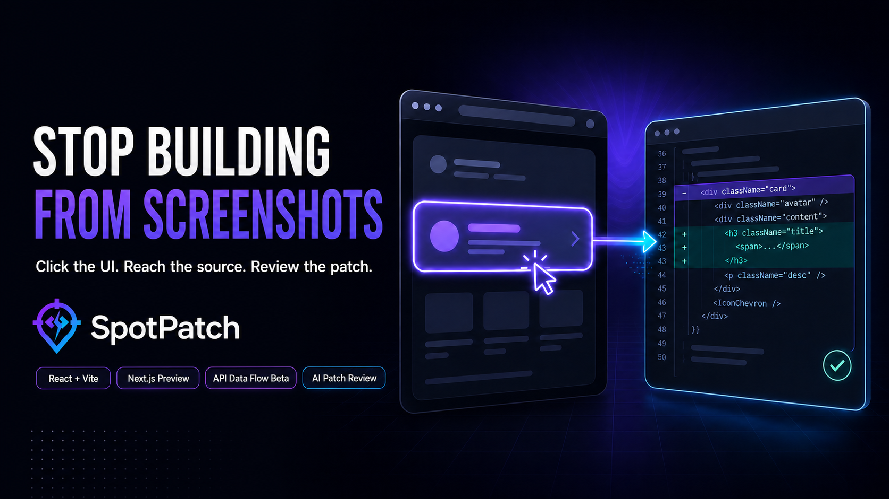
</p>

<p align="center">
  <strong>Click the UI. Reach the source. Ship a reviewed patch.</strong>
</p>

<p align="center">
  A local-first, development-only feedback workspace for React.
</p>

<p align="center">
  <strong>English</strong> · <a href="./README.zh-CN.md">简体中文</a>
</p>

<p align="center">
  <a href="https://www.npmjs.com/package/@spotpatch/vite"></a>
  <a href="https://www.npmjs.com/package/@spotpatch/next"></a>
  <a href="https://www.npmjs.com/package/@spotpatch/vite"></a>
  <a href="https://github.com/huanglvjing/spotpatch/actions/workflows/ci.yml"></a>
  <a href="./LICENSE"></a>
</p>

SpotPatch turns rendered React UI into precise, reusable development context. Select one or more elements in the browser, trace each target to its JSX/TSX source, inspect the component and its proven data flow, then open the exact location in Cursor or VS Code, copy a structured prompt, run the guarded built-in AI workflow, or explicitly hand the request to a connected external Agent.

<p align="center">
  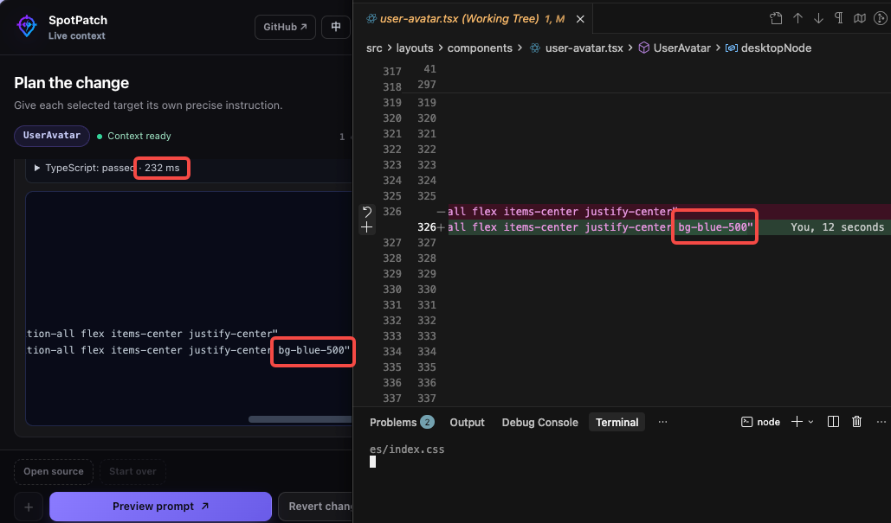
</p>

<p align="center">
  <sub>A selected UI target, its exact TSX location, and the resulting source change—kept in one feedback loop.</sub>
</p>

> [!IMPORTANT]
> `@spotpatch/vite` is the supported public integration. The installable [Next.js adapter](./packages/next/README.md) is a **0.x public preview**, not yet part of the public support matrix.

**Start here:** [Vite quick start](#quick-start-vite) · [Visual workflow](#visual-workflow) · [External Agents](#external-agent-handoff-local-validation) · [Data flow Beta](#component-data-flow-beta) · [Optional AI](#optional-ai-agent)

## Why SpotPatch

- **UI-to-source, without guesswork** — map rendered elements to an authorized source file, line, and column.
- **Evidence-first component data flow** — inspect proven APIs, parameter keys, consumed response fields, destinations, and current-page unassigned requests without opening DevTools.
- **Multi-target feedback** — keep independent instructions and context for up to eight targets by default.
- **Useful without AI** — inspect context, open Cursor or VS Code, preview a structured prompt, and copy it to any coding assistant.
- **Explicit external-Agent handoff** — publish reviewed targets to a generic MCP Inbox, or actively dispatch them through narrow Claude Code and Codex adapters when those hosts are connected.
- **A guarded AI path when you want it** — use an explicitly configured OpenAI-compatible provider, bounded tools, an isolated Git worktree, project checks, Diff review, Apply, and conflict-safe Revert.
- **Local-first and development-only** — switch between Chinese and English, while production builds retain no SpotPatch Runtime, source markers, or local protocol endpoints.

## Quick start: Vite

**Requirements:** Node.js 20.19+, React 18.2–18.3, and Vite 5, 6, or 7.

### 1. Set up SpotPatch

Run one command from the root of an existing Vite + React project:

```bash
npx --yes @spotpatch/vite@latest setup
```

The initializer detects npm or pnpm, installs the matching SpotPatch version, safely updates a supported `vite.config.*`, and enables the development-only data-flow Beta. If a safe local TypeScript check is discoverable, it also exposes the optional Trusted direct mode; the page still starts in Review mode.

<details>
<summary><strong>Manual setup and pnpm 11 notes</strong></summary>

For npm, installation and initialization can be kept separate:

```bash
npm install --save-dev @spotpatch/vite@latest
npx spotpatch-vite init
```

The generated integration places SpotPatch before the React plugin:

```ts
// vite.config.ts
import { spotPatch } from "@spotpatch/vite";
import react from "@vitejs/plugin-react-swc";
import { defineConfig } from "vite";

export default defineConfig({
  plugins: [spotPatch({ dataFlow: {}, trustedFastMode: true }), react()],
});
```

If no safe local TypeScript check is discoverable, the initializer generates `spotPatch({ dataFlow: {} })` and keeps the page in Review-only mode. It supports static config objects and object-returning `defineConfig` callbacks. Ambiguous dynamic configurations fail without writing the Vite config, so they can be integrated manually.

On pnpm 11, use the recommended setup command, install an explicitly trusted exact version, or wait until a release satisfies pnpm's default 24-hour `minimumReleaseAge`. SpotPatch does not disable that supply-chain policy globally.

</details>

### 2. Select an element

Start the ordinary Vite development server and open the application:

```bash
pnpm dev
```

Click **Select element** in the bottom-right corner or press `Mod+Shift+S`. Select one or more targets, give each one a separate instruction, then choose the path that fits the task:

- open the exact source location in Cursor or VS Code;
- preview and copy a structured prompt to any coding assistant; or
- if AI is configured, run a change in default Review mode or explicitly opt into Trusted direct when the project exposes it.

## Visual workflow

<table>
  <tr>
    <td align="center" width="50%">
      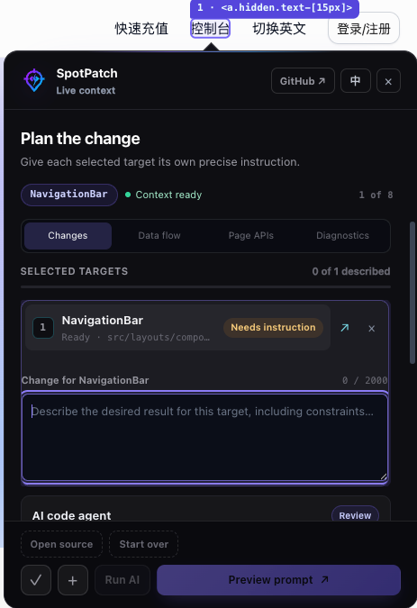
    </td>
    <td align="center" width="50%">
      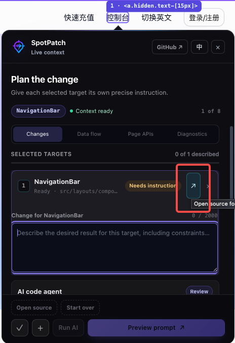
    </td>
  </tr>
  <tr>
    <td align="center"><strong>1. Select and describe</strong><br /><sub>Keep a separate request for every UI target.</sub></td>
    <td align="center"><strong>2. Jump to source</strong><br /><sub>Open the exact line in Cursor or VS Code.</sub></td>
  </tr>
  <tr>
    <td align="center">
      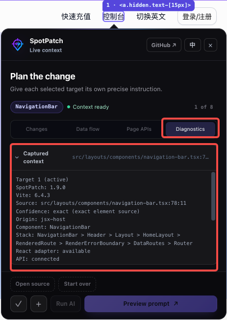
    </td>
    <td align="center">
      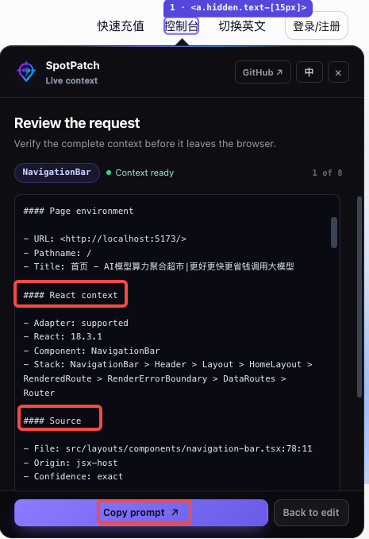
    </td>
  </tr>
  <tr>
    <td align="center"><strong>3. Verify the context</strong><br /><sub>Inspect component, stack, source coordinates, and confidence.</sub></td>
    <td align="center"><strong>4. Hand off cleanly</strong><br /><sub>Copy bounded context instead of explaining a screenshot.</sub></td>
  </tr>
</table>

> The screenshots show SpotPatch in `en-US`; the example host application keeps its own locale. Switching the SpotPatch interface language does not discard the current draft or review state.

## External Agent handoff (local validation)

Enable the development-only handoff UI explicitly:

```ts
// Vite
spotPatch({ externalAgent: true });

// Next.js
export default withSpotPatch({ externalAgent: true })(nextConfig);
```

Start the ordinary SpotPatch development server first, then run an active connector from that exact project root. The Codex connector owns a headless App Server process, reuses the user's existing Codex authentication, and requires no separately opened Codex window:

```bash
# Next.js; use spotpatch-vite in a Vite project
pnpm exec spotpatch-next connect codex --allow-workspace-write
```

Keep the connector running. Each explicit **Send to Agent** action is projected into a bounded source-aware task, starts one Codex turn, reports protocol-backed working/terminal state, and returns to idle after the terminal event. SpotPatch does not relay approvals, enable sandbox-command network access, or treat a completed turn as proof that the requested code change is correct.

Claude Code uses its experimental Channel capability and must already be running with that Channel enabled. Cursor and generic MCP clients use the project Inbox because they do not share the same verified active-delivery protocol:

```bash
pnpm exec spotpatch-next bridge setup --client claude --scope project --mode active --write
MCP_PROTOCOL_NEGOTIATION=legacy claude --dangerously-load-development-channels server:spotpatch

pnpm exec spotpatch-next bridge setup --client cursor --scope project --write
```

No `nvm` step is required; the running Node.js process must satisfy `>=20.19.0`. Commands are project-root scoped so discovery cannot silently attach to another repository. When multiple SpotPatch sessions exist for one root, select the opaque ID reported by `bridge sessions --json` with `--session <id>`.

This integration remains **local validation**, not stable host support. Automated two-handoff tests pass, and a two-revision Codex flow has been manually validated on the recorded macOS/Next.js/Codex environment. Claude's real two-click flow, Cursor active delivery, Windows process-tree cleanup, and the full cross-platform matrix remain unverified or unsupported. See the [external Agent status and evidence](./docs/技术方案/外部Agent连接/00-索引与决策摘要.md).

## Component data flow (Beta)

Enable the development-only inspector explicitly when integrating manually:

```ts
// Vite
spotPatch({ dataFlow: {} });

// Next.js public preview
export default withSpotPatch({ dataFlow: {} })(nextConfig);
```

After selecting an element, use **Data flow** for the proven component report and **Page APIs** for the selected page scope plus actually observed but unassigned requests.

<table>
  <tr>
    <td align="center" width="50%">
      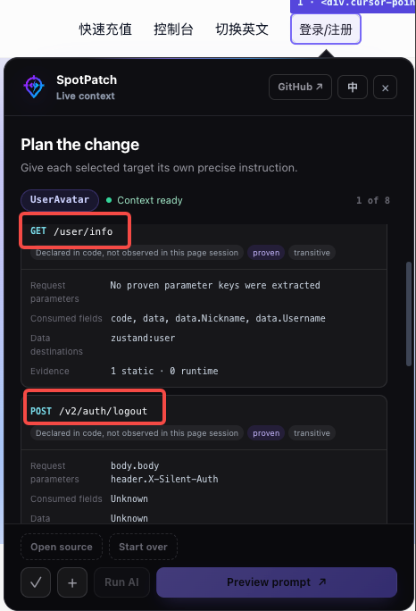
    </td>
    <td align="center" width="50%">
      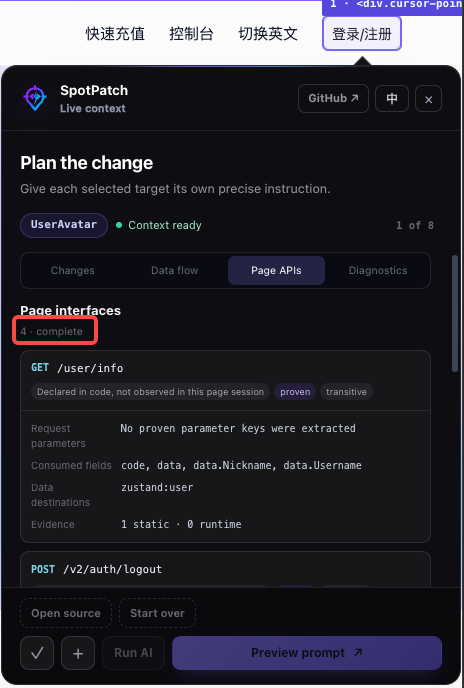
    </td>
  </tr>
  <tr>
    <td align="center"><strong>Component data flow</strong><br /><sub>See APIs proven to belong to the selected component.</sub></td>
    <td align="center"><strong>Page APIs</strong><br /><sub>See the page scope and requests not yet assigned to a component.</sub></td>
  </tr>
</table>

Reports include HTTP method/path, parameter keys and positions, source-consumed response fields, and proven React state, Zustand, storage, or callback destinations. Runtime observation is dispatch-only: SpotPatch does not read or clone response bodies, and query values are never retained.

The current adapters cover supported direct and component-service `fetch`, Axios, React Query/TanStack Query callback forms, and an experimental tRPC logical-procedure path. A tRPC procedure and its physical batch HTTP request remain separate evidence layers.

This Beta reports a relationship only when stable component, source, callsite, and invocation evidence agree. Unsupported or ambiguous traffic remains partial, unknown, or unassigned; URL or timing similarity alone is never treated as proof. Vite + React 18 is the validated baseline. The Next.js public preview uses the same evidence model for browser Client Components; server-side RSC, Server Action, and Route Handler dispatch remains unobservable. React 19 accepts only compiler-registered component identity and never trusts private Fiber source coordinates. See the [implementation status and exact support matrix](./docs/技术方案/组件数据链路/13-Beta实现状态与使用手册.md).

## Optional AI Agent

AI is disabled unless a complete provider configuration is available. The smallest setup uses a Git-ignored `.env.local` file and requires no change to `spotPatch()`:

```dotenv
SPOTPATCH_AI_BASE_URL=https://relay.example.com/v1
SPOTPATCH_AI_MODEL=provider-model-name
SPOTPATCH_AI_API_KEY=<your-key>

# Optional defaults:
# SPOTPATCH_AI_PROTOCOL=chat-completions
# SPOTPATCH_AI_AUTHENTICATION=bearer
```

`SPOTPATCH_AI_PROTOCOL` supports `chat-completions` and `responses`. Authentication supports `bearer` and `x-api-key`. API keys stay in the Vite Node process and must never use a `VITE_` prefix or be committed to Git.

Non-secret provider information can also be declared in `vite.config.ts`:

```ts
spotPatch({
  ai: {
    baseURL: "https://relay.example.com/v1",
    model: "provider-model-name",
  },
});
```

### What a guarded run looks like

The sequence below shows the default Review path:

<table>
  <tr>
    <td align="center" width="50%">
      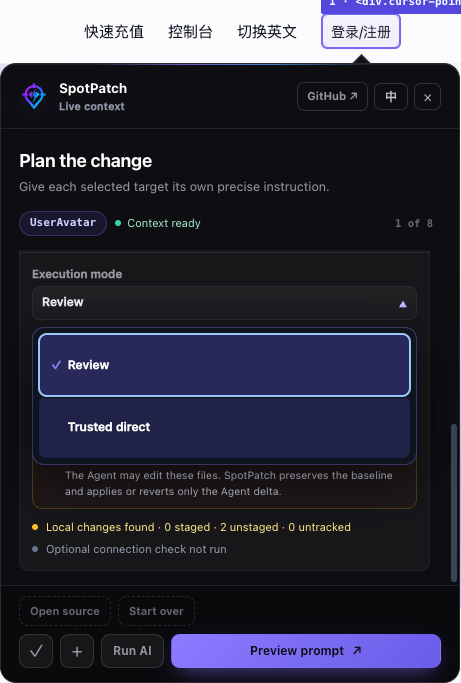
    </td>
    <td align="center" width="50%">
      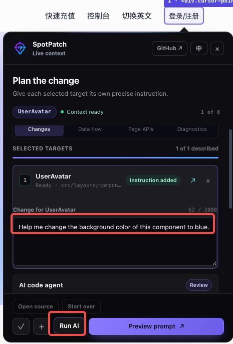
    </td>
  </tr>
  <tr>
    <td align="center"><strong>1. Choose the boundary</strong><br /><sub>Review is the default; Trusted direct is explicit and skips host checks.</sub></td>
    <td align="center"><strong>2. State the exact change</strong><br /><sub>Every selected target keeps its own instruction and context.</sub></td>
  </tr>
  <tr>
    <td align="center">
      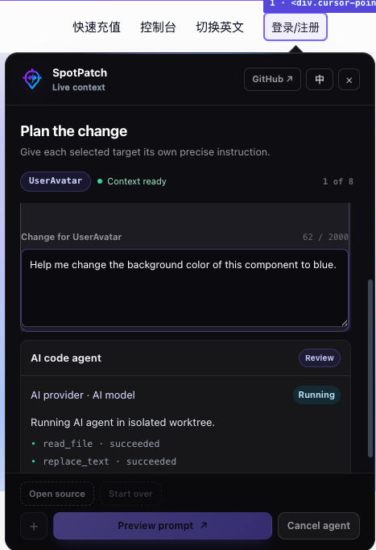
    </td>
    <td align="center">
      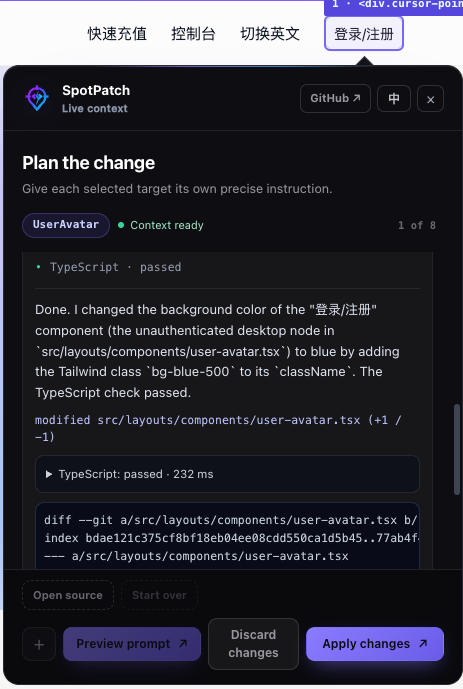
    </td>
  </tr>
  <tr>
    <td align="center"><strong>3. Watch bounded execution</strong><br /><sub>Changes are prepared in an isolated Git worktree.</sub></td>
    <td align="center"><strong>4. Review the result</strong><br /><sub>Inspect checks and the Diff, then apply or discard the change.</sub></td>
  </tr>
</table>

To expose **Trusted direct** during manual integration, SpotPatch must discover a local TypeScript project check. The discovered check protects Review mode; Trusted direct itself skips host checks:

```ts
spotPatch({ trustedFastMode: true });
```

The configuration field remains `trustedFastMode`, while the current UI labels the mode **Trusted direct**. After one session-scoped consent, Trusted direct prioritizes SpotPatch's exact source path, skips host project checks, and immediately applies the isolated Diff. It does not promise that TypeScript, lint, tests, or builds pass. Project-root boundaries, protected paths, atomic patch validation, concurrent-edit checks, Revert, and the ban on arbitrary shell commands remain enforced. SpotPatch does not commit, push, publish, or deploy application code. See [AI Agent execution](./docs/技术方案/16-AIAgent执行与变更审阅.md) and [provider credentials](./docs/技术方案/17-模型提供商与凭据配置.md) for the normative rules.

## Supported scope

| Area              | Supported public scope                | Notes                                                        |
| ----------------- | ------------------------------------- | ------------------------------------------------------------ |
| Framework         | React with Vite                       | `@spotpatch/vite` is the public entry point.                 |
| Vite              | 5, 6, 7                               | Verified through versioned compatibility fixtures.           |
| React             | 18.2–18.3                             | React 19 is not in the Vite v1 support promise.              |
| Source            | `.jsx`, `.tsx` under `src` by default | Include and exclude filters are configurable.                |
| Node.js           | 20.19 or newer                        | Node 20 and 22 are exercised in CI.                          |
| Browsers          | Chromium                              | Automated interaction coverage runs through Playwright.      |
| Editors           | Cursor, VS Code                       | Auto-detected by default; either can be selected explicitly. |
| Operating systems | macOS, Windows, Linux                 | CI and editor launch behavior are platform-aware.            |

Other combinations may work, but they are not part of the current public promise. The [product boundary](./docs/技术方案/01-产品定义与边界.md) is the source of truth.

> [!WARNING]
> React 19, including 19.2.x, may be tried experimentally but is outside the supported Vite range. Verify picking, source resolution, HMR, and any AI workflow in your own project before relying on it.

## Next.js public preview

> [!WARNING]
> `@spotpatch/next` is a **0.x public preview**. It is installable from npm, but its peer range is a candidate test range—not a completed compatibility or production-support claim.

The preview contains a CLI, Sidecar, Turbopack and webpack Loader paths, atomic source/data-flow registration, a pre-hydration recorder, the shared data-flow panel, Runtime bootstrap, and production no-op isolation. It has passed the locked POC and a private Next 16 App Router host, but the complete Next/React/router/Node/OS/browser support matrix is unfinished.

```bash
pnpm add -D @spotpatch/next
pnpm exec spotpatch-next init
pnpm exec spotpatch-next check
pnpm dev
```

`init` safely composes `next.config` with `dataFlow: {}`, adds the `@spotpatch/next/client` import to the correct `instrumentation-client` file, and changes a simple `next dev` script to `spotpatch-next dev`. `check` verifies those integration points without writing files. Always start development through the package script; a direct `next dev` has no SpotPatch Sidecar lifecycle owner.

A successful startup prints a line beginning with `[spotpatch:next] ready`. Open the printed loopback URL and use **Select element** / **选择元素**. The optional AI workflow uses the same server-only `SPOTPATCH_AI_*` variables described above; never rename them with a `NEXT_PUBLIC_` prefix.

See the complete [`@spotpatch/next` public-preview guide](./packages/next/README.md) for generated file examples, production commands, known restrictions, and the exact evidence boundary. Follow the [Next.js adapter plan](./docs/技术方案/Next适配/00-索引与架构摘要.md) and [remaining support gates](./docs/技术方案/Next适配/08-测试验收与实施计划.md) before making compatibility claims.

## Configuration

The Vite entry exports `spotPatch(options)`. Important defaults are:

| Option            | Default                                        | Purpose                                                                   |
| ----------------- | ---------------------------------------------- | ------------------------------------------------------------------------- |
| `enabled`         | `true`                                         | Disable the plugin explicitly when needed.                                |
| `include`         | JSX/TSX inside `src`                           | Source files eligible for marker injection.                               |
| `exclude`         | dependencies, tests, stories, generated output | Files that must not be transformed.                                       |
| `editor`          | `"auto"`                                       | Auto-detect Cursor or VS Code.                                            |
| `redact`          | `true`                                         | Sanitize collected browser context.                                       |
| `shortcut`        | `"Mod+Shift+S"`                                | Toggle the element picker.                                                |
| `allowLan`        | `false`                                        | Keep the local protocol loopback-only by default.                         |
| `locale`          | `"auto"`                                       | Resolve `en-US` or `zh-CN`.                                               |
| `maxTargets`      | `8`                                            | Maximum targets in one task by default.                                   |
| `ai`              | `false` or detected complete environment       | Optional provider and Agent configuration.                                |
| `dataFlow`        | `false`                                        | Opt-in dispatch-only component data-flow Beta.                            |
| `externalAgent`   | `false`                                        | Opt-in external Agent Inbox and active-connector UI; local validation.    |
| `trustedFastMode` | `false`                                        | Expose Review/Trusted direct; discovered TypeScript protects Review only. |

See [`@spotpatch/vite`](./packages/vite/README.md) and the [public API specification](./docs/技术方案/03-公共API与数据模型.md) for complete types and constraints.

## Security and production isolation

- The browser receives random file identifiers, never absolute source paths.
- Source reads are limited to files registered by the active development session and kept inside the project root.
- Passwords, tokens, cookies, authorization data, URL credentials, and inline data are sanitized.
- Provider credentials stay on the Node side and are never injected into client code.
- Loopback Host and Origin checks are the default. Enabling Vite LAN access explicitly expands the trust boundary.
- Production builds are tested for zero Runtime, source markers, private API routes, and internal secrets.
- SpotPatch never performs an implicit `stash`, `reset`, `commit`, `push`, publish, or deployment.

Read the complete [local protocol and security specification](./docs/技术方案/09-本地协议与安全.md) before enabling LAN access or AI execution.

## Packages

Applications should normally install only a framework adapter.

| Package                                                            | Role                                                          | Direct application use                  |
| ------------------------------------------------------------------ | ------------------------------------------------------------- | --------------------------------------- |
| [`@spotpatch/vite`](https://www.npmjs.com/package/@spotpatch/vite) | Supported Vite integration                                    | **Yes**                                 |
| [`@spotpatch/next`](./packages/next/README.md)                     | Installable Next.js 0.x public preview                        | Preview only; not formally supported    |
| `@spotpatch/compiler`                                              | Framework-neutral JSX/TSX marker compiler                     | Adapter infrastructure                  |
| `@spotpatch/analyzer`                                              | Node-only component/request semantic analyzer                 | Adapter infrastructure; Node only       |
| `@spotpatch/dev-server`                                            | Local sessions, source access, editor and Agent orchestration | Adapter infrastructure; Node only       |
| `@spotpatch/bridge`                                                | External-Agent Inbox, CLI, event pump and host adapters       | Adapter infrastructure; Node only       |
| `@spotpatch/runtime`                                               | Browser picker, collectors, workbench and prompt composer     | Installed through an adapter            |
| `@spotpatch/react-adapter`                                         | Isolated React/Fiber compatibility boundary                   | Installed through an adapter            |
| `@spotpatch/agent`                                                 | Provider, bounded tools, worktree and validation engine       | Installed through an adapter; Node only |
| `@spotpatch/shared`                                                | Immutable models, protocol schemas and error codes            | Shared internal contract                |

Packages that are publicly published to complete the dependency graph are not automatically separate user-facing integration surfaces.

## Repository development

```bash
pnpm install --frozen-lockfile
pnpm format:check
pnpm lint
pnpm typecheck
pnpm test:unit
pnpm build
pnpm test:compatibility
pnpm test:performance
pnpm test:e2e:chromium
pnpm test:production-leakage
pnpm package:validate
```

The CI workflow also runs its quality matrix on Ubuntu, macOS, and Windows with the declared Node versions. Next.js experiments have separate POC and private real-host commands; passing them does not bypass the documented Next formal-support gates.

## Documentation

- [Documentation index](./docs/技术方案/00-索引与导航.md)
- [Product definition and support boundary](./docs/技术方案/01-产品定义与边界.md)
- [Architecture and package ownership](./docs/技术方案/02-总体架构与技术栈.md)
- [Public API and defaults](./docs/技术方案/03-公共API与数据模型.md)
- [Security model](./docs/技术方案/09-本地协议与安全.md)
- [Testing and acceptance](./docs/技术方案/12-测试与验收.md)
- [Component data-flow Beta status](./docs/技术方案/组件数据链路/13-Beta实现状态与使用手册.md)
- [External Agent handoff status](./docs/技术方案/外部Agent连接/00-索引与决策摘要.md)
- [Next.js adapter status](./docs/技术方案/Next适配/00-索引与架构摘要.md)

## Feedback

If SpotPatch shortens your UI-fix loop, consider [starring the repository](https://github.com/huanglvjing/spotpatch). Found an unsupported pattern or a source-resolution edge case? [Open an issue](https://github.com/huanglvjing/spotpatch/issues) with a minimal reproduction and your framework versions.

## License

[MIT](./LICENSE) © SpotPatch contributors.
