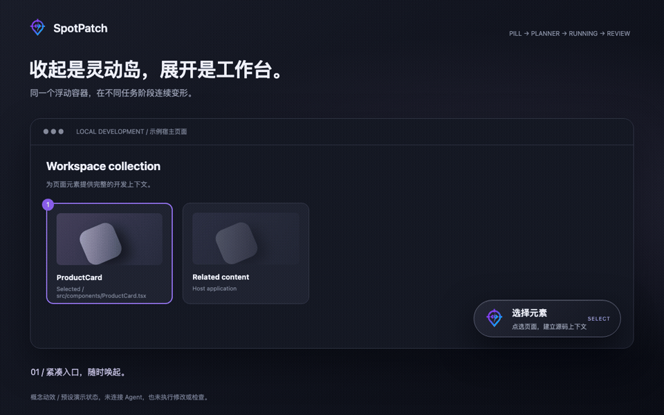
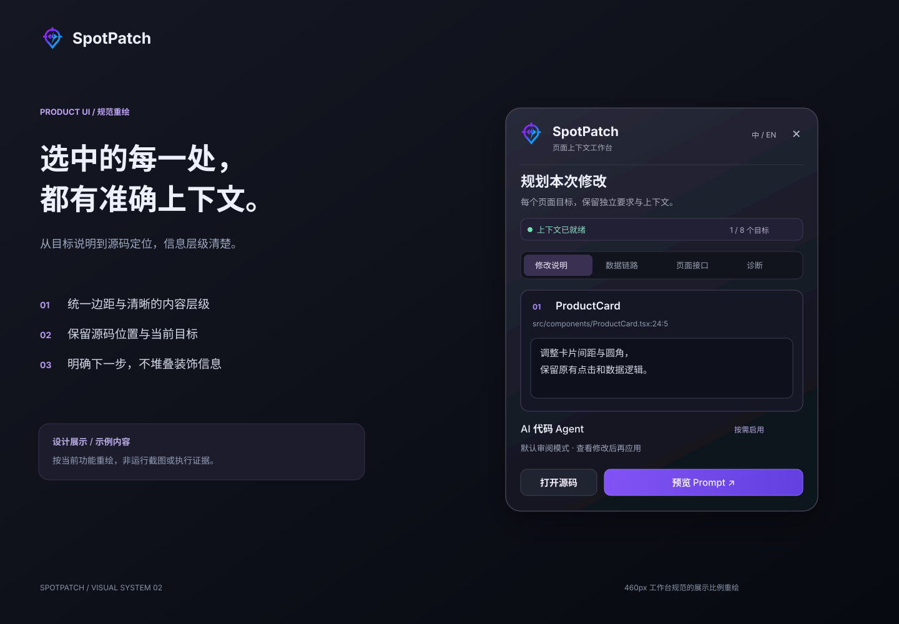
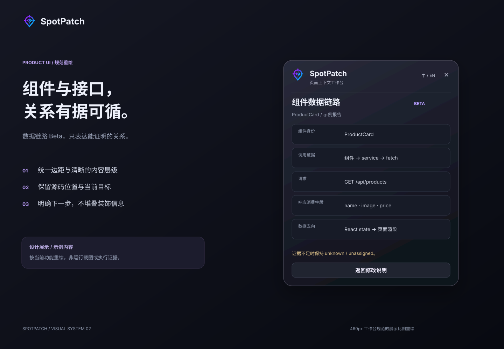
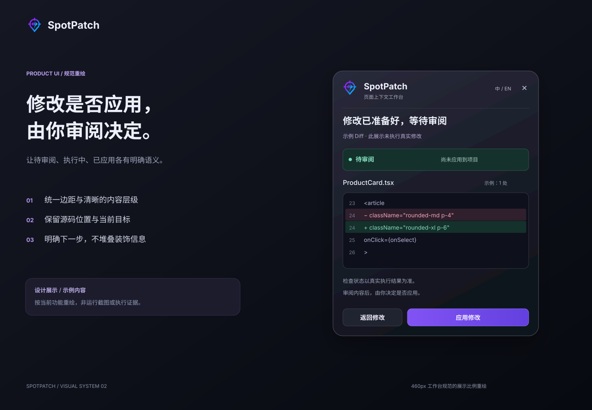

<h1 align="center">
  <a href="https://github.com/huanglvjing/spotpatch"></a><br />SpotPatch
</h1>

<p align="center"><strong>点选页面，直达源码，审阅后再应用。</strong></p>
<p align="center">本地优先、仅在开发期运行的页面上下文与修改工作台。</p>
<p align="center"><a href="./README.md">English</a> · <a href="./README.zh-CN.md">简体中文</a></p>
<p align="center">
  <a href="https://www.npmjs.com/package/@spotpatch/vite"></a>
  <a href="https://www.npmjs.com/package/@spotpatch/astro"></a>
  <a href="https://www.npmjs.com/package/@spotpatch/next"></a>
  <a href="https://github.com/huanglvjing/spotpatch/actions/workflows/ci.yml"></a>
  <a href="./LICENSE"></a>
</p>

<p align="center"></p>

> 本文图片为产品概念展示，动图为预设状态演示，均不是当前版本截图、操作实录或验收证据。实际功能与成熟度以下文为准。

SpotPatch 从真实页面元素出发，收集有界的 DOM、CSS 与源码上下文。你可以选择一个或多个目标，分别描述要求，在 Cursor / VS Code 打开源码，复制结构化 Prompt，或按需启用只读问答、AI 修改与审阅。页面入口、任务规划和执行反馈共用一个可拖拽的浮动工作台。

**开始使用：** [Vite](#快速开始vite) · [Astro](#astro) · [Next.js 预览](#nextjs-公共预览) · [灵动岛](#浮动工作台与灵动岛) · [架构](#包结构) · [技术文档](#文档)

## 当前能力与支持范围

| 能力 / 入口                | 当前范围                              | 边界                                                                             |
| -------------------------- | ------------------------------------- | -------------------------------------------------------------------------------- |
| React + Vite               | 正式公共入口 `@spotpatch/vite`        | React 18.2–18.3；Vite 5/6/7；Node.js 20.19+                                      |
| Astro                      | 已发布的 `@spotpatch/astro` 集成      | 验证 fixture：Astro 5.18.2 / 6.4.8 / 7.2.8，Node.js 22.12+；原生模板不要求 React |
| Next.js                    | `@spotpatch/next` 0.x 公共预览        | 可安装不等于完整兼容；完整 Router / 构建器 / OS 矩阵仍未完成                     |
| 页面选择、源码导航、Prompt | 核心能力                              | 无需配置 AI；源码定位与组件语义分别报告来源和置信度                              |
| 浮动工作台与灵动岛         | 已实现                                | 同一 Shell、拖拽、吸附与 Session 恢复；专项真实浏览器视觉/性能门禁仍有待完成项   |
| 组件数据链路               | Beta，按配置启用                      | 仅报告有证据的归属；浏览器无法观测服务端执行                                     |
| Contextual Ask             | 已实现，显式启用；专题仍标记 internal | 单轮只读问答；未据本次审计提升为跨平台 Beta                                      |
| 外部 Agent / Managed Codex | `local-validation`                    | 需要本机能力和协议检查；不能宣传为全部宿主的稳定支持                             |

Chromium 是浏览器自动化基线；React 19 不在 Vite 正式支持范围内。Astro、Next.js 和外部 Agent 各自保留独立支持边界，详见[产品定义](./docs/技术方案/01-产品定义与边界.md)。

> 仓库 `main` 与 npm `latest` 可能不同步。2026-09-09 核对时，源码已完成新一轮版本变更，但 npm 仍指向上一轮发布；不要把新素材或源码修复当作 `@latest` 已交付。具体快照见[文档事实核对记录](./docs/技术方案/24-文档与素材事实核对.md)。

## 为什么使用 SpotPatch

- **让目标自带上下文**：从页面定位授权源码位置，保留 DOM、CSS、组件信息和定位置信度。
- **逐个目标写清要求**：默认最多八个目标，每项独立描述，不用一段全局说明覆盖不同需求。
- **选择合适的交接方式**：打开编辑器、复制 Prompt、只读提问或运行可选的修改流程。
- **在页面里跟进任务**：紧凑灵动岛和展开工作台共享位置，目标切换不会让面板追着元素移动。
- **保留审阅决定**：内置 AI 默认先准备隔离修改和 Diff，由你审阅后应用；未启用 AI 仍可使用核心功能。

## 快速开始：Vite

在已有 Vite + React 项目根目录运行：

```bash
npx --yes @spotpatch/vite@latest setup
```

然后用项目原有命令启动开发服务器，例如：

```bash
pnpm dev
```

点击右下角的 **选择元素**，或按 `Mod+Shift+S`，选中目标并描述要求。

初始化器识别 npm / pnpm、安装匹配的适配器，并更新可静态分析的 Vite 配置。当前源码的初始化配置启用 `dataFlow: {}` 和 `externalAgent: true`；发现安全的本地 TypeScript 检查时还启用 `trustedFastMode: true`。页面默认仍是审阅模式。`init` 同时创建当前用户、当前项目私有且可撤销的 Managed Codex 授权；这不代表已安装、登录或连接 Codex，也不代表已配置模型 Provider。

<details>
<summary>手动接入：仅使用核心选择、定位与 Prompt</summary>

```bash
pnpm add -D @spotpatch/vite
```

把 SpotPatch 放在 React 插件之前：

```ts
import { spotPatch } from "@spotpatch/vite";
import react from "@vitejs/plugin-react-swc";
import { defineConfig } from "vite";

export default defineConfig({
  plugins: [spotPatch({ ai: false }), react()],
});
```

不运行初始化器时，不会由该命令创建 Managed Codex 项目授权。高级能力通过配置逐项启用。pnpm 的发布冷却策略保持有效；遇到新版本安装限制时，使用经过确认的版本或等待冷却期，不全局关闭供应链策略。

</details>

完整接入选项与限制见 [Vite 包文档](./packages/vite/README.md)。

## 浮动工作台与灵动岛

<p align="center"></p>

同一个持续 Shell 承载入口、上下文采集、Planner 和执行岛。默认停靠右下角，支持拖拽、边缘吸附和当前开发 Session 的位置恢复。展开与收起共享锚点；窄视口有受限布局，减少动画偏好保留状态信息。

真实产品按 Runtime、Agent Job 与外部交接事件更新状态，不按动画时间自动完成，不伪造百分比。**等待审阅不等于已经应用**：待审阅结果保留入口，不能被自动收起逻辑隐藏。实现与待验收项见[浮动位置规范](./docs/技术方案/21-浮动工作台与灵动岛交互方案.md)和[持续 Shell 动效规范](./docs/技术方案/22-持续Shell与灵动岛动效系统方案.md)。

## 从页面到源码的四步流程

1. **点选并描述**：每个目标保留独立要求与编号高亮。
2. **核对上下文**：检查源码坐标、组件语义、DOM/CSS 与置信度。
3. **选择路径**：打开源码、复制 Prompt；或配置后显式使用 Ask / Change。
4. **审阅修改**：可选 AI 的默认审阅模式展示 Diff；应用后可在冲突安全条件满足时撤销。

<p align="center"></p>

## 组件数据链路（Beta）

手动配置时显式启用：

```ts
spotPatch({ dataFlow: {} });
```

**数据链路**查看当前业务组件的可证明报告，**页面接口**同时保留尚未归属组件的请求。报告包括 method/path、参数键、源码读取的响应字段，以及可证明的 state、storage、callback 等去向。

<p align="center"></p>

静态分析和运行时证据共同约束归属。运行时只记录 dispatch，不读取或 clone 响应体，不保留 query 值。相同 URL 或相近时间不构成归属依据；证据不足保持 `partial`、`unknown` 或 `unassigned`。支持的 `fetch`、Axios、React Query/TanStack Query 形态和实验性 tRPC 范围见 [Beta 使用手册](./docs/技术方案/组件数据链路/13-Beta实现状态与使用手册.md)。

## 只读上下文问答

```ts
spotPatch({ contextualAsk: true });
```

选中至少一个元素后，在工作台显式切换 **Ask / Change**。Ask 可使用配置 Key 的执行器或通过兼容检查的 Managed Codex，返回单次答案与经服务端校验的源码引用。

Ask 不写文件、不创建 worktree、不运行项目检查，也不产生 Diff / Apply / Revert。“转为修改”只建立可编辑草稿，需要再次提交才能进入写入流程。它不是无目标全仓聊天，也不提供长期聊天历史或连续追问。模型列表可见不代表每个模型请求都验证成功。当前成熟度与放行证据见[问答专题](./docs/技术方案/上下文问答/00-索引与决策摘要.md)。

## 可选 AI Agent

### 配置 Provider 的内置修改流程

在 Git 忽略的 `.env.local` 中配置：

```dotenv
SPOTPATCH_AI_BASE_URL=https://relay.example.com/v1
SPOTPATCH_AI_MODEL=provider-model-name
SPOTPATCH_AI_API_KEY=<your-key>
```

完整环境配置可启用内置 Provider 路径；也可在适配器 `ai` 选项配置非秘密信息。`SPOTPATCH_AI_PROTOCOL` 支持 `chat-completions` / `responses`，认证支持 `bearer` / `x-api-key`。凭据只保留在 Node 端，不要使用 `VITE_`、`NEXT_PUBLIC_` 等客户端前缀。

默认路径为：**隔离 Git worktree → 受限工具 → 配置的项目检查 → Diff 审阅 → Apply → 可安全 Revert**。

<p align="center"></p>

`trustedFastMode` 需要显式开放和会话授权；该路径跳过宿主项目检查并直接应用隔离 Diff，不承诺 TypeScript、lint、测试或构建通过。路径限制、补丁校验、并发修改检测和安全撤销继续生效。详见 [AI 执行与审阅](./docs/技术方案/16-AIAgent执行与变更审阅.md)。

### 外部 Agent 交接（本地验证）

```ts
spotPatch({ externalAgent: true });
```

已接入的项目可以只初始化私有项目授权，不重写接入文件：

```bash
pnpm exec spotpatch-vite bridge init
```

Astro / Next.js 分别使用 `spotpatch-astro` / `spotpatch-next`。授权绑定当前用户和 canonical 项目根，可在面板撤销；本机 Codex 安装、登录和协议 Gate 仍须满足。由开发会话管理的 Managed Codex 与手动启动的 attached connector 是不同执行路径，不应混为一谈。

通用 MCP 和 Cursor 使用 Inbox；Codex 主动连接及 Claude Channel 有各自的宿主与协议要求。不要把 `turn completed` 直接宣传为修改正确或已应用。高级命令、授权边界及尚未验证的客户端/平台见[外部 Agent 专题](./docs/技术方案/外部Agent连接/00-索引与决策摘要.md)与 [CLI 授权规范](./docs/技术方案/外部Agent连接/23-CLI初始化项目授权.md)。

## Astro

```bash
pnpm add -D @spotpatch/astro@latest
pnpm exec spotpatch-astro init
pnpm exec spotpatch-astro check
pnpm dev
```

Node.js 22.12+。`init` 安全更新可支持的静态 `astro.config.*`，把 SpotPatch 加入 **integrations**，不是 `vite.plugins`。当前初始化器启用数据链路、只读 Ask、外部 Agent，并在发现相应检查时开放可信极速；同时创建私有 Managed Codex 项目授权。

原生 `.astro` 使用独立 compiler-rs 解析；React 岛屿复用共享 JSX 编译链路。服务端请求只能提供静态证据，其他岛框架与动态 DOM 不保证内部 exact。动态或含糊配置会安全失败。安装、验证矩阵和功能限制见 [Astro 包文档](./packages/astro/README.md)。

## Next.js 公共预览

```bash
pnpm add -D @spotpatch/next
pnpm exec spotpatch-next init
pnpm exec spotpatch-next check
pnpm dev
```

`init` 组合 `next.config`、接入 `instrumentation-client`，并把支持的开发脚本改为 `spotpatch-next dev`。必须经该开发入口管理 Next 子进程与 Sidecar，不要绕过它直接执行 `next dev`。当前初始化配置启用 `dataFlow` 和 `externalAgent`；需要 Ask 时另行启用。

预览包含 Turbopack / webpack 接入与生产 no-op 隔离，但 peer dependency 候选范围不是完整支持承诺。RSC / Server Action / Route Handler 的服务端执行不由浏览器观测。生产仍使用普通 Next 命令，SpotPatch 不在生产中运行。详见 [Next.js 包文档](./packages/next/README.md)。

## 配置

以下是手动接入的主要默认值；**初始化器会显式修改部分选项，不等于默认值发生改变**。

| 选项              | 默认行为                                   |
| ----------------- | ------------------------------------------ |
| `enabled`         | `true`，仅开发期装配                       |
| `editor`          | `"auto"`，Cursor / VS Code                 |
| `locale`          | `"auto"`，支持 `en-US` / `zh-CN`           |
| `maxTargets`      | `8`                                        |
| `shortcut`        | `"Mod+Shift+S"`                            |
| `redact`          | `true`                                     |
| `dataFlow`        | `false`                                    |
| `contextualAsk`   | `false`                                    |
| `externalAgent`   | `false`                                    |
| `trustedFastMode` | `false`                                    |
| `ai`              | 未配置时关闭；完整环境 Provider 配置可启用 |
| `allowLan`        | `false`；Next.js 预览拒绝开启              |

配置类型以各[适配器文档](./packages/vite/README.md)和[公共 API](./docs/技术方案/03-公共API与数据模型.md)为准。

## 安全与生产隔离

- 源码读取限制在当前开发会话登记、项目根内的授权文件；浏览器使用不透明源码标识。
- 对密码、Token、Cookie、Authorization 等上下文执行清洗；模型凭据仅保留在 Node 端。
- 默认限制 loopback Host / Origin。显式启用 LAN 会扩大信任边界。
- 本地优先不等于永不联网：配置模型 Provider 或外部 Agent 后，相应上下文会进入所选执行路径。
- 生产构建应无 Runtime、源码标记和私有开发端点；仓库提供相应隔离测试，预览支持矩阵仍独立受限。
- SpotPatch 不替业务项目自动 commit、push、发包或部署。

详见[本地协议与安全](./docs/技术方案/09-本地协议与安全.md)和 [Provider 凭据规范](./docs/技术方案/17-模型提供商与凭据配置.md)。

## 包结构

<p align="center"></p>

仓库包含 **11 个 workspace 包**。业务项目通常只安装一个框架入口；三个适配器平级，产品 UI 由共享 Runtime 实现。

| 包                                                     | 职责                                                   |
| ------------------------------------------------------ | ------------------------------------------------------ |
| [`@spotpatch/vite`](./packages/vite)                   | Vite 插件、初始化、开发期注入                          |
| [`@spotpatch/astro`](./packages/astro)                 | Astro Integration、原生模板解析与生命周期              |
| [`@spotpatch/next`](./packages/next)                   | 预览适配器、Loader、client 与 Sidecar                  |
| [`@spotpatch/runtime`](./packages/runtime)             | 选择、DOM/CSS、Prompt、Shadow DOM UI、灵动岛与按需面板 |
| [`@spotpatch/react-adapter`](./packages/react-adapter) | 隔离 React/Fiber 组件语义与降级                        |
| [`@spotpatch/compiler`](./packages/compiler)           | 共享 JSX/TSX 标记与转换基础设施                        |
| [`@spotpatch/analyzer`](./packages/analyzer)           | Node-only TypeScript 组件/请求语义分析                 |
| [`@spotpatch/dev-server`](./packages/dev-server)       | 本地会话、源码服务、编辑器、问答与修改编排             |
| [`@spotpatch/agent`](./packages/agent)                 | Provider、只读/修改执行器、受限工具、worktree 与检查   |
| [`@spotpatch/bridge`](./packages/bridge)               | MCP Inbox、CLI、宿主连接与 Managed Codex 生命周期      |
| [`@spotpatch/shared`](./packages/shared)               | 公共模型、协议 Schema 与错误码                         |

框架差异留在适配器中；UI 共享不代表框架支持矩阵相同。Vite / Astro 内联 Runtime 的发布快照必须随共享改动重建，Next 复用公共 Runtime 入口。精确结构与依赖方向见[中文版架构导读](./docs/architecture.zh-CN.md)和[跨框架发布一致性](./docs/技术方案/23-跨框架Runtime与发布一致性方案.md)。

## 仓库开发

使用 `.node-version` 指定的 Node 22 与根 `packageManager` 指定的 pnpm：

```bash
pnpm install --frozen-lockfile
pnpm dev
```

根 `pnpm dev` 先构建 `@spotpatch/vite...` 依赖图，再同时启动包监听和 React playground。修改 Runtime UI 时，不要只单独启动 playground，以免看到旧构建。完整流程见[本地开发说明](./docs/技术方案/20-本地开发与完整产品验收环境.md)。

```bash
pnpm format:check
pnpm lint
pnpm typecheck
pnpm test:unit
pnpm package:validate
pnpm test:compatibility
pnpm test:e2e:chromium
pnpm test:production-leakage
pnpm test:astro
pnpm test:astro:compatibility
pnpm test:next-poc
```

这是验证入口列表，不是本次文档改动已执行全部命令的声明。完整 CI / Beta 矩阵和各能力剩余 Gate 以专题证据为准。

## 文档

- [架构导读（中文）](./docs/architecture.zh-CN.md) / [Architecture (English)](./docs/architecture.md)
- [完整技术文档索引](./docs/技术方案/00-索引与导航.md)
- [产品定义与支持边界](./docs/技术方案/01-产品定义与边界.md)
- [浮动工作台](./docs/技术方案/21-浮动工作台与灵动岛交互方案.md) / [灵动岛动效](./docs/技术方案/22-持续Shell与灵动岛动效系统方案.md)
- [只读问答](./docs/技术方案/上下文问答/00-索引与决策摘要.md) / [数据链路 Beta](./docs/技术方案/组件数据链路/13-Beta实现状态与使用手册.md)
- [事实核对与素材说明](./docs/技术方案/24-文档与素材事实核对.md)

## 反馈与支持

欢迎通过 [Issue](https://github.com/huanglvjing/spotpatch/issues) 提交框架版本、接入配置和最小复现。若 SpotPatch 对你有帮助，欢迎给[仓库](https://github.com/huanglvjing/spotpatch)一个 Star。

## 许可证

[MIT](./LICENSE) © SpotPatch contributors.
