<h1 align="center">
  <a href="https://github.com/huanglvjing/spotpatch"></a>&nbsp;SpotPatch
</h1>

<p align="center">
  
</p>

<p align="center">
  <strong>点选页面，直达源码，审阅后再应用。</strong>
</p>

<p align="center">
  一个本地优先、仅在开发期运行的 React 与 Astro 页面反馈工作台。
</p>

<p align="center">
  <a href="./README.md">English</a> · <strong>简体中文</strong>
</p>

<p align="center">
  <a href="https://www.npmjs.com/package/@spotpatch/vite"></a>
  <a href="https://www.npmjs.com/package/@spotpatch/astro"></a>
  <a href="https://www.npmjs.com/package/@spotpatch/next"></a>
  <a href="https://www.npmjs.com/package/@spotpatch/vite"></a>
  <a href="https://github.com/huanglvjing/spotpatch/actions/workflows/ci.yml"></a>
  <a href="./LICENSE"></a>
</p>

SpotPatch 把真实 React 页面转换成准确、可复用的开发上下文。你可以在浏览器中选择一个或多个元素，追溯到对应 JSX/TSX 源码，检查组件及其可证明的数据链路，然后在 Cursor 或 VS Code 中打开精确位置、复制结构化 Prompt、运行受控的内建 AI 流程，或把已审阅的修改要求显式交给已连接的外部 Agent。

<p align="center">
  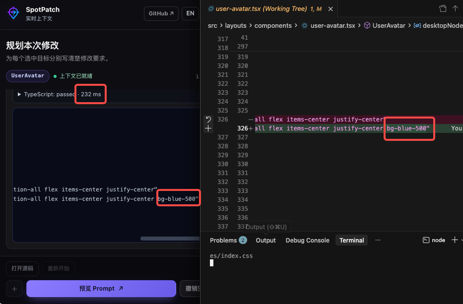
</p>

<p align="center">
  <sub>从选中页面目标、定位 TSX 源码，到查看实际修改结果，都在同一条反馈链路内完成。</sub>
</p>

> [!IMPORTANT]
> `@spotpatch/vite` 是当前正式支持的公共接入包。可安装的 [Next.js 适配器](./packages/next/README.md#简体中文)是 **0.x 公共预览版**，尚未进入公共支持矩阵。
> [`@spotpatch/astro`](./packages/astro/README.md#简体中文) 是已发布的公共集成，正式覆盖文档列出的 Astro 5/6/7 验证矩阵；其源码与运行边界不同于 React 适配器。

**从这里开始：** [Vite 快速开始](#快速开始vite) · [界面流程](#从页面到源码的四步流程) · [外部 Agent](#外部-agent-交接本地验证) · [数据链路 Beta](#组件数据链路beta) · [可选 AI](#可选-ai-agent)

## 为什么使用 SpotPatch

- **从页面精确定位源码**：把渲染后的元素映射到经过授权的源码文件、行号和列号，不再靠截图和猜测沟通。
- **证据优先的组件数据链路**：无需打开 DevTools，即可查看有证据的组件接口、参数键、响应消费字段、数据去向和页面未归属请求。
- **多目标独立描述**：一次任务默认最多选择八个目标，每个目标保留自己的修改要求与上下文。
- **不配置 AI 也能完整使用**：查看上下文、打开 Cursor 或 VS Code、预览结构化 Prompt，并复制给任意编程助手。
- **显式外部 Agent 交接**：把已审阅目标发布到通用 MCP 收件箱；当 Claude Code 或 Codex 主动适配器已连接时，按宿主正式能力立即派发。
- **需要时再启用受控 AI**：显式配置 OpenAI-compatible Provider 后，使用受限工具、隔离 Git worktree、项目检查、Diff 审阅、Apply 和冲突安全的 Revert。
- **本地优先且仅限开发期**：工作台支持中英文切换，生产构建不包含 SpotPatch Runtime、源码标记或本地协议端点。

## 快速开始：Vite

**环境要求：** Node.js 20.19+、React 18.2–18.3，以及 Vite 5、6 或 7。

### 1. 接入 SpotPatch

在已有 Vite + React 项目的根目录运行一条命令：

```bash
npx --yes @spotpatch/vite@latest setup
```

初始化器会识别 npm 或 pnpm，安装匹配的 SpotPatch 版本，安全更新受支持的 `vite.config.*`，并启用仅在开发期生效的数据链路 Beta。如果能发现安全的本地 TypeScript 检查，还会开放可选的“可信极速”模式；页面仍默认使用审阅模式。

<details>
<summary><strong>手动接入与 pnpm 11 说明</strong></summary>

npm 项目也可以分开安装和初始化：

```bash
npm install --save-dev @spotpatch/vite@latest
npx spotpatch-vite init
```

初始化器会把 SpotPatch 放在 React 插件之前：

```ts
// vite.config.ts
import { spotPatch } from "@spotpatch/vite";
import react from "@vitejs/plugin-react-swc";
import { defineConfig } from "vite";

export default defineConfig({
  plugins: [spotPatch({ dataFlow: {}, trustedFastMode: true }), react()],
});
```

如果无法发现安全的本地 TypeScript 检查，初始化器会生成 `spotPatch({ dataFlow: {} })`，页面只保留审阅模式。初始化器支持静态配置对象，也支持返回对象的 `defineConfig` 回调；存在歧义的动态配置会在不写入 Vite 配置的情况下失败，之后可以手动接入。

pnpm 11 项目请使用上面的推荐 setup 命令、显式安装已经确认的精确版本，或等待新版本满足默认 24 小时 `minimumReleaseAge`。SpotPatch 不会全局关闭这项供应链安全策略。

</details>

### 2. 选择页面元素

照常启动 Vite 开发服务器并打开页面：

```bash
pnpm dev
```

点击右下角的 **选择元素**，或者按下 `Mod+Shift+S`。选择一个或多个目标，为每项填写独立要求，然后按任务选择后续路径：

- 在 Cursor 或 VS Code 中打开准确源码位置；
- 预览并复制结构化 Prompt 给任意编程助手；或
- 配置 AI 后，在隔离 worktree 中运行默认需要审阅的修改。

## 从页面到源码的四步流程

<table>
  <tr>
    <td align="center" width="50%">
      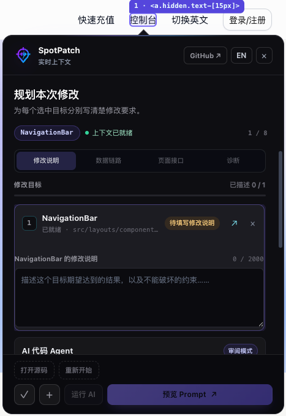
    </td>
    <td align="center" width="50%">
      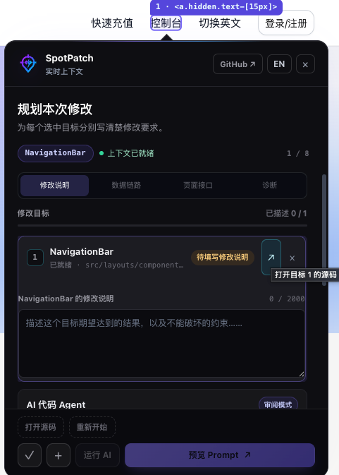
    </td>
  </tr>
  <tr>
    <td align="center"><strong>1. 点选并描述</strong><br /><sub>每个页面目标都保留独立的修改要求。</sub></td>
    <td align="center"><strong>2. 直达源码</strong><br /><sub>在 Cursor 或 VS Code 中打开准确行列。</sub></td>
  </tr>
  <tr>
    <td align="center">
      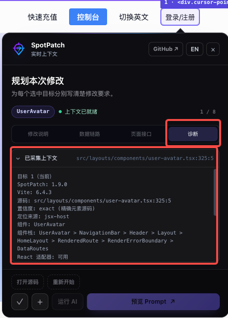
    </td>
    <td align="center">
      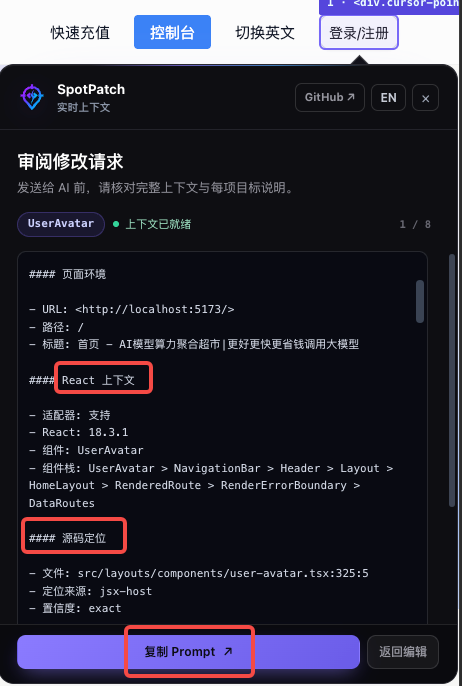
    </td>
  </tr>
  <tr>
    <td align="center"><strong>3. 核对上下文</strong><br /><sub>检查组件、组件栈、源码坐标与定位置信度。</sub></td>
    <td align="center"><strong>4. 准确交接</strong><br /><sub>复制经过预算裁剪的上下文，不再解释一张截图。</sub></td>
  </tr>
</table>

> 截图使用 SpotPatch 的 `zh-CN` 界面；宿主应用可以保持自己的语言。切换 SpotPatch 界面语言不会丢失当前草稿或审阅状态。

## 外部 Agent 交接（本地验证）

必须显式开启仅开发期的交接入口：

```ts
// Vite
spotPatch({ externalAgent: true });

// Next.js
export default withSpotPatch({ externalAgent: true })(nextConfig);
```

先启动普通 SpotPatch 开发服务，再从该开发会话所属的精确项目根启动主动连接器。Codex 连接器会自行管理无界面的 App Server 子进程并复用用户已有的 Codex 认证，不需要另外打开 Codex 窗口：

```bash
# Next.js；Vite 项目将 spotpatch-next 替换为 spotpatch-vite
pnpm exec spotpatch-next connect codex --allow-workspace-write
```

连接器必须保持运行。每次用户显式点击**发送给 Agent**，SpotPatch 都会生成有界、带源码位置的任务投影，启动一个 Codex turn，按协议证据显示 working/terminal，并在终态后恢复 idle。SpotPatch 不转发审批、不开放沙箱命令网络，也不会把 turn completed 冒充成“修改已正确完成”。

Claude Code 使用实验性的 Channel 能力，必须已有一个启用了该 Channel 的运行中会话。Cursor 和通用 MCP 客户端使用项目 Inbox，因为它们没有相同的已验证主动投递协议：

```bash
pnpm exec spotpatch-next bridge setup --client claude --scope project --mode active --write
MCP_PROTOCOL_NEGOTIATION=legacy claude --dangerously-load-development-channels server:spotpatch

pnpm exec spotpatch-next bridge setup --client cursor --scope project --write
```

不需要执行 `nvm`；当前 Node.js 进程满足 `>=20.19.0` 即可。命令必须绑定项目根，避免发现过程静默连接到其他仓库。同一项目根存在多个 SpotPatch 会话时，先执行 `bridge sessions --json`，再用 `--session <id>` 选择其返回的不透明 ID。

该能力仍是 **local-validation**，不是稳定宿主支持。确定性的连续两 Handoff 自动化已经通过，并已在记录的 macOS/Next.js/Codex 环境中人工验证连续两个 revision。真实 Claude 双次点击、Cursor 主动派发、Windows 进程树清理和完整跨平台矩阵仍未验证或不支持。准确边界见[外部 Agent 状态与证据](./docs/技术方案/外部Agent连接/00-索引与决策摘要.md)。

## 组件数据链路（Beta）

手工接入时，需要显式启用这个仅在开发期生效的检查器：

```ts
// Vite
spotPatch({ dataFlow: {} });

// Next.js 公共预览
export default withSpotPatch({ dataFlow: {} })(nextConfig);
```

选择元素后，使用 **数据链路** 查看当前业务组件的可证明报告，使用 **页面接口** 查看当前已选页面范围以及实际发生但尚未归属组件的请求。

<table>
  <tr>
    <td align="center" width="50%">
      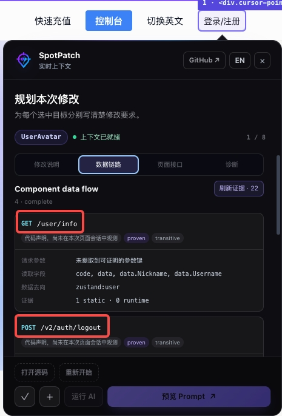
    </td>
    <td align="center" width="50%">
      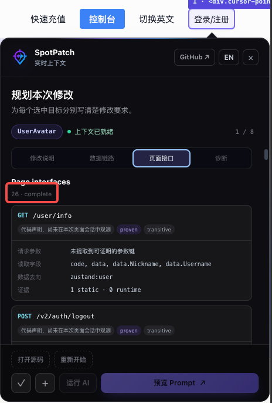
    </td>
  </tr>
  <tr>
    <td align="center"><strong>组件数据链路</strong><br /><sub>只展示能够证明属于当前组件的接口关系。</sub></td>
    <td align="center"><strong>页面接口</strong><br /><sub>同时查看页面范围与尚未归属组件的请求。</sub></td>
  </tr>
</table>

报告包含 method/path、参数键和位置、源码实际读取的响应字段，以及可证明的 React state、Zustand、storage 或 callback 数据去向。运行时观测只记录 dispatch：SpotPatch 不读取或 clone 响应体，也不保留 query 值。

当前适配器覆盖已支持的组件直接调用与 Service `fetch`、Axios、React Query/TanStack Query 回调形态，以及实验性的 tRPC 逻辑 procedure 链路。tRPC procedure 与物理 batch HTTP 请求保持为两层证据。

只有稳定组件、源码、callsite 与 invocation 证据一致时，Beta 才报告组件关联。范围外或存在歧义的流量保持 partial、unknown 或 unassigned，绝不因为 URL 相同或时间接近就猜测。Vite + React 18 是已验证基线；Next.js 公共预览复用同一证据模型，浏览器 Client Component 支持共享语法，RSC/Server Action/Route Handler 的服务端执行保持不可观测。React 19 只接受 compiler 登记的组件身份，不信任 Fiber 私有源码坐标。完整事实见 [Beta 实现状态与支持矩阵](./docs/技术方案/组件数据链路/13-Beta实现状态与使用手册.md)。

## 可选 AI Agent

首次接入可显式一次授权，之后无需再去开发终端输入 `yes`：在项目根执行对应的 `pnpm exec spotpatch-vite init`、`pnpm exec spotpatch-next init` 或 `pnpm exec spotpatch-astro init`；Astro 命令还会安全更新可支持的静态 `astro.config.*`。

已经接入的项目，三个适配器均支持 `bridge init`，不会重写接入配置。执行初始化即授权隔离快照修改及 SpotPatch 审计、校验后的合规回写；授权保存在当前用户私有目录、绑定规范化项目路径、不进入 Git，可在面板撤销。仍需启用 `externalAgent: true`，并满足本机 Codex 安装、登录和协议检查；无需附加授权参数或交互确认，旧参数仅作为兼容入口保留。

启用 `contextualAsk: true` 后，选中元素即可切换到只读问答。Managed Codex 提供独立的「模型」下拉框，列表来自本机 app-server，不硬编码模型名；提交和执行时校验选择，失效时明确报错，不静默退回默认模型。配置 Key 的模型仍通过服务端配置的执行器档案选择。Vite、Next.js、Astro 共用该实现，不修改全局 Codex 配置；模型可列出不等于所有模型的真实请求都已验证成功。

只有完整的 Provider 配置可用时 AI 才会启用。最小接入只需在 Git 忽略的 `.env.local` 中提供以下内容，不需要修改 `spotPatch()`：

```dotenv
SPOTPATCH_AI_BASE_URL=https://relay.example.com/v1
SPOTPATCH_AI_MODEL=provider-model-name
SPOTPATCH_AI_API_KEY=<your-key>

# 可选默认值：
# SPOTPATCH_AI_PROTOCOL=chat-completions
# SPOTPATCH_AI_AUTHENTICATION=bearer
```

`SPOTPATCH_AI_PROTOCOL` 支持 `chat-completions` 和 `responses`，认证方式支持 `bearer` 和 `x-api-key`。API Key 只保留在 Vite Node 进程中，绝不能使用 `VITE_` 前缀，也不能提交到 Git。

非秘密的 Provider 信息也可以写在 `vite.config.ts` 中：

```ts
spotPatch({
  ai: {
    baseURL: "https://relay.example.com/v1",
    model: "provider-model-name",
  },
});
```

### 一次受控执行是什么样的

下面展示默认的审阅路径：

<table>
  <tr>
    <td align="center" width="50%">
      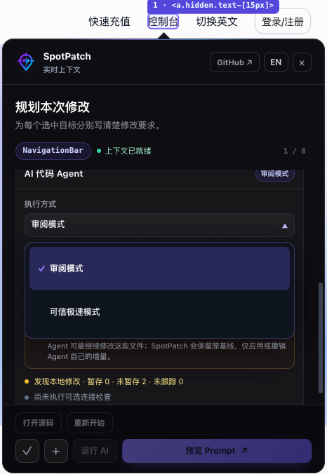
    </td>
    <td align="center" width="50%">
      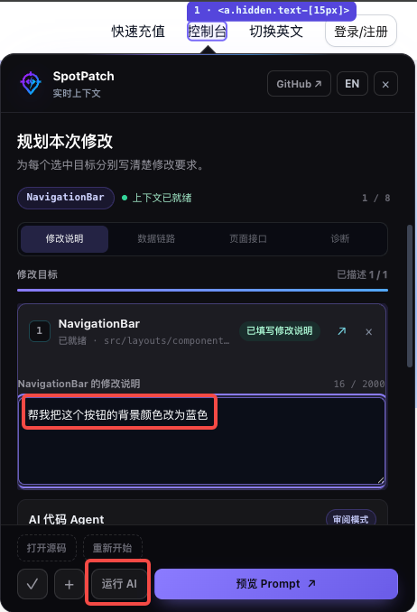
    </td>
  </tr>
  <tr>
    <td align="center"><strong>1. 选择执行边界</strong><br /><sub>默认审阅；可信极速需显式授权，并会跳过宿主项目检查。</sub></td>
    <td align="center"><strong>2. 写清当前修改</strong><br /><sub>每个选中目标都保持自己的要求和上下文。</sub></td>
  </tr>
  <tr>
    <td align="center">
      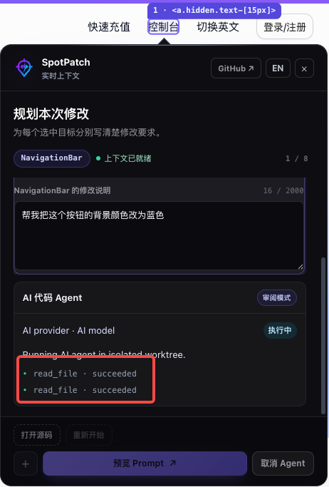
    </td>
    <td align="center">
      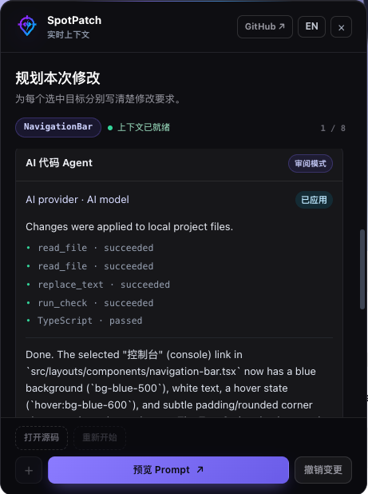
    </td>
  </tr>
  <tr>
    <td align="center"><strong>3. 查看受限执行</strong><br /><sub>修改先在隔离 Git worktree 中准备。</sub></td>
    <td align="center"><strong>4. 审阅、应用或撤销</strong><br /><sub>审阅模式显示检查与 Diff；应用后仍可安全撤销。</sub></td>
  </tr>
</table>

手工接入时，如果要开放 **可信极速**，SpotPatch 必须能够发现本地 TypeScript 项目检查。该检查用于保护审阅模式；可信极速任务本身会跳过宿主项目检查：

```ts
spotPatch({ trustedFastMode: true });
```

页面默认保持审阅模式。完成一次会话级授权后，可信极速会优先使用 SpotPatch 已定位的精确源码路径，跳过宿主项目检查，并立即应用隔离 Diff；它不承诺 TypeScript、lint、测试或构建通过。项目根、保护路径、原子 patch 校验、并发修改检查、Revert 和任意 Shell 禁令仍然有效。SpotPatch 不会替业务代码执行 commit、push、发包或部署。规范规则见 [AI Agent 执行与变更审阅](./docs/技术方案/16-AIAgent执行与变更审阅.md)和 [Provider 与凭据配置](./docs/技术方案/17-模型提供商与凭据配置.md)。

## 正式支持范围

| 项目     | 当前正式支持范围                   | 说明                                 |
| -------- | ---------------------------------- | ------------------------------------ |
| 框架     | React + Vite                       | `@spotpatch/vite` 是公共入口。       |
| Vite     | 5、6、7                            | 通过分版本兼容 fixture 验证。        |
| React    | 18.2–18.3                          | React 19 不在 Vite v1 的正式承诺内。 |
| 源码     | 默认处理 `src` 下的 `.jsx`、`.tsx` | 可配置 include 和 exclude。          |
| Node.js  | 20.19 或更高                       | CI 覆盖 Node 20 与 22。              |
| 浏览器   | Chromium                           | 自动化交互覆盖通过 Playwright 运行。 |
| 编辑器   | Cursor、VS Code                    | 默认自动识别，也可显式固定。         |
| 操作系统 | macOS、Windows、Linux              | CI 与编辑器启动逻辑按平台处理。      |

其他组合可能可以运行，但不属于当前公共承诺。唯一事实来源是[产品定义与边界](./docs/技术方案/01-产品定义与边界.md)。

> [!WARNING]
> React 19（包括 19.2.x）可以自行尝试，但不在 Vite 正式支持范围内。请先在自身项目验证元素选择、源码定位、HMR 和 AI 流程，再用于日常开发。

## Next.js 公共预览

> [!WARNING]
> `@spotpatch/next` 是 **0.x 公共预览版**，可以从 npm 安装；但 peer 范围只是候选测试范围，不能解释成完整兼容或生产支持声明。

该预览包含 CLI、Sidecar、Turbopack 与 webpack Loader、原子源码/data-flow 注册、pre-hydration recorder、共享数据链路面板、Runtime bootstrap 和生产 no-op 隔离。它已经通过锁定范围 POC 和一个私有 Next 16 App Router 宿主，但完整的 Next/React/router/Node/OS/浏览器支持矩阵仍未完成。

```bash
pnpm add -D @spotpatch/next
pnpm exec spotpatch-next init
pnpm exec spotpatch-next check
pnpm dev
```

`init` 会安全组合 `next.config` 并写入 `dataFlow: {}`、在正确的 `instrumentation-client` 文件中增加 `@spotpatch/next/client`，再把简单的 `next dev` 脚本改为 `spotpatch-next dev`。`check` 只读检查这些接入点。开发时必须通过 package script 启动；直接运行 `next dev` 不存在 SpotPatch Sidecar 生命周期所有者。

启动成功后，终端会打印一行以 `[spotpatch:next] ready` 开头的信息。打开其中的 loopback 地址，即可使用 **选择元素** / **Select element**。可选 AI 流程复用上文的服务端 `SPOTPATCH_AI_*` 变量，绝不能改成带 `NEXT_PUBLIC_` 前缀的变量。

生成文件示例、生产命令、已知限制和证据边界见完整的 [`@spotpatch/next` 公共预览指南](./packages/next/README.md#简体中文)。作出兼容性声明前，必须核对 [Next.js 适配计划](./docs/技术方案/Next适配/00-索引与架构摘要.md)和[剩余支持门禁](./docs/技术方案/Next适配/08-测试验收与实施计划.md)。

## Astro

新增 [`@spotpatch/astro`](./packages/astro/README.md#简体中文) 平级适配器，不需要安装 React。复用元素选择、DOM/CSS、双语多目标 Prompt、编辑器跳转和配置 Key 的 AI 审阅流程。版本化 fixture 覆盖 Astro 5.18.2 / 6.4.8 / 7.2.8；要求 Node.js 22.12+。

安装已发布的适配器，并把配置放入 Astro 的 `integrations`，不要放入 `vite.plugins`：

```bash
pnpm add -D @spotpatch/astro@latest
pnpm exec spotpatch-astro init
pnpm dev
```

`init` 会安全更新可支持的静态 `astro.config.*`，开启数据链路、Contextual Ask 与外部 Agent，在可发现 Astro checker 时开启可信极速，并创建 Managed Codex 私有项目授权。动态或含糊配置会无写入失败；`spotpatch-astro check` 提供只读核验。若第三方 registry 镜像尚未同步全部新发布的 SpotPatch 包，安装命令临时增加 `--registry=https://registry.npmjs.org`。

已接入 React 岛屿标记、原生/浏览器数据链路、只读 Ask、外部 Agent Inbox/托管控制及 Astro 专用可信快速检查，复用既有公共服务。这些功能按配置启用；服务端请求仍是静态证据，不把 inline 脚本改成模块，外部 Agent 实验模式仍保留原有成熟度限制。详见[功能对齐方案与本轮验收证据](./docs/技术方案/Astro适配/02-功能对齐实施方案.md)。

## 配置

Vite 公共入口导出 `spotPatch(options)`，重要默认值如下：

| 选项              | 默认值                       | 用途                                                      |
| ----------------- | ---------------------------- | --------------------------------------------------------- |
| `enabled`         | `true`                       | 需要时显式禁用插件。                                      |
| `include`         | `src` 内 JSX/TSX             | 允许注入源码标记的文件。                                  |
| `exclude`         | 依赖、测试、Story、生成目录  | 不允许转换的文件。                                        |
| `editor`          | `"auto"`                     | 自动识别 Cursor 或 VS Code。                              |
| `redact`          | `true`                       | 清洗采集到的浏览器上下文。                                |
| `shortcut`        | `"Mod+Shift+S"`              | 切换元素选择器。                                          |
| `allowLan`        | `false`                      | 默认只允许 loopback 本地协议。                            |
| `locale`          | `"auto"`                     | 自动解析 `en-US` 或 `zh-CN`。                             |
| `maxTargets`      | `8`                          | 一次任务默认最多选择的目标数。                            |
| `ai`              | `false` 或检测到完整环境配置 | 可选 Provider 和 Agent 配置。                             |
| `dataFlow`        | `false`                      | 可选 dispatch-only 数据链路 Beta。                        |
| `externalAgent`   | `false`                      | 可选外部 Agent Inbox 与主动连接 UI；当前为本地验证。      |
| `trustedFastMode` | `false`                      | 开放审阅/可信极速；发现的 TypeScript 检查只保护审阅模式。 |

完整类型和约束见 [`@spotpatch/vite`](./packages/vite/README.md)与[公共 API 规范](./docs/技术方案/03-公共API与数据模型.md)。

## 安全与生产隔离

- 浏览器只接收随机文件标识，不接收绝对源码路径。
- 源码读取仅限当前开发会话登记且位于项目 root 内的文件。
- 密码、Token、Cookie、Authorization、URL 凭据和内联数据会被清洗。
- Provider 凭据只保留在 Node 端，不注入客户端代码。
- 默认检查 loopback Host 与 Origin；显式开启 Vite LAN 会扩大信任边界。
- 生产构建验证 Runtime、源码标记、私有 API 和内部秘密零残留。
- SpotPatch 不会隐式执行 `stash`、`reset`、`commit`、`push`、发包或部署。

开启 LAN 或 AI 前，请阅读完整的[本地协议与安全规范](./docs/技术方案/09-本地协议与安全.md)。

## 包结构

业务应用通常只需要安装一个框架适配器。

| 包                                                                   | 职责                                       | 业务应用是否直接使用    |
| -------------------------------------------------------------------- | ------------------------------------------ | ----------------------- |
| [`@spotpatch/vite`](https://www.npmjs.com/package/@spotpatch/vite)   | 正式支持的 Vite 接入                       | **是**                  |
| [`@spotpatch/next`](./packages/next/README.md#简体中文)              | 可安装的 Next.js 0.x 公共预览              | 仅供预览，尚未正式支持  |
| [`@spotpatch/astro`](https://www.npmjs.com/package/@spotpatch/astro) | 已发布的原生 Astro 开发集成                | **是**，限文档验证矩阵  |
| `@spotpatch/compiler`                                                | 框架无关 JSX/TSX 标记编译器                | 适配器基础设施          |
| `@spotpatch/analyzer`                                                | Node-only 组件/请求语义分析器              | 适配器基础设施，仅 Node |
| `@spotpatch/dev-server`                                              | 本地会话、源码访问、编辑器与 Agent 编排    | 适配器基础设施，仅 Node |
| `@spotpatch/bridge`                                                  | 外部 Agent Inbox、CLI、事件泵和宿主适配器  | 适配器基础设施，仅 Node |
| `@spotpatch/runtime`                                                 | 浏览器选择器、采集器、工作台和 Prompt 生成 | 由适配器安装            |
| `@spotpatch/react-adapter`                                           | 隔离的 React/Fiber 兼容边界                | 由适配器安装            |
| `@spotpatch/agent`                                                   | Provider、受限工具、worktree 和检查引擎    | 由适配器安装，仅 Node   |
| `@spotpatch/shared`                                                  | 不可变模型、协议 Schema 和错误码           | 内部共享契约            |

某个包为了形成完整依赖图而公开发布，不代表它自动成为独立的用户接入入口。

## 仓库开发

```bash
pnpm install --frozen-lockfile
pnpm format:check
pnpm lint
pnpm typecheck
pnpm test:unit
pnpm build
pnpm test:compatibility
pnpm test:performance
pnpm test:e2e:chromium
pnpm test:production-leakage
pnpm package:validate
```

CI 质量矩阵还会在 Ubuntu、macOS、Windows 和声明的 Node 版本上运行。Next.js 实验具有独立的 POC 与私有真实宿主命令；这些局部通过结果不能绕过文档中的 Next 正式支持门禁。

## 文档

- [文档索引](./docs/技术方案/00-索引与导航.md)
- [产品定义与支持边界](./docs/技术方案/01-产品定义与边界.md)
- [总体架构与包职责](./docs/技术方案/02-总体架构与技术栈.md)
- [公共 API 与默认值](./docs/技术方案/03-公共API与数据模型.md)
- [安全模型](./docs/技术方案/09-本地协议与安全.md)
- [组件数据链路 Beta 状态](./docs/技术方案/组件数据链路/13-Beta实现状态与使用手册.md)
- [外部 Agent 交接状态](./docs/技术方案/外部Agent连接/00-索引与决策摘要.md)
- [测试与验收](./docs/技术方案/12-测试与验收.md)
- [Next.js 适配状态](./docs/技术方案/Next适配/00-索引与架构摘要.md)

## 反馈与支持

如果 SpotPatch 缩短了你的页面修改链路，欢迎给[仓库点一个 Star](https://github.com/huanglvjing/spotpatch)。遇到尚未支持的调用形态或源码定位边界时，请提交包含最小复现与框架版本的 [Issue](https://github.com/huanglvjing/spotpatch/issues)。

## 许可证

[MIT](./LICENSE) © SpotPatch contributors.
