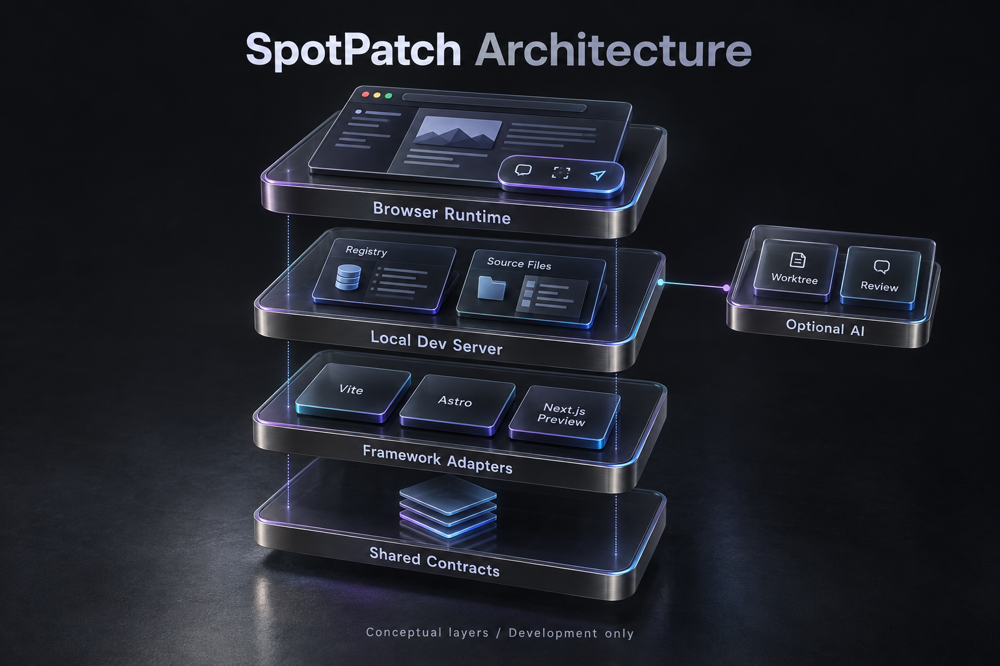
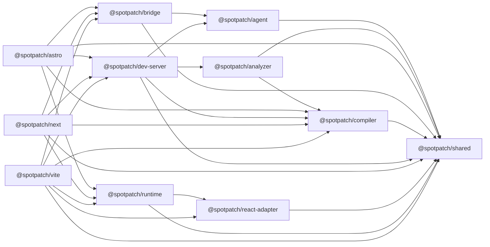
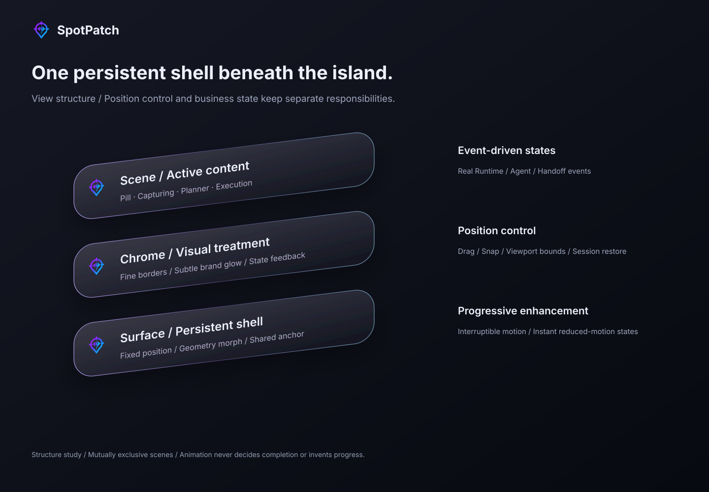

# SpotPatch architecture

Based on repository source and package manifests checked on 2026-09-09. [简体中文](./architecture.zh-CN.md).

The illustration groups responsibilities. The graph below represents direct internal dependencies declared in package.json.

## Three entries, one shared product core

Vite, Astro and Next are peer adapters, not wrappers around each other. Vite owns plugin transforms and middleware; Astro owns its integration, native templates and navigation lifecycle; Next owns loaders, client entry, CLI and Sidecar. Runtime implements shared UI, while source semantics and support matrices remain framework-specific.

## Source and runtime responsibilities

| Package                                      | Responsibility                                                                                |
| -------------------------------------------- | --------------------------------------------------------------------------------------------- |
| [`compiler`](../packages/compiler)           | JSX/TSX source marking and transforms                                                         |
| [`analyzer`](../packages/analyzer)           | Node-only TypeScript semantic analysis for data flow                                          |
| [`dev-server`](../packages/dev-server)       | Sessions, registry, source reads, editor access and task coordination                         |
| [`runtime`](../packages/runtime)             | Browser selection, DOM/CSS, prompts, Shadow DOM workspace and separate extensions             |
| [`react-adapter`](../packages/react-adapter) | React/Fiber component semantics and degradation; not a replacement for source-marker evidence |
| [`agent`](../packages/agent)                 | Configured-provider read-only/change executors, bounded tools, worktrees and checks           |
| [`bridge`](../packages/bridge)               | MCP Inbox, CLI, external hosts and Managed Codex lifecycle                                    |
| [`shared`](../packages/shared)               | Models, protocol schemas and error codes; no dependency on another SpotPatch package          |

Astro parses `.astro` within its own adapter using compiler-rs; the shared compiler does not own all `.astro` syntax. Node-only analysis, credentials, Git and filesystem capabilities must stay out of browser bundles.

## Direct package dependencies

Arrows mean “depends on”. Only internal dependencies are shown, not initialization order, execution order or browser bundle contents.

## Floating island and browser extensions

Runtime core, React compatibility, data-flow prelude/panel, external-agent panel, Ask panel and motion have separate entries or artifacts. The entire runtime package is not unconditionally injected. The positioning controller owns anchors, dragging and viewport bounds; business events drive scenes. GSAP belongs to the separate motion extension for interruptible visual transitions. Core UI uses native DOM and Shadow DOM without creating another React application root.

Selection and prompts do not require a model. Ask uses single-turn read-only tools and server-validated citations; conversion to a change creates a draft only. Built-in Change uses isolated worktrees and review/apply. Managed Codex follows a separate bridge lifecycle and grant contract; it must not be conflated with the older attached-connector path.

## Delivery and support boundaries

Vite and Astro inline shared UI into their published artifacts; Next loads public Runtime entries. Editing Runtime source does not update old npm artifacts. Shared delivery changes must include all three adapters in the release plan and pass artifact-parity checks.

Vite + React is the supported baseline; Astro is limited to its documented matrix; Next is a 0.x public preview. Data flow is Beta, the Ask topic remains internal, and external agents are locally validated. Dedicated browser visual/performance motion gates still have pending items. This guide does not promote maturity or treat artwork as test evidence.

## Source references

- [Runtime entries](../packages/runtime/tsup.config.ts)
- [Vite runtime artifacts](../packages/vite/tsup.config.ts)
- [Astro integration](../packages/astro/src/initializer.ts)
- [Next initialization](../packages/next/src/initializer.ts)
- [Artifact parity gate](../tests/production/framework-ui-parity.test.ts)
- [Technical specification index](./技术方案/00-索引与导航.md)
