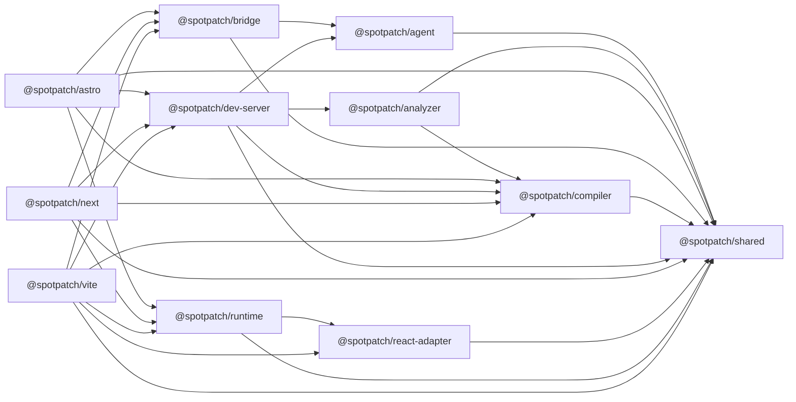
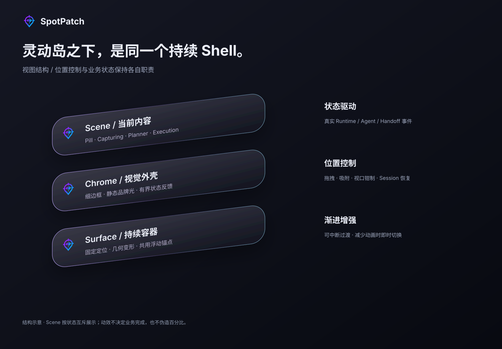

# SpotPatch 架构导读

本文基于 2026-09-09 的仓库源码与包清单。English: [Architecture](./architecture.md)。

图片仅表示职责分层；下方依赖图才表示 package.json 中的直接内部依赖。

## 三个入口，一个共享产品内核

Vite、Astro、Next 是平级适配器，不互相包装。Vite 负责插件转换与中间件；Astro 负责 Integration、原生模板和导航生命周期；Next 负责 Loader、客户端入口、CLI 与 Sidecar。相同 UI 由 Runtime 实现，但框架的源码语义和支持矩阵不同。

## 源码与运行分层

| 包                                           | 职责                                                       |
| -------------------------------------------- | ---------------------------------------------------------- |
| [`compiler`](../packages/compiler)           | JSX/TSX 标记与转换                                         |
| [`analyzer`](../packages/analyzer)           | Node-only TypeScript 语义分析，服务于数据链路              |
| [`dev-server`](../packages/dev-server)       | 会话、registry、源码读取、编辑器及任务编排                 |
| [`runtime`](../packages/runtime)             | 浏览器选择、DOM/CSS、Prompt、Shadow DOM 工作台与独立扩展   |
| [`react-adapter`](../packages/react-adapter) | React/Fiber 组件语义与降级，不能替代 AST 源码证据          |
| [`agent`](../packages/agent)                 | 配置 Provider 的只读/修改执行器、受限工具、worktree 和检查 |
| [`bridge`](../packages/bridge)               | MCP Inbox、CLI、外部宿主及 Managed Codex 生命周期          |
| [`shared`](../packages/shared)               | 模型、协议 Schema 与错误码；不依赖其他 SpotPatch 包        |

Astro 的 `.astro` 解析在其自身适配器使用 compiler-rs；共享 compiler 并不负责全部 `.astro` 语法。Node-only 分析、凭据、Git 和文件系统能力不得进入浏览器包。

## 直接包依赖

箭头表示“依赖于”，只包含内部 dependencies，不是初始化或执行顺序，也不是浏览器 bundle 的内容清单。

## 灵动岛与浏览器扩展

Runtime 核心、React 兼容层、数据链路 prelude / panel、外部 Agent panel、Ask panel 与 motion 都有独立入口或产物。不是“整个 runtime 包都无条件进入页面”。浮动位置控制器拥有锚点、拖拽和视口约束，业务事件驱动 Scene；GSAP 只在独立 motion 扩展中负责可中断视觉过渡。核心 UI 使用原生 DOM 与 Shadow DOM，不创建第二个 React 应用根。

选择和 Prompt 不依赖模型。Ask 只有单轮只读工具与经服务端校验的引用，转修改只创建草稿。内置 Change 使用隔离 worktree 和审阅/应用流程；Managed Codex 由 bridge 的单独生命周期与授权契约约束，不能与旧 attached connector 混为一条安全路径。

## 发布与支持边界

Vite 与 Astro 将共享 UI 内联到各自发布物中，Next 客户端加载公共 Runtime 入口。更新 Runtime 源码不会自动改变旧 npm 包；共享交付改动需更新三个适配器的发布计划并通过产物一致性检查。

Vite + React 为正式基线；Astro 仅覆盖其文档矩阵；Next 为 0.x 公共预览。数据链路为 Beta，Ask 专题仍标记 internal，外部 Agent 为 local-validation。独立 motion 真实浏览器视觉/性能门禁尚有待完成项。本导读不提升成熟度，也不把概念图片当作测试证据。

## 源码核对入口

- [Runtime entries](../packages/runtime/tsup.config.ts)
- [Vite runtime artifacts](../packages/vite/tsup.config.ts)
- [Astro integration](../packages/astro/src/initializer.ts)
- [Next initialization](../packages/next/src/initializer.ts)
- [Artifact parity gate](../tests/production/framework-ui-parity.test.ts)
- [Technical specification index](./技术方案/00-索引与导航.md)
