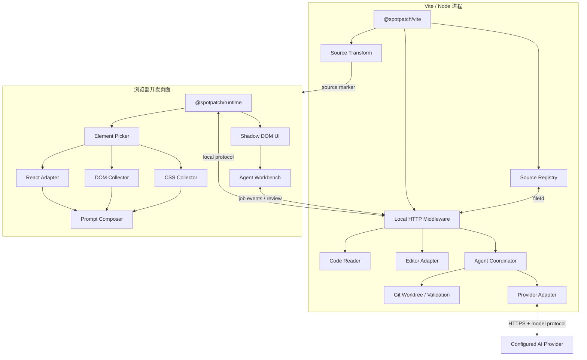

# 总体架构与技术栈

本架构以 v1 核心与 v1.1 可选 AI 扩展的产品定义和支持边界为约束 (见 doc-id:01-product-boundary)。

## 核心设计原则

### 源码定位与组件语义分离

一次选择同时产生两类事实：

- **元素源码位置**：这个 DOM 对应哪个 JSX opening element。
- **React 组件语义**：这个 DOM 由哪个业务组件负责，组件调用链是什么。

前者由 AST 标记提供，后者由 React Adapter 提供。二者不能混为一个字段。

数据表达以公共模型为准 (见 doc-id:03-public-api-models)，两类事实的解析和置信度判定以源码解析规范为准 (见 doc-id:06-source-resolution)。

### AST 为主，Fiber 为辅

- AST 注入使用 Vite 的公开 transform 钩子，是 v1 的稳定主链路。
- Fiber 是 React 私有实现，只放在隔离的兼容层中。
- Fiber 失效不能让元素选择、DOM/CSS、源码标记和复制功能失效。
- 所有 Fiber 结果必须带来源和置信度，不允许静默猜测。

AST 规则由 Vite 插件规范定义 (见 doc-id:04-vite-plugin)，Fiber 的兼容边界和降级由源码解析规范定义 (见 doc-id:06-source-resolution)。

### 跨模块健壮性归属

原规格书的“开发工具不得破坏业务页面”原则已按责任模块归一：AST fail-open (见 doc-id:04-vite-plugin)、React Adapter 降级 (见 doc-id:06-source-resolution)、资源释放与 HMR 单例 (见 doc-id:05-runtime-lifecycle)、Shadow DOM 隔离 (见 doc-id:10-ui-diagnostics)。

## 总体架构



图中的 source marker 与 fileId 由 Vite 插件规范定义 (见 doc-id:04-vite-plugin)，local protocol 由本地协议与安全规范定义 (见 doc-id:09-local-protocol-security)。Agent 工具与 worktree 的执行边界见 Agent 规范 (见 doc-id:16-ai-agent-execution)，Provider Adapter 的 URL、凭据和兼容契约见模型提供商规范 (见 doc-id:17-model-provider-credentials)。AI 未启用时，`AG`、`WT`、`PA` 和相关路由均不得初始化。

### 依赖方向

```text
shared  ←  vite
shared  ←  react-adapter  ←  runtime
shared  ←  runtime
shared  ←  agent  ←  vite

禁止：
vite    → runtime 内部模块
runtime → vite 内部模块
agent   → runtime 内部模块
shared  → 任何其他包
```

客户端与服务端只能通过 `shared/protocol` 中定义的协议通信，不共享可执行内部模块。`agent` 是纯 Node 包；provider 凭据、文件系统、Git 和子进程实现不得进入 Runtime bundle。

浏览器发布产物保持两个内部边界：核心 `runtime-client` 包含选择、采集、工作台、双语消息和 Prompt；React/Fiber/Bippy 只进入独立 `runtime-react-adapter`。Vite 注入插件仅在核心虚拟模块导入 `@spotpatch/react-adapter` 时把它解析到私有 adapter 虚拟模块，不得劫持宿主业务代码中的同名导入。两个产物均只在开发服务器中提供，生产构建不注入；包体分别核算，不用删除功能或调高阈值掩盖核心 Runtime 超限。该边界由 ADR-016 约束 (见 doc-id:15-risks-adr)，并由包体门禁验证。

协议的唯一规范位于安全与协议文档 (见 doc-id:09-local-protocol-security)。

## 技术栈

### 运行与构建

| 类别 | 选择 | 用途 | 决策原因 |
| --- | --- | --- | --- |
| 语言 | TypeScript strict | 全部产品代码 | 保证协议、状态和错误路径可检查 |
| 包管理 | pnpm workspace | Monorepo | workspace 原生、依赖去重、发布清晰 |
| 包构建 | tsup | ESM/CJS 和类型声明 | 配置少，适合小型 TS 包 |
| 插件平台 | Vite Plugin API | transform、虚拟模块、中间件 | 公开稳定接口 |
| AST | `oxc-parser` | 解析 JSX/TSX | 性能好；同类 Source Inspector 已验证 |
| 代码修改 | `magic-string` | 精准注入和 source map | 不重新打印整个 AST，减少格式扰动 |
| 文件过滤 | `@rollup/pluginutils` | createFilter | 与 Vite/Rollup 生态一致 |
| 协议校验 | Zod | HTTP 边界运行时校验 | TypeScript 类型不能校验外部输入 |
| 编辑器 | `launch-editor` | 以受控枚举自动识别或显式打开 Cursor/VS Code | 已被多个开发工具采用，且支持精确行列参数 |
| React 兼容 | Bippy adapter | DOM → Fiber、组件栈 | 避免在业务模块散落 React 私有字段 |
| Runtime UI | 原生 DOM + Shadow DOM | 工具栏、面板、高亮层 | 无 React 根冲突，无 UI 框架体积 |
| AI 传输 | Node 原生 `fetch` + SSE parser | 中转站请求、流式事件、取消 | 凭据留在 Node；协议事件先校验后归一化 |
| 本地隔离 | Git worktree + 固定 argv `spawn` | 变更沙箱、检查、应用与撤销 | 不向模型开放 shell；便于 Diff 审阅与冲突检测 |

### 质量工具

| 类别 | 选择 | 要求 |
| --- | --- | --- |
| 单元测试 | Vitest | transform、registry、sanitizer、prompt、协议 |
| 浏览器 E2E | Playwright | Chromium 主验收，Firefox/WebKit 作为兼容观察 |
| 静态检查 | ESLint flat config | TypeScript、import 边界、无浮动 Promise |
| 格式化 | Prettier | 与 ESLint 格式规则解耦 |
| 包验证 | publint + Are the Types Wrong | exports、类型与模块格式 |
| 版本发布 | Changesets | 多包版本和 changelog |

### 不引入的依赖

- 不引入 React 作为 Runtime UI 框架。
- 不引入 Redux、Zustand 等状态库；状态机规模不足以证明其必要性。
- 不引入 Axios；浏览器和 Node 均使用各自运行时的原生 `fetch`。
- 不引入 DOMPurify；采集内容只通过 `textContent` 展示，不使用 `innerHTML`。
- 不引入 selector 生成库；v1 使用受控的最小 selector 算法。
- 不引入 Express；直接注册 Vite Connect middleware。
- 不引入通用命令执行封装；打开编辑器、受控 Git 子命令和预配置检查分别经过窄接口 adapter。编辑器只接受 `auto | cursor | vscode` 公共枚举并映射到固定命令，不接收浏览器命令；其他子进程使用固定 `command + args` 且 `shell: false`。

这不是为了追求依赖数量最少，而是避免两个库承担同一职责。

## Monorepo 源码结构

```text
spotpatch/
├─ .gitattributes
├─ .changeset/
├─ .github/
│  ├─ actions/
│  │  └─ setup/
│  │     └─ action.yml
│  └─ workflows/
│     ├─ ci.yml
│     └─ release.yml
├─ docs/
│  ├─ architecture.md
│  ├─ security.md
│  ├─ compatibility.md
│  └─ contributing.md
├─ packages/
│  ├─ shared/
│  │  ├─ src/
│  │  │  ├─ index.ts
│  │  │  ├─ model/
│  │  │  │  ├─ annotation.ts
│  │  │  │  ├─ source-ref.ts
│  │  │  │  └─ style-context.ts
│  │  │  ├─ protocol/
│  │  │  │  ├─ endpoints.ts
│  │  │  │  ├─ requests.ts
│  │  │  │  └─ responses.ts
│  │  │  └─ errors/
│  │  │     └─ error-code.ts
│  │  ├─ package.json
│  │  └─ tsconfig.json
│  ├─ react-adapter/
│  │  ├─ src/
│  │  │  ├─ index.ts
│  │  │  ├─ adapter.ts
│  │  │  ├─ bippy-adapter.ts
│  │  │  ├─ display-name.ts
│  │  │  ├─ source-normalizer.ts
│  │  │  └─ unsupported-adapter.ts
│  │  ├─ package.json
│  │  └─ tsconfig.json
│  ├─ runtime/
│  │  ├─ src/
│  │  │  ├─ index.ts
│  │  │  ├─ annotation/
│  │  │  │  └─ create-annotation.ts
│  │  │  ├─ controller/
│  │  │  │  ├─ bootstrap.ts
│  │  │  │  ├─ runtime-config.ts
│  │  │  │  ├─ runtime-controller.ts
│  │  │  │  └─ agent-workflow.ts
│  │  │  ├─ state/
│  │  │  │  └─ runtime-state.ts
│  │  │  ├─ picker/
│  │  │  │  ├─ hit-test.ts
│  │  │  │  └─ geometry.ts
│  │  │  ├─ collectors/
│  │  │  │  ├─ dom-collector.ts
│  │  │  │  ├─ css-collector.ts
│  │  │  │  └─ computed-style-properties.ts
│  │  │  ├─ security/
│  │  │  │  └─ content-sanitizer.ts
│  │  │  ├─ api/
│  │  │  │  ├─ runtime-api.ts
│  │  │  │  └─ agent-response-validation.ts
│  │  │  ├─ prompt/
│  │  │  │  └─ prompt-composer.ts
│  │  │  ├─ source/
│  │  │  │  └─ source-resolver.ts
│  │  │  ├─ keyboard/
│  │  │  │  └─ shortcut.ts
│  │  │  └─ ui/
│  │  │     ├─ runtime-view.ts
│  │  │     ├─ agent-panel.ts
│  │  │     ├─ localization.ts
│  │  │     ├─ brand-mark.ts
│  │  │     ├─ dialog-placement.ts
│  │  │     ├─ selection-summary.ts
│  │  │     ├─ dom.ts
│  │  │     └─ ui-constants.ts
│  │  ├─ package.json
│  │  └─ tsconfig.json
│  ├─ agent/
│  │  ├─ src/
│  │  │  ├─ index.ts
│  │  │  ├─ engine/
│  │  │  │  ├─ agent-engine.ts
│  │  │  │  └─ job-store.ts
│  │  │  ├─ provider/
│  │  │  │  ├─ provider-adapter.ts
│  │  │  │  ├─ responses-adapter.ts
│  │  │  │  └─ chat-completions-adapter.ts
│  │  │  ├─ tools/
│  │  │  ├─ worktree/
│  │  │  ├─ validation/
│  │  │  └─ events/
│  │  ├─ package.json
│  │  └─ tsconfig.json
│  └─ vite/
│     ├─ src/
│     │  ├─ index.ts
│     │  ├─ runtime-client.ts
│     │  ├─ runtime-react-adapter.ts
│     │  ├─ options.ts
│     │  ├─ plugin.ts
│     │  ├─ constants.ts
│     │  ├─ transform/
│     │  │  ├─ transform-plugin.ts
│     │  │  ├─ inject-source-markers.ts
│     │  │  ├─ intrinsic-element.ts
│     │  │  └─ source-map.ts
│     │  ├─ registry/
│     │  │  ├─ source-registry.ts
│     │  │  └─ source-id.ts
│     │  ├─ server/
│     │  │  ├─ server-plugin.ts
│     │  │  ├─ router.ts
│     │  │  ├─ request-guard.ts
│     │  │  ├─ source-context-handler.ts
│     │  │  ├─ open-editor-handler.ts
│     │  │  └─ agent-handler.ts
│     │  ├─ source/
│     │  │  ├─ safe-path.ts
│     │  │  ├─ code-reader.ts
│     │  │  └─ component-boundary.ts
│     │  └─ runtime/
│     │     └─ runtime-injection-plugin.ts
│     ├─ package.json
│     ├─ tsconfig.json
│     ├─ tsup.runtime-client.config.ts
│     └─ tsup.runtime-react-adapter.config.ts
├─ playgrounds/
│  ├─ minimal-react-18/
│  └─ spotpatch-fixtures/
├─ tests/
│  ├─ e2e/
│  │  ├─ selection.spec.ts
│  │  ├─ source-resolution.spec.ts
│  │  ├─ portal.spec.ts
│  │  ├─ privacy.spec.ts
│  │  └─ production-leakage.spec.ts
│  └─ fixtures/
│     ├─ jsx-cases/
│     └─ css-cases/
├─ eslint.config.js
├─ playwright.config.ts
├─ prettier.config.js
├─ pnpm-workspace.yaml
├─ tsconfig.base.json
├─ tsup.config.ts
└─ vitest.workspace.ts
```

目录和模块的强制编码规则集中定义在编码规范中 (见 doc-id:11-coding-standards)。

### 发布策略

用户只需要显式安装：

```bash
pnpm add -D @spotpatch/vite
```

`@spotpatch/runtime`、`@spotpatch/react-adapter`、`@spotpatch/shared` 和可选 Node-only `@spotpatch/agent` 作为内部依赖随插件安装。公共文档不要求用户直接安装或导入内部包；`ai: false` 时 agent 模块不得产生网络、文件或子进程副作用。

五个公共包必须作为一个可闭合的版本图发布：入口包引用的任何 `workspace:` 依赖都必须出现在 npm 发布集合中。首次发布时，所有版本仍为 `0.0.0` 的公共包必须同时出现在 pending Changeset；不得只发布入口包而留下 npm 无法解析的内部依赖。包级 `README.md`、仓库地址、源码目录、问题地址、公开访问级别和 npm registry 均由仓库结构测试校验。

CI 和 Release 共用 `.github/actions/setup/action.yml`，固定执行顺序为：

1. `pnpm/action-setup` 从根 `packageManager` 字段安装唯一声明的 pnpm 版本。
2. `actions/setup-node` 配置 Node 与 pnpm store 缓存。
3. `pnpm install --frozen-lockfile` 恢复依赖。

工作流不得在 pnpm 安装前启用 `cache: pnpm`，也不得在多个 workflow 中复制并漂移启动逻辑。Changesets 在 `main` 上先创建 Version Packages PR；版本 PR 合并后才运行发布。首发前必须由维护者在 npm 创建或取得 `@spotpatch` scope 权限，并在 GitHub Actions 配置最小权限的 `NPM_TOKEN`。发布产物启用 npm provenance；包首次存在后应为每个包配置 GitHub Actions trusted publisher，再移除长期 npm token。令牌、scope 所有权和仓库设置属于外部发布前置条件，不得由代码或 CI 假定已经存在。

此发布策略受 ADR-007 约束 (见 doc-id:15-risks-adr)。
