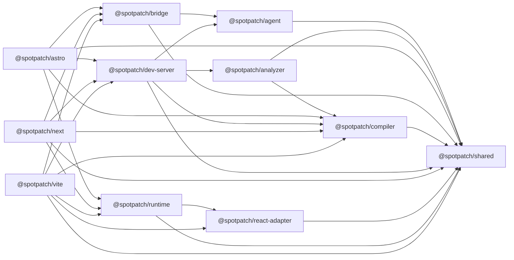

# 总体架构与技术栈

## Astro 平级适配补充（2026-09-05）

`packages/astro` 与 vite/next 平级，不依赖其他适配器。Astro Integration 管理开发期 hook，官方 compiler-rs 仅在该包中解析 `.astro`，dev-server 复用会话/registry/源码/Agent 服务，runtime 复用选择与工作台。无 React 时使用原生 marker，不伪造 Fiber 语义。Node 入口与 bundled 浏览器 client 分离。协议新增 astro framework、astro-host origin、astro language；细节见 [Astro 设计](./Astro适配/00-方案与验收.md)。

本架构以 v1 核心与 v1.1 可选 AI 扩展的产品定义和支持边界为约束 (见 doc-id:01-product-boundary)。

## 核心设计原则

### 源码定位与组件语义分离

一次选择同时产生两类事实：

- **元素源码位置**：这个 DOM 对应哪个 JSX opening element。
- **React 组件语义**：这个 DOM 由哪个业务组件负责，组件调用链是什么。

前者由 AST 标记提供，后者由 React Adapter 提供。二者不能混为一个字段。

数据表达以公共模型为准 (见 doc-id:03-public-api-models)，两类事实的解析和置信度判定以源码解析规范为准 (见 doc-id:06-source-resolution)。

### AST 为主，Fiber 为辅

- AST 注入使用 Vite 的公开 transform 钩子，是 v1 的稳定主链路。
- Fiber 是 React 私有实现，只放在隔离的兼容层中。
- Fiber 失效不能让元素选择、DOM/CSS、源码标记和复制功能失效。
- 所有 Fiber 结果必须带来源和置信度，不允许静默猜测。

AST 规则由 Vite 插件规范定义 (见 doc-id:04-vite-plugin)，Fiber 的兼容边界和降级由源码解析规范定义 (见 doc-id:06-source-resolution)。

### 跨模块健壮性归属

原规格书的“开发工具不得破坏业务页面”原则已按责任模块归一：AST fail-open (见 doc-id:04-vite-plugin)、React Adapter 降级 (见 doc-id:06-source-resolution)、资源释放与 HMR 单例 (见 doc-id:05-runtime-lifecycle)、Shadow DOM 隔离 (见 doc-id:10-ui-diagnostics)。

## 总体架构

当前架构有三个平级入口：`vite`、`astro`、`next`，不是 Vite 包内部承载所有能力。中文与英文导读分别见 [architecture.zh-CN.md](../architecture.zh-CN.md)、[architecture.md](../architecture.md)。


该图是职责示意，不是依赖箭头或执行顺序。源码入口拥有以下责任：

- 框架适配器：配置/CLI、框架转换 hook、开发服务器生命周期、浏览器入口与生产隔离；三者不互相依赖。
- `compiler`：共享 JSX/TSX 标记与转换；Astro 原生 `.astro` 由 Astro 包内 compiler-rs 解析。
- `dev-server`：本地会话、registry、授权源码访问、编辑器和任务编排；`analyzer` 提供 Node-only 语义分析。
- `runtime`：原生 DOM / Shadow DOM 选择与工作台；`react-adapter` 隔离 React/Fiber 兼容。
- `agent`：配置 Provider 的只读/修改执行器、受限工具与 worktree；`bridge`：MCP/CLI、宿主连接与 Managed Codex 生命周期。
- `shared`：模型、Schema 与错误码；浏览器/服务端通过协议交互，不共享 Node 执行能力。

### 当前直接包依赖

以下按 2026-09-09 `packages/*/package.json` 的内部 `dependencies` 核对。箭头表示“依赖于”，不表示按需模块一定初始化或进入浏览器 bundle。



禁止跨包深层导入；`shared` 不依赖其他 SpotPatch 包。Provider 凭据、Git、文件系统和 Node-only analyzer 不得进入 Runtime 浏览器产物。

### 浏览器发布边界

核心 Runtime、React 兼容层、data-flow prelude、data-flow panel、external-handoff panel、contextual-ask panel 与 motion 具有独立入口/构建边界，不能再简化为“只有两个浏览器产物”。Vite 显式构建这些浏览器入口；Astro 按功能装配相应 client；Next client 消费公共 Runtime 入口。功能是否装配以当前配置与开发模式为准，生产必须隔离。

`runtime-motion` 单独承载 GSAP Core 与持续 Shell 动效。位置控制器拥有几何与锚点，动画只能投影视图状态，不得改变权限或决定业务终态。相同 UI 的发布一致性由 [23-跨框架Runtime与发布一致性方案](./23-跨框架Runtime与发布一致性方案.md) 和 `tests/production/framework-ui-parity.test.ts` 约束。

## 技术栈

### 运行与构建

| 类别 | 选择 | 用途 | 决策原因 |
| --- | --- | --- | --- |
| 语言 | TypeScript strict | 全部产品代码 | 保证协议、状态和错误路径可检查 |
| 包管理 | pnpm workspace | Monorepo | workspace 原生、依赖去重、发布清晰 |
| 包构建 | tsup | ESM/CJS 和类型声明 | 配置少，适合小型 TS 包 |
| 插件平台 | Vite Plugin API | transform、虚拟模块、中间件 | 公开稳定接口 |
| AST | `oxc-parser` | 解析 JSX/TSX | 性能好；同类 Source Inspector 已验证 |
| 代码修改 | `magic-string` | 精准注入和 source map | 不重新打印整个 AST，减少格式扰动 |
| 文件过滤 | `@rollup/pluginutils` | createFilter | 与 Vite/Rollup 生态一致 |
| 协议校验 | Zod | HTTP 边界运行时校验 | TypeScript 类型不能校验外部输入 |
| 编辑器 | Node `spawn` 窄适配器 + `launch-editor` 后备 | 识别集成终端并以受控 CLI 打开 Cursor/VS Code；未知环境后备探测 | 固定参数、精确行列、允许编辑器按绝对路径选择匹配工作区 |
| React 兼容 | Bippy adapter | DOM → Fiber、组件栈 | 避免在业务模块散落 React 私有字段 |
| Runtime UI | 原生 DOM + Shadow DOM | 工具栏、面板、高亮层 | 无 React 根冲突，无 UI 框架体积 |
| Motion | 独立 GSAP Core browser extension | 持续 Shell 可中断几何过渡 | 不复制业务状态、不决定任务完成 |
| AI 传输 | Node 原生 `fetch` + SSE parser | 中转站请求、流式事件、取消 | 凭据留在 Node；协议事件先校验后归一化 |
| 本地隔离 | Git worktree + 固定 argv `spawn` | 健康检查、clean 或显式同意的本地快照、变更沙箱、检查、应用与撤销 | 不向模型开放 shell；业务 index 不变；只应用/撤销 Agent 增量 |

### 质量工具

| 类别 | 选择 | 要求 |
| --- | --- | --- |
| 单元测试 | Vitest | transform、registry、sanitizer、prompt、协议 |
| 浏览器 E2E | Playwright | Chromium 主验收，Firefox/WebKit 作为兼容观察 |
| 静态检查 | ESLint flat config | TypeScript、import 边界、无浮动 Promise |
| 格式化 | Prettier | 与 ESLint 格式规则解耦 |
| 包验证 | publint + Are the Types Wrong | exports、类型与模块格式 |
| 版本发布 | Changesets | 多包版本和 changelog |

### 不引入的依赖

- 不引入 React 作为 Runtime UI 框架。
- 不引入 Redux、Zustand 等状态库；状态机规模不足以证明其必要性。
- 不引入 Axios；浏览器和 Node 均使用各自运行时的原生 `fetch`。
- 不引入 DOMPurify；采集内容只通过 `textContent` 展示，不使用 `innerHTML`。
- 不引入 selector 生成库；v1 使用受控的最小 selector 算法。
- 不引入 Express；直接注册 Vite Connect middleware。
- 不引入通用命令执行封装；打开编辑器、受控 Git 子命令和预配置检查分别经过窄接口 adapter。编辑器只接受 `auto | cursor | vscode` 公共枚举并映射到固定命令；Cursor/VS Code 只使用 `--goto <absolute-file>:<line>:<column>`，不强制 `--reuse-window` 或 `--new-window`，让编辑器根据文件所属工作区路由。浏览器不能提交命令或参数；其他子进程使用固定 `command + args` 且 `shell: false`。

这不是为了追求依赖数量最少，而是避免两个库承担同一职责。

## Monorepo 源码结构

以下是当前目录的职责级摘要，不再列出已经迁移或不存在的旧 Vite 私有模块路径：

```text
spotpatch/
├── packages/
│   ├── vite/             # Vite 入口、CLI、转换与 Runtime 构建
│   ├── astro/            # Astro Integration、原生解析、client
│   ├── next/             # Next 预览、Loader、client、Sidecar
│   ├── compiler/         # 共享 JSX/TSX 编译基础设施
│   ├── analyzer/         # Node-only TypeScript 语义分析
│   ├── dev-server/       # 会话、registry、源码服务、任务编排
│   ├── runtime/          # 浏览器核心、UI、独立功能扩展
│   ├── react-adapter/    # React/Fiber 兼容与降级
│   ├── agent/            # Provider、受限执行、worktree、检查
│   ├── bridge/           # MCP、CLI、宿主与 Managed Codex
│   └── shared/           # 公共模型与协议
├── playgrounds/          # React、Vite 与 Astro 开发/兼容 fixture
├── experiments/          # Next 与 Ask 专项实验/真实宿主验证
├── tests/                # 单元、浏览器、生产隔离和性能门禁
├── scripts/              # 开发编排、fixture 与包验证
├── docs/                 # 双语架构导读、规范、验收与素材
├── skills/spotpatch/     # 项目提供的集成技能
└── .github/              # CI、发布与共享 setup action
```

目录和模块的强制编码规则见 [编码规范](./11-编码规范.md)。

### Next.js 多适配器架构

当前 Monorepo 已抽取框架无关的 `@spotpatch/compiler` 与 `@spotpatch/dev-server`，并让 `@spotpatch/vite` 和 0.x 公共预览 `@spotpatch/next` 成为平级适配器。Next.js 能力不复制 Vite 包，也不另建仓库；包图、依赖方向、迁移证据和禁止依赖只有一个规范位置 (见 doc-id:next-02-package-architecture)。

公共内核抽取已经完成；后续变更仍不得跨包深层导入或复制转换/服务逻辑。任何所有权迁移必须在同一变更中更新规范、实现、测试和两个消费方，并保证 Vite 零回归。

### 发布策略

用户只需要显式安装：

```bash
pnpm add -D @spotpatch/vite
```

`@spotpatch/runtime`、`@spotpatch/react-adapter`、`@spotpatch/shared`、`@spotpatch/compiler`、`@spotpatch/dev-server`、`@spotpatch/analyzer` 和可选 Node-only `@spotpatch/agent` 作为内部依赖随插件安装。公共文档不要求用户直接安装或导入内部包；`ai: false` 时 agent 模块不得产生网络、文件或子进程副作用，`dataFlow: false` 时 analyzer/recorder/endpoint 不得初始化。

所有公开包必须作为一个可闭合的版本图发布：入口包引用的任何 `workspace:` 依赖都必须出现在 npm 发布集合中。首次发布时，所有版本仍为 `0.0.0` 的公共包必须同时出现在 pending Changeset；不得只发布入口包而留下 npm 无法解析的内部依赖。包级 `README.md`、仓库地址、源码目录、问题地址、公开访问级别和 npm registry 均由仓库结构测试校验。

CI 和 Release 共用 `.github/actions/setup/action.yml`，固定执行顺序为：

1. `pnpm/action-setup` 从根 `packageManager` 字段安装唯一声明的 pnpm 版本。
2. `actions/setup-node` 配置 Node 与 pnpm store 缓存。
3. `pnpm install --frozen-lockfile` 恢复依赖。

工作流不得在 pnpm 安装前启用 `cache: pnpm`，也不得在多个 workflow 中复制并漂移启动逻辑。Changesets 在 `main` 上先创建 Version Packages PR；版本 PR 合并后才运行发布。首发前必须由维护者在 npm 创建或取得 `@spotpatch` scope 权限，并在 GitHub Actions 配置最小权限的 `NPM_TOKEN`。发布产物启用 npm provenance；包首次存在后应为每个包配置 GitHub Actions trusted publisher，再移除长期 npm token。令牌、scope 所有权和仓库设置属于外部发布前置条件，不得由代码或 CI 假定已经存在。

当前 Vite 发布策略受 ADR-007 约束；多框架入口对该决策的演进由 ADR-022 记录 (见 doc-id:15-risks-adr)。
