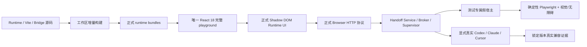

# 本地开发与完整产品验收环境

## 1. 文档目的与状态

本文解决两个相互关联的问题：

1. SpotPatch 仓库开发者不能通过一个稳定入口看到与安装后相同的完整 UI，修改 Runtime UI 后也缺少可靠的即时反馈；
2. “发送给 Agent”已经具有 Inbox、Claude Channel、Codex attached 和 Codex managed 等实现，但当前浏览器 E2E 没有覆盖完整交接与受管执行链路。

本文采用分阶段实施。2026-08-27 已完成 P0 与 P1：仓库根 `pnpm dev`、完整 React 18 playground、workspace 增量构建、runtime bundle 缓存失效和 managed 默认文档路径已经落地并通过本页第 11 节记录的门禁。P2–P5 的确定性浏览器 fixture、真实宿主矩阵和发布收敛仍未完成。外部 Agent 的产品实现状态仍只由 (见 doc-id:external-agent-00-index) 维护；本文只记录本地开发与验收环境的实施证据，不创建第二个支持状态事实源。

## 2. 结论摘要

当前仓库已能用根 `pnpm dev` 启动唯一 React 18 playground，并装配核心选择器、数据链路、正式 external Agent UI 与对应服务。Runtime 源码变化会经过 workspace watch 重建正式 bundle，Vite 注入插件按 bundle 清缓存、失效 virtual module，并把同一批变化合并为一次 full reload。开发者不再需要把包安装到另一个项目才能查看本地 UI。

这不等于完整验收已经完成：现有 Playwright 仍没有覆盖 external handoff/managed 的完整浏览器状态矩阵，本轮环境也没有可控制的浏览器实例，因此不能声称视觉、窄视口、无障碍或浏览器端 external Agent 闭环已通过。P2–P5 继续按本文保留为发布阻断项。

目标方案不是再复制一套静态 UI Lab，而是建立一个**唯一的完整开发宿主**，并围绕同一正式 Runtime 建立三层证据：

| 层级 | 用途 | Agent 实现 | 是否允许凭据/费用 | 结论能力 |
| --- | --- | --- | --- | --- |
| 完整本地开发宿主 | 日常 UI 与交互开发 | 真实 SpotPatch 服务；未连接时不启动厂商任务 | 默认不允许 | 证明开发者看到完整正式 UI |
| 确定性浏览器验收 | CI、状态回归、视觉与无障碍 | 测试目录中的假宿主，复用正式协议边界 | 不允许 | 证明浏览器到本地服务的可重复行为 |
| 真实宿主兼容 Gate | Codex/Claude/Cursor 的实际兼容性 | 锁定版本的真实客户端 | 显式人工启用 | 只证明记录的平台、版本和能力 |

三层不能相互冒充：假宿主通过不等于真实 Codex/Claude 已支持；单次真实运行通过也不等于跨平台发布门禁通过。

## 3. 2026-08-27 实仓事实与实施校准

### 3.1 playground 能力漂移已修复

`playgrounds/minimal-react-18/vite.config.ts` 现固定传入 `dataFlow: {}`、`externalAgent: true` 与 `contextualAsk: true`，和完整产品验收面的能力装配保持一致。内建 AI fake provider 仍只在 `SPOTPATCH_E2E_AI_UI=1` 时启用，不把测试 provider 混入日常开发。

### 3.2 正式 UI 与服务代码已经存在

- `packages/runtime/src/ui/external-handoff-panel.ts` 已包含“外部 Agent 连接”“连接 Codex”“发送给 Agent”、Inbox 和 managed 结果等正式 UI；
- `packages/vite/src/server/server-plugin.ts` 只在解析后的 `options.externalAgent.enabled` 为真时创建 `ExternalHandoffService` 和 `ExternalAgentSupervisor`；
- `packages/bridge/src/supervisor/supervisor.ts` 已提供 `connectManagedAdapter`、终端授权、状态订阅、取消、结果和释放边界；
- `packages/vite/src/cli.ts` 已转发 bridge、Claude Channel 和 legacy Codex Connector 命令。

所以主要问题不是“功能完全没有实现”，而是缺少统一的本地产品宿主和跨层验收入口。

### 3.3 浏览器 E2E 覆盖不完整

`tests/e2e/` 当前只有 picker、fixture、HMR、数据链路和内建 Agent selector 用例，没有 external handoff、Connect Codex、Send to Agent、Inbox pickup、managed phase 或结果回写用例。仓库已有 Runtime、HTTP、Broker、Supervisor、Claude/Codex adapter 和 managed execution 的单元/集成测试，但这些测试尚未证明浏览器用户流程完整闭环。

现有 E2E 也没有 `toHaveScreenshot` 或等价的可访问性扫描。UI 单元测试覆盖了部分 ARIA 属性，但不能替代真实浏览器中的中英文、窄视口、滚动、焦点和视觉层级回归。

### 3.4 Runtime 源码增量反馈链路已落地

`packages/vite/src/runtime/runtime-injection-plugin.ts` 仍只读取 `@spotpatch/vite` 的正式构建产物，没有引入跨包私有 source 路径；下列 bundle 的 virtual id、文件名、启用条件和缓存状态现由单一描述表管理：

- `runtime-client.js`；
- `runtime-react-adapter.js`；
- `runtime-data-flow-prelude.js`；
- `runtime-data-flow-panel.js`；
- `runtime-external-handoff-panel.js`。

根 `pnpm dev` 先执行依赖有序构建，再由 `scripts/dev.mjs` 启动两类长驻进程：依赖包与 Vite bundle 继续通过 pnpm parallel watch，但关闭其标准输入；唯一 playground 单独以前台进程继承当前终端。这样既保留并行增量构建，也确保首次 managed Agent 授权提示可以读取同一终端，不会被 recursive pnpm 的输入管道吞掉。任一长驻进程退出或根进程收到终止信号时，runner 会停止另一侧；集成测试证明授权输入只到达 playground，watcher 不会读取该输入。

Vite 包显式监听 Runtime、React Adapter 和 Shared 的上游产物；bundle 变化时只清除并失效对应 virtual module，同一事件循环的多 bundle 变化合并为一次 full reload。服务关闭会移除 watcher listener 并取消待发送 reload。单元测试覆盖文件内容更新、无关路径忽略、缓存失效、reload 合并和关闭清理。

### 3.5 外部宿主能力必须区分

| 宿主 | 官方入口 | 仓内当前边界 | 本机采样 | 当前可得结论 |
| --- | --- | --- | --- | --- |
| Codex | App Server、MCP | managed/attached 均为 `local-validation` | 已安装 `codex-cli 0.151.0` | 0.151.0 的绝对 executable 已通过版本解析与 generated Schema 合同；0.150.1 的无 thread 真实 initialize/account/model/config preflight 已通过；真实 managed turn Gate 仍待显式终端授权后执行 |
| Claude Code | MCP、Channels | Channel adapter 为 `local-validation` | `claude` 不在 PATH | 只能运行假宿主/合同测试，不能声称真实通过 |
| Cursor | MCP | Inbox-only | 已安装 Cursor `3.14.7` | 可规划真实 Inbox 验收，不能宣传主动派发 |

本机采样只用于定位当前开发阻断，不构成产品支持矩阵。官方资料仍明确：Claude Channels 是 Research Preview，只向正在运行且显式启用 Channel 的会话推送；Codex App Server 适合深度嵌入，但 `app-server` 命令仍是 experimental，Schema 可由具体 CLI 版本生成；Cursor 官方 MCP 能力不等于存在与 Claude Channel/Codex App Server 等价的入站执行 API。准确能力边界见 (见 doc-id:external-agent-02-research-compatibility)。

### 3.6 Codex 兼容策略已收敛为最低版本与逐版本能力验证

`packages/bridge/src/active/codex/executable.ts` 现在只保留一条集中兼容政策：

- 最低版本为 `0.149.0`，因为更早版本没有本项目所需权限与协议证据；
- 不设置未来版本上限；只接受规范的稳定三段 semver，预发布版不冒充稳定兼容；
- 每次连接都调用同一绝对 Codex executable 的 `app-server generate-json-schema --experimental`，在用户配置隔离的临时目录生成当前版本 Schema；
- Schema 必须包含 attached 与 managed 实际使用的 client request、client notification、server notification 和反向 request 方法子集；生成失败、输出超限、结构异常或方法缺失统一 fail closed；
- Schema 合同通过后仍必须完成真实 `initialize/initialized`、账户、模型、配置要求、权限 profile、hooks/MCP 隔离和 thread/turn 响应 preflight，不能把“方法名存在”当成可执行证明。

2026-08-27 对官方 npm 包 `@openai/codex@0.149.0` 与本机 `codex-cli 0.150.1` 生成的 experimental v2 Schema 做了结构差异审计：bundle 变化为 1329 行新增、92 行删除，证明跨版本变化真实存在；SpotPatch 当前使用的核心请求字段未出现破坏性变化，新增主要落在浏览器/电脑使用要求、MCP runtime status、实时 thread 和多 Agent 状态枚举。2026-08-30 又用本机真实 `codex-cli 0.151.0` 通过了同一 absolute-executable 版本解析与 generated Schema 合同。由此不能宣称“所有历史和未来版本天然兼容”，但能够承诺：`>=0.149.0` 的稳定版本只要自身生成 Schema 和运行时 preflight 都满足固定安全子集，就无需 SpotPatch 为每个 Codex patch/minor 单独发布版本；不兼容版本明确降级 Inbox。

### 3.7 开发工具链基线已收敛

根 `package.json` 继续作为 pnpm `10.34.5` 的唯一事实源；新增 `.node-version` 选择 required Node 22 主版本，README 指示通过 Corepack 使用根 `packageManager`。本轮全部门禁实际使用 Node `22.23.2` 与 pnpm `10.34.5`，没有把本机全局 Node 26/pnpm 11 的结果冒充仓库基线。

### 3.8 managed 默认文档路径已收敛

根 README、`packages/vite/README.md` 和 `packages/bridge/README.md` 现统一说明：managed 正常路径由 `pnpm dev` 内 Supervisor 托管，用户在页面连接并于当前 dev 终端完成首次授权；旧 `connect codex --allow-workspace-write` 只保留为高级诊断/迁移回退，使用同一最低版本与逐版本 Schema 合同，且明确不等价于 managed 隔离与验证。

## 4. 目标与非目标

### 4.1 目标

1. 仓库根单一开发命令展示核心选择器、数据链路、内建 AI 可选入口和外部 Agent 的完整正式 UI；
2. 修改 Runtime UI 源码后，不安装到其他项目、不手工重建整仓即可看到更新；
3. 确定性覆盖外部 Agent 的连接、发布、派发、执行、验证、回写、失败、取消和恢复状态；
4. 真实宿主测试始终运行在一次性 Git fixture 中，并记录客户端版本、平台和证据；
5. 测试和 playground 不引入生产后门、第二套协议、第二套 UI 或长期无消费者的抽象；
6. 实施后同步清理旧脚本、旧文档、重复常量和被替代分支。

### 4.2 非目标

- 不把外部 Agent 默认改为发布级稳定能力；
- 不让 CI 使用真实账户、真实模型或产生不可控费用；
- 不为了测试新增 Browser 可控制的 command、cwd、sandbox、model 或授权绕过参数；
- 不把 Claude Code 改造成 Codex managed 的同构流程；
- 不为 Cursor 创建没有官方入站能力证据的空主动 adapter；
- 不在本阶段重写全部 Runtime UI；先建立可观察和回归门禁，再做渐进式模块拆分。

## 5. 总体方案



### 5.1 唯一完整 playground

继续复用 `playgrounds/minimal-react-18`，不新建复制业务页面的 `ui-lab`。该 playground 应始终启用：

```ts
spotPatch({
  dataFlow: {},
  externalAgent: true,
  contextualAsk: true,
});
```

内建 AI 的 fake provider 仍只在 E2E 显式启用；外部 Agent UI 可以默认出现，因为连接动作前不应启动厂商任务或授予写权限。若启用外部 Agent 本身会产生模型请求、任意写入或非 loopback 暴露，则视为实现缺陷，不能通过关闭 playground 功能掩盖。

playground 配置不复制公共默认值；`externalAgent`、`dataFlow` 与 `contextualAsk` 只表达该宿主需要覆盖的产品能力。Contextual Ask 在完整 playground 必须始终装配；Configured Key 仍只在完整 Provider 环境存在时出现，Managed Codex 则按本机可执行文件、登录态和只读兼容 Gate 报告 capability。不得再把产品 UI 开关绑定到 `SPOTPATCH_E2E_AI_UI`；该变量只允许选择测试专属 fake Provider。

### 5.2 工作区 watch 与 virtual module 失效

开发命令必须先按 workspace 依赖顺序完成一次构建，再并行启动必要包的增量构建和 playground。实现不得新增 `concurrently` 一类仅为并发而存在的依赖；包级 watch 使用 pnpm recursive/parallel 能力和 tsup 自身 watch，playground 必须单独继承交互式标准输入，以满足同一 dev 终端的首次授权契约。进程编排只负责启动、输入所有权、信号转发和清理，不复制包依赖图或构建逻辑。

`runtime-injection-plugin` 应集中描述每个 runtime bundle 的 virtual id、文件名和启用条件。开发服务器监听实际解析出的 bundle 文件；变化时只清除对应缓存并失效对应 Vite module，无法安全局部替换时发送一次 full reload。监听器、缓存和订阅都必须在 server close 时释放。

禁止通过以下方式获得“看似热更新”：

- playground 跨包导入 `packages/*/src` 私有路径；
- 再实现一套 HTML/CSS 假面板；
- 每次变更自动执行完整 `pnpm build`；
- 保留旧 bundle 和新 source 两条运行路径；
- 用固定延时等待构建，而不等待文件版本或可观察模块更新。

### 5.3 测试专属假宿主

假宿主只放在 `tests/fixtures/`，不得进入公共包 exports、发布文件或生产配置 Schema。它必须从真实进程边界模拟厂商协议，而不是直接修改 UI 状态：

- 假 Codex executable 支持版本探测和 SpotPatch 实际使用的 App Server JSONL 子集；
- 假 Claude host 完成 Channel initialize、notification transport 和 exact-cursor 结果工具闭环；
- Cursor fixture 只调用真实 MCP Inbox 的 list/get/wait/ack，不模拟不存在的主动入口；
- 所有输入/输出先通过仓内共享 Schema 或 adapter 的真实解析器；
- 场景由测试启动器的类型完备配置选择，不从 Browser 接收任意字符串；
- fixture 每次创建独立临时配置目录、runtime 目录和 Git 仓库，完成后按所有权证明精确清理。

测试不能新增 `SPOTPATCH_DISABLE_SECURITY=1`、自动批准 Browser 参数或生产代码中的“测试模式”。需要授权成功场景时，由测试启动器在隔离终端完成真实 challenge，或通过 Supervisor 已有依赖注入构造测试实例；不能改变默认终端授权逻辑。

### 5.4 浏览器场景矩阵

同一正式 UI 至少覆盖：

| 类别 | 必须场景 |
| --- | --- |
| 能力 | external disabled、Inbox-only、managed available、版本不支持、二进制缺失 |
| 连接 | disconnected、diagnosing、awaiting-consent、ready、busy、degraded、error、disconnecting |
| 交接 | publish、picked-up、superseded、expired、delivery unknown、用户确认解除 unknown |
| managed | preparing、running、auditing、validating、applying、completed、review-required、failed、cancelled、cleanup-warning |
| 安全 | 无效 Origin/token、非固定 profile、路径越界、目标文件脏、并发哈希冲突、重复 requestId |
| UI | `zh-CN`/`en-US`、桌面/窄视口、键盘操作、焦点恢复、长错误、长路径、滚动区和底部操作可见 |
| 连续性 | 同一 Session 连续两个 revision、HMR 后旧选择失效、刷新后不伪造任务完成 |

Playwright 禁止固定 sleep，必须等待可观察的 DOM、HTTP 或协议状态。视觉断言使用有限且稳定的关键截图，不为每个内部状态制造高维护快照；可访问性检查至少覆盖 dialog 名称、焦点圈、键盘顺序、状态播报和颜色对比。

### 5.5 真实宿主 Gate

真实测试不属于默认 `test:e2e`，必须由显式命令运行并满足：

- 使用系统临时目录中的一次性、已提交、目标路径干净的 Git fixture；
- 不允许 Agent 写 SpotPatch 仓库、用户其他项目、用户配置或 lockfile；
- 运行前记录 OS、Node、SpotPatch 包版本、宿主可执行路径的脱敏结果和宿主版本；
- 运行后验证两个连续 revision、实际 diff、required checks、回写内容、thread/result 清理和业务仓库外零变化；
- 任一凭据、组织策略或客户端缺失记为 `not-tested`，不能改记 pass；
- 输出只保留结构化阶段和脱敏摘要，不保存 Prompt、源码、token 或原始协议全文。

Codex 0.150.1 已完成版本 Schema 生成、与 0.149.0 的差异审计、必需方法合同预检和现有假宿主协议/权限回归；0.151.0 已通过真实 executable 的版本解析与 generated Schema 合同。最低版本保持 `0.149.0`，未来上限由逐版本 Schema 与运行时 preflight 取代。packed-package 合同、临时 Git fixture 连续双 revision、取消/崩溃/清理的真实当前版本 Gate 仍须完成，未通过前不能把 `local-validation` 提升为稳定支持。

Claude Code 真实 Gate 必须先安装并锁定 POC 版本，显式启用 Channel，验证连续两次 transport write、exact-cursor pickup、结果上报、busy/关闭/组织策略和第二次等待恢复。Cursor 真实 Gate 只验 Inbox publish/pickup/ack。

## 6. 命令契约与当前状态

当前已实现：

```text
pnpm dev                    # 构建一次、启动增量构建和唯一完整 playground
pnpm test:e2e               # 现有 picker/data-flow/内建 Agent 浏览器验收；尚不含 P2 external 完整矩阵
```

以下真实宿主 Gate 仍是目标命令，不得提前加入根 scripts：

```text
pnpm test:real:codex        # 显式、隔离、锁定版本的真实 Codex Gate
pnpm test:real:claude       # 显式、隔离、锁定版本的真实 Claude Gate
pnpm test:real:cursor-inbox # 显式真实 Cursor Inbox Gate
```

根 `packageManager` 是 pnpm 版本唯一事实源。实施时应选择仓库 required Node 主版本作为开发默认，并让本地说明、CI setup 和故障提示引用现有引擎/矩阵，不在多个脚本重复版本字符串。

不得预先添加没有实现和测试消费方的命令；每个脚本必须与同一变更中的可运行入口、清理逻辑和文档一起提交。

## 7. 代码组织与去冗余约束

### 7.1 复用边界

- 正式 UI 只来自 `@spotpatch/runtime`，playground 和 E2E 不复制消息表、CSS 或 DOM 结构；
- HTTP path、header、Schema、状态联合和错误码继续只来自 `@spotpatch/shared`；
- Browser E2E 的 payload builder 从共享类型/Schema 构造，不能粘贴 JSON 常量；
- 假宿主复用 adapter parser 和协议 fixture，不实现第二个生产 adapter；
- Vite/Next 继续复用 dev-server 和 bridge 核心，本方案不在 framework 包复制 Supervisor；
- 外部 Agent 状态仍只在 (见 doc-id:external-agent-00-index) 更新。

### 7.2 禁止死代码

每个新增文件必须同时具备实际 import/执行入口和测试。以下内容不得合入：

- 未接入根脚本的 fixture launcher；
- 未被 Runtime 使用的消息键、CSS token 或状态值；
- 仅注释为“以后支持”的 adapter/interface；
- 新路径启用后仍保留的旧 watch、旧 playground 或重复 README 步骤；
- 为测试而导出的生产内部函数；
- 永远为 false 的兼容分支或跳过安全检查的环境变量。

### 7.3 渐进式 UI 拆分

`runtime-view.ts`、`agent-panel.ts` 和 `external-handoff-panel.ts` 当前分别约 1803、856 和 1000 行，这是维护风险，不是仅凭行数即可认定的缺陷。先以浏览器场景和截图冻结行为；后续 UI 优化触及某一职责时，再按“shell/选择工作台/内建 Agent/外部交接/结果审阅”等真实边界提取模块，并在同一变更删除原实现。禁止一次性搬文件但保留转发壳、重复样式或兼容死分支。

## 8. 分阶段实施

### P0：事实与工具链收敛（2026-08-27 已完成）

- 使用根 `packageManager` 和 required Node 主版本复现 clean install、build、typecheck、unit；
- 修正 playground 与 initializer 的能力漂移；
- 把 README 的默认 Codex 流程与 managed 规范对齐，legacy `connect` 明确降为诊断/回退；
- 为本方案新增 ADR 或在现有 ADR 中接受“唯一完整 playground + 三层验收”。

完成证据：`.node-version` 固定 required Node 主版本；根 `packageManager` 仍是 pnpm 唯一版本源；完整 playground 与 initializer 能力一致；三份 README 不再把 legacy Connector 当作 managed 默认流程。

### P1：增量构建与 UI 即时反馈（2026-08-27 已完成）

- 建立一次构建加必要包 watch，并保证 playground 独占交互式终端输入；
- 给 runtime bundle 建立集中描述、文件监听、缓存失效和 module reload；
- 补充修改中英文文案、样式和 external panel 后的 HMR 行为测试；
- 验证关闭开发服务后没有残留 watcher 和子进程。

完成证据：真实启动根 `pnpm dev` 后，触碰 `packages/runtime/src/ui/external-handoff-panel.ts` 触发 Runtime 与 Vite runtime bundle 连续重建；HTTP 返回的正式 client 导入 external handoff panel；文件级单元测试证明缓存更新、module invalidation、合并 reload 与 watcher 清理。由于本轮没有可控制的浏览器实例，“同一浏览器会话肉眼看到更新”仍需在 P2 浏览器 Gate 中补证，不能把 HTTP/单元证据写成视觉通过。

### P2：确定性完整浏览器验收

- 在 `tests/fixtures/` 增加最小假宿主和拥有者明确的临时资源管理；
- 扩展 Playwright 覆盖第 5.4 节状态矩阵；
- 加入关键视觉、窄视口和无障碍门禁；
- 验证两 revision、取消、错误和 cleanup。

完成标准：无真实凭据、无网络模型调用即可稳定复现完整 UI 和关键交接状态，测试结束后 SpotPatch 工作区与用户配置无变化。

### P3：Codex 跨版本兼容核验（2026-08-27 部分完成）

- 已按 (见 doc-id:external-agent-10-convergence) 收敛为最低稳定版本、逐版本生成 Schema 和运行时 capability preflight；
- 已生成并审计 0.149.0/0.150.1 App Server Schema，并用真实 0.151.0 executable 复验 generated Schema 合同；自动化覆盖当前版本、兼容的未来稳定版本、低于最低版本、畸形/预发布版本和缺失必需方法；
- 通过 packed fixture、权限负向、连续双 revision 和故障清理；
- 完整真实证据通过后才更新唯一实现状态入口与成熟度。

完成标准：当前记录版本的真实 Gate 通过；后续稳定版本在无需修改范围常量的情况下，仍必须依次通过版本 Schema 合同与运行时 preflight。不满足固定安全子集时保持明确“不兼容”并给出 Inbox 降级，不能用跳过校验换取表面兼容。

### P4：Claude 与 Cursor 真实矩阵

- Claude 安装后完成锁定版本 Channel 双 revision；
- Cursor 完成 Inbox list/get/wait/ack；
- 扩展 Node 20/22 和 macOS/Ubuntu/Windows required/observed 矩阵。

完成标准：每个宿主只声明真实证据支持的上限，未验证项保持 `not-tested` 或 `unsupported`。

### P5：清理与发布门禁

- 删除被替代的脚本、文档、重复常量和测试兼容分支；
- 执行 format、lint、typecheck、unit、E2E、production leakage、package validation；
- 从 packed package 安装到一次性外部 fixture，验证 UI 与仓库 playground 一致；
- 更新 Changeset 和唯一状态页，但只提升通过全部 Gate 的能力。

## 9. 验收门禁

以下条件全部成立前，本方案不得标为 implemented：

当前结论是 `partially-implemented`：第 3、7、8、10 项的本轮范围已有自动化或实仓证据；第 1 项只证明正式模块和服务装配，尚无浏览器视觉证据；第 2、4–6、9、11–12 项仍需 P2–P5。不得因为 P0/P1 通过而提前把整页改为 implemented。

1. 根开发命令展示 external Agent 正式面板，且未点击连接/发送时没有模型请求和工作区写入；
2. playground 与 packed Vite fixture 对同一配置展示相同能力和关键文案；
3. Runtime 源码变更能触发有界重建、缓存失效和浏览器更新；
4. 默认 E2E 不依赖 Codex、Claude、Cursor、账户、网络或用户真实仓库；
5. 完整交接关键路径与第 5.4 节失败路径有浏览器断言；
6. fake-host、真实宿主和发布支持状态在报告中明确分栏；
7. 所有临时仓库、配置、进程和监听器在成功、失败、取消后均可证明清理；
8. 没有新增公共测试后门、跨包私有 import、重复协议字符串或未消费导出；
9. Codex 兼容范围只在 Schema、preflight、合同测试和真实双 revision 同时通过后改变；
10. README、专题规范、命令帮助和 UI 流程一致，legacy 路径不再冒充默认路径；
11. `format:check`、`lint`、`typecheck`、unit、E2E、production leakage 和 package validation 全部通过；
12. 测试前后 `git status --short` 不新增非预期变化。

## 10. 风险与固定处理

| 风险 | 固定处理 |
| --- | --- |
| 假宿主与厂商协议漂移 | 使用锁定版本生成 Schema/合同 fixture；真实宿主 Gate 独立阻断支持声明 |
| watch 重建期间读到半写 bundle | 监听原子完成后的文件版本，清缓存后失效 module；失败保留上次有效 UI 并报诊断 |
| 自动化绕过终端授权 | 禁止生产环境变量后门；使用隔离终端或 Supervisor 依赖注入的测试实例 |
| 真实 Agent 污染 SpotPatch 仓库 | 只传一次性 Git fixture，业务仓库不进入 writable roots |
| UI 快照过多导致维护成本 | 只截关键层级/视口，状态语义主要用 DOM 与协议断言 |
| 为追求热更新引入第二套 source 路径 | 只消费正式 bundle，通过 watch 和 virtual module 失效更新 |
| 新脚本越来越多 | 根命令保持单一职责；无实现消费方的脚本不得提交 |
| 本机一次通过被误认为发布支持 | 报告固定记录版本/平台并标记 local evidence，状态提升仍执行专题发布 Gate |

## 11. 2026-08-27 实施与验证记录

本轮实际变更：

- 新增 `.node-version`，根 `packageManager` 保持 pnpm 唯一版本源；
- 根 `pnpm dev` 先按 `@spotpatch/vite...` 依赖图构建，再由无第三方依赖的 runner 并行运行 package watch 与唯一 playground；watcher 关闭标准输入，playground 继承当前终端，以保证 managed 首次授权可交互；
- external Agent 面板在 `awaiting-consent + missing` 时明确提示用户到启动 `pnpm dev` 的终端输入 `yes`，并说明无提示时需要从可交互终端重启；
- Runtime 与 Vite 使用单一 tsup 配置，删除被替代的六个 Vite runtime/CLI 配置文件；build 先显式清理，watch 不互相清空共享 `dist`；
- playground 固定启用 `dataFlow` 与 `externalAgent`，但不默认启用 E2E fake AI；
- runtime injection 用集中 bundle 描述表解析、缓存和监听正式产物；变化时按 virtual module 失效，合并 full reload，关闭时释放 listener 和待执行 reload；
- 根、Vite 和 Bridge README 统一 managed 与 legacy 操作边界。
- Codex 版本政策从写死 `0.149.x` 改为最低 `0.149.0`、无未来上限、逐版本 generated Schema 合同和现有运行时 preflight；新增独立 Schema 错误分类与中英文诊断，不自动安装、升级或降级用户 Codex。

实际验证环境为 macOS、Node `22.23.2`、pnpm `10.34.5`。已通过：

- `pnpm format:check`；
- `pnpm lint`；
- `pnpm typecheck`；
- `pnpm test:unit`：109 个测试文件通过，739 项通过、2 项按现有平台条件跳过；
- `pnpm build`；
- `pnpm test:production-leakage`：10 项通过；
- `pnpm package:validate`：所有发布包的 publint 与 Are the Types Wrong 验证通过；
- 根 `pnpm dev` 真实启动于 `http://localhost:5173/`，Runtime source 事件触发上游与 Vite bundle 重建，停止后 5173 端口和相关子进程无残留；
- runtime injection 定向测试 10 项通过，覆盖文件更新、无关文件忽略、缓存失效、module invalidation、reload 合并和关闭清理。
- dev runner 集成测试证明首次构建参数、package watch 参数和 playground 参数均来自单一入口，授权输入只到达 playground，playground 退出后 watcher 收到终止信号；external panel 单元测试覆盖中英文终端授权提示。
- Node `22.23.2` 下，本机真实 `codex-cli 0.150.1` 的 absolute executable 通过 generated Schema 合同；隔离临时 `CODEX_HOME` 的真实无 thread 连接完成 initialize、authenticated account、默认模型 `gpt-5.6-sol` 与 config requirements preflight，随后立即关闭，Schema 与运行目录均已清理。2026-08-30 本机升级到 `codex-cli 0.151.0` 后，同一 resolver 仍通过绝对 executable 版本解析与 generated Schema 合同。这些证据没有创建 Agent thread、没有发起模型 turn，也不替代用户项目 grant。

本轮未通过或未执行的项目必须保持明确：

- 当前运行环境没有可控制的浏览器实例，未执行 UI 肉眼检查，也没有运行 Playwright external Agent 新场景；
- P2 假宿主、完整 external Agent 浏览器状态矩阵、视觉和无障碍 Gate 尚未实现；
- Codex 0.150.1 已通过版本解析、generated Schema 合同、真实无 thread preflight 和假宿主回归；0.151.0 已通过版本解析与 generated Schema 合同，但本轮没有冒充其完成了真实 preflight 或 managed turn。需要用户显式终端授权的真实 managed 双 revision 仍未完成，因此状态仍是 `local-validation`；
- Claude 未安装，真实 Claude/Cursor/Codex Gate 与跨平台矩阵未执行；
- 因此不新增 `test:real:*` 空脚本，不提升 external Agent 支持状态。

## 12. 最终工程判断

SpotPatch 不需要“先安装到另一个项目才能验证 UI”，也不应通过复制一个静态 Demo 解决这个问题。正确收敛方式是让仓库自身的唯一 playground 成为安装后能力的代表，并让正式 Runtime bundle 具备可靠的增量构建和失效链路。

外部 Agent 测试必须同时保留确定性和真实性：日常/CI 用假宿主覆盖完整状态与安全失败，真实 Codex/Claude/Cursor 用显式隔离 Gate 验证厂商兼容。任何最低版本调整、固定协议子集变化、状态提升或 UI “完成”都必须由对应证据支持；未来版本只因 generated Schema 与运行时 preflight 同时通过而兼容，不因版本号更大而自动受信。否则保持不兼容或降级 Inbox，是符合事实和安全边界的结果。
