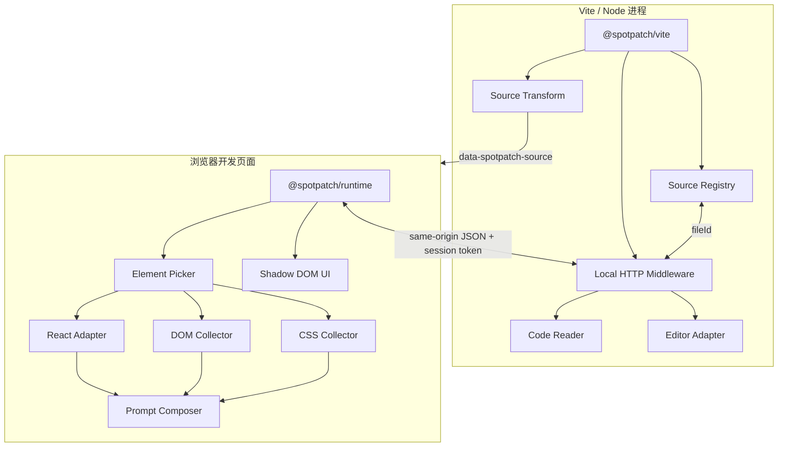

本文是 SpotPatch 第一版的规范性开发文档。它定义产品边界、支持矩阵、架构、源码组织、模块职责、公共 API、通信协议、安全要求、关键算法、测试方式和验收标准。实现与本文冲突时，应先更新设计决策，再修改代码，避免“代码先跑起来、规则后补”的失控状态。

---

## 1. 产品定义

SpotPatch 是一个仅运行在本地开发环境的 React 页面反馈工具：用户在页面中点选问题元素、输入文字标注，工具自动关联 React 组件、源码位置、相关 DOM、CSS 和代码片段，并生成可复制给 AI 编程助手的结构化 Prompt。

一句话定位：

> 像在 Figma 里评论网页，但每个标注都直接连接真实源码，并能转化为 AI 可执行的开发上下文。
> 

### 1.1 v1 必须交付

- 鼠标悬浮高亮页面元素。
- 点击选中元素，不触发业务点击行为。
- 显示 React 组件名称和精简组件栈。
- 定位业务源码文件、行号、列号。
- 显示定位来源和置信度。
- 添加一条文字标注。
- 提取经过清洗的 DOM。
- 提取命中 CSS 规则和关键计算样式。
- 提取源码附近片段。
- 预览并一键复制结构化 AI Prompt。
- 一键在 VS Code 中打开文件位置。
- 仅在 Vite 开发服务器中工作。
- 生产构建零代码、零属性、零接口残留。

### 1.2 v1 明确不做

- 不调用任何 AI API。
- 不自动修改业务代码。
- 不读取或上传整个项目。
- 不做账号、团队、云同步和分享链接。
- 不创建 GitHub、Linear 或 Jira 任务。
- 不录制完整用户操作过程。
- 不支持生产环境。
- 不正式支持 Vue、Svelte、Angular、Next.js、Webpack。
- 不承诺精确还原第三方 CSS-in-JS 的原始源码行号。
- 不读取跨域 iframe 和跨域 stylesheet。

### 1.3 v1 支持矩阵

| 项目 | v1 支持范围 | 说明 |
| --- | --- | --- |
| React | 18.2–18.3 | 当前目标项目为 React 18.3.1 |
| Vite | 5、6、7 | 依赖公开 Plugin API；CI 分版本验证 |
| TypeScript | 5.5+ | 工具自身启用最严格配置 |
| JSX | `.jsx`、`.tsx` | 不解析 `.js` 中的 JSX |
| 浏览器 | Chromium 最新两个主版本 | v1 自动化验收基线 |
| 编辑器 | VS Code | 其他编辑器后续通过 adapter 扩展 |
| 操作系统 | macOS、Windows、Linux | 打开编辑器由 `launch-editor` 适配 |
| 启动方式 | `vite` / `vite dev` | `vite build`、`vite preview` 禁用 |

React 19 先进入实验兼容矩阵，不进入 v1 正式承诺。原因不是 DOM/AST 方案不支持，而是组件栈增强依赖 React 私有 Fiber 信息；Bippy 文档也明确指出 React 19 的源码定位需要不同的 JSX runtime 配置。

---

## 2. 核心设计原则

### 2.1 源码定位与组件语义分离

一次选择同时产生两类事实：

- **元素源码位置**：这个 DOM 对应哪个 JSX opening element。
- **React 组件语义**：这个 DOM 由哪个业务组件负责，组件调用链是什么。

前者由 AST 标记提供，后者由 React Adapter 提供。二者不能混为一个字段。

### 2.2 AST 为主，Fiber 为辅

- AST 注入使用 Vite 的公开 transform 钩子，是 v1 的稳定主链路。
- Fiber 是 React 私有实现，只放在隔离的兼容层中。
- Fiber 失效不能让元素选择、DOM/CSS、源码标记和复制功能失效。
- 所有 Fiber 结果必须带来源和置信度，不允许静默猜测。

### 2.3 浏览器不持有源码和绝对路径

- DOM 属性只保存会话内的短 source ID、行号和列号。
- 文件绝对路径只存在于 Vite Node 端内存。
- 源码仅在用户完成选择后按需读取。
- 默认只返回有限代码片段，不返回完整文件。

### 2.4 开发工具不得破坏业务页面

- AST 转换失败时 fail-open：记录警告并返回原代码。
- React Adapter 失败时降级为 AST/DOM 模式。
- 工具 UI 使用 Shadow DOM，与业务 CSS 隔离。
- 所有事件监听器、Observer 和定时任务必须可释放。
- HMR 不能重复挂载实例。

### 2.5 提取“最相关上下文”，不是“全部上下文”

无限制复制完整 DOM、完整源码和全部计算样式，会造成隐私风险、Prompt 噪声和 token 浪费。所有采集器必须执行预算和清洗策略。

---

## 3. 总体架构



### 3.1 依赖方向

```
shared  ←  vite
shared  ←  runtime  ←  react-adapter

禁止：
vite    → runtime 内部模块
runtime → vite 内部模块
shared  → 任何其他包
```

客户端与服务端只能通过 `shared/protocol` 中定义的 JSON 协议通信，不共享可执行内部模块。

---

## 4. 技术栈

### 4.1 运行与构建

| 类别 | 选择 | 用途 | 决策原因 |
| --- | --- | --- | --- |
| 语言 | TypeScript strict | 全部产品代码 | 保证协议、状态和错误路径可检查 |
| 包管理 | pnpm workspace | Monorepo | workspace 原生、依赖去重、发布清晰 |
| 包构建 | tsup | ESM/CJS 和类型声明 | 配置少，适合小型 TS 包 |
| 插件平台 | Vite Plugin API | transform、虚拟模块、中间件 | 公开稳定接口 |
| AST | `oxc-parser` | 解析 JSX/TSX | 性能好；同类 Source Inspector 已验证 |
| 代码修改 | `magic-string` | 精准注入和 source map | 不重新打印整个 AST，减少格式扰动 |
| 文件过滤 | `@rollup/pluginutils` | createFilter | 与 Vite/Rollup 生态一致 |
| 协议校验 | Zod | HTTP 边界运行时校验 | TypeScript 类型不能校验外部输入 |
| 编辑器 | `launch-editor` | 打开 VS Code | 已被多个开发工具采用 |
| React 兼容 | Bippy adapter | DOM → Fiber、组件栈 | 避免在业务模块散落 React 私有字段 |
| Runtime UI | 原生 DOM + Shadow DOM | 工具栏、面板、高亮层 | 无 React 根冲突，无 UI 框架体积 |

### 4.2 质量工具

| 类别 | 选择 | 要求 |
| --- | --- | --- |
| 单元测试 | Vitest | transform、registry、sanitizer、prompt、协议 |
| 浏览器 E2E | Playwright | Chromium 主验收，Firefox/WebKit 作为兼容观察 |
| 静态检查 | ESLint flat config | TypeScript、import 边界、无浮动 Promise |
| 格式化 | Prettier | 与 ESLint 格式规则解耦 |
| 包验证 | publint + Are the Types Wrong | exports、类型与模块格式 |
| 版本发布 | Changesets | 多包版本和 changelog |

### 4.3 不引入的依赖

- 不引入 React 作为 Runtime UI 框架。
- 不引入 Redux、Zustand 等状态库；状态机规模不足以证明其必要性。
- 不引入 Axios；使用浏览器原生 `fetch`。
- 不引入 DOMPurify；采集内容只通过 `textContent` 展示，不使用 `innerHTML`。
- 不引入 selector 生成库；v1 使用受控的最小 selector 算法。
- 不引入 Express；直接注册 Vite Connect middleware。
- 不引入命令执行封装；打开编辑器只经过固定 adapter。

这不是为了追求依赖数量最少，而是避免两个库承担同一职责。

---

## 5. Monorepo 源码结构

```
spotpatch/
├─ .changeset/
├─ .github/
│  └─ workflows/
│     ├─ ci.yml
│     └─ release.yml
├─ docs/
│  ├─ architecture.md
│  ├─ security.md
│  ├─ compatibility.md
│  └─ contributing.md
├─ packages/
│  ├─ shared/
│  │  ├─ src/
│  │  │  ├─ index.ts
│  │  │  ├─ model/
│  │  │  │  ├─ annotation.ts
│  │  │  │  ├─ source-ref.ts
│  │  │  │  └─ style-context.ts
│  │  │  ├─ protocol/
│  │  │  │  ├─ endpoints.ts
│  │  │  │  ├─ requests.ts
│  │  │  │  └─ responses.ts
│  │  │  └─ errors/
│  │  │     └─ error-code.ts
│  │  ├─ package.json
│  │  └─ tsconfig.json
│  ├─ react-adapter/
│  │  ├─ src/
│  │  │  ├─ index.ts
│  │  │  ├─ adapter.ts
│  │  │  ├─ bippy-adapter.ts
│  │  │  ├─ display-name.ts
│  │  │  ├─ source-normalizer.ts
│  │  │  └─ unsupported-adapter.ts
│  │  ├─ package.json
│  │  └─ tsconfig.json
│  ├─ runtime/
│  │  ├─ src/
│  │  │  ├─ index.ts
│  │  │  ├─ bootstrap.ts
│  │  │  ├─ controller.ts
│  │  │  ├─ state-machine.ts
│  │  │  ├─ picker/
│  │  │  │  ├─ element-picker.ts
│  │  │  │  ├─ candidate-filter.ts
│  │  │  │  ├─ source-marker.ts
│  │  │  │  └─ geometry.ts
│  │  │  ├─ collectors/
│  │  │  │  ├─ dom-collector.ts
│  │  │  │  ├─ css-collector.ts
│  │  │  │  ├─ computed-style.ts
│  │  │  │  └─ page-context.ts
│  │  │  ├─ privacy/
│  │  │  │  ├─ sanitizer.ts
│  │  │  │  ├─ sensitive-patterns.ts
│  │  │  │  └─ budget.ts
│  │  │  ├─ api/
│  │  │  │  ├─ client.ts
│  │  │  │  └─ api-error.ts
│  │  │  ├─ prompt/
│  │  │  │  ├─ composer.ts
│  │  │  │  └─ sections.ts
│  │  │  └─ ui/
│  │  │     ├─ mount.ts
│  │  │     ├─ toolbar.ts
│  │  │     ├─ highlight.ts
│  │  │     ├─ annotation-panel.ts
│  │  │     ├─ preview-panel.ts
│  │  │     └─ styles.ts
│  │  ├─ package.json
│  │  └─ tsconfig.json
│  └─ vite/
│     ├─ src/
│     │  ├─ index.ts
│     │  ├─ options.ts
│     │  ├─ plugin.ts
│     │  ├─ constants.ts
│     │  ├─ transform/
│     │  │  ├─ transform-plugin.ts
│     │  │  ├─ inject-source-markers.ts
│     │  │  ├─ intrinsic-element.ts
│     │  │  └─ source-map.ts
│     │  ├─ registry/
│     │  │  ├─ source-registry.ts
│     │  │  └─ source-id.ts
│     │  ├─ server/
│     │  │  ├─ server-plugin.ts
│     │  │  ├─ router.ts
│     │  │  ├─ request-guard.ts
│     │  │  ├─ source-context-handler.ts
│     │  │  └─ open-editor-handler.ts
│     │  ├─ source/
│     │  │  ├─ safe-path.ts
│     │  │  ├─ code-reader.ts
│     │  │  └─ component-boundary.ts
│     │  └─ virtual/
│     │     ├─ ids.ts
│     │     ├─ client-module.ts
│     │     └─ html-injection.ts
│     ├─ package.json
│     └─ tsconfig.json
├─ playgrounds/
│  ├─ minimal-react-18/
│  └─ shengsuanyun-fixtures/
├─ tests/
│  ├─ e2e/
│  │  ├─ selection.spec.ts
│  │  ├─ source-resolution.spec.ts
│  │  ├─ portal.spec.ts
│  │  ├─ privacy.spec.ts
│  │  └─ production-leakage.spec.ts
│  └─ fixtures/
│     ├─ jsx-cases/
│     └─ css-cases/
├─ eslint.config.js
├─ playwright.config.ts
├─ prettier.config.js
├─ pnpm-workspace.yaml
├─ tsconfig.base.json
├─ tsup.config.ts
└─ vitest.workspace.ts
```

### 5.1 目录规则

- `index.ts` 只定义公共导出，不放实现。
- 禁止跨包导入 `src/*` 私有路径。
- 禁止创建含义模糊的 `utils.ts`、`helpers.ts`、`common.ts`。
- 每个模块只承担一个明确职责。
- 协议常量只能定义在 `shared/protocol`，客户端与服务端不得复制字符串。
- 浏览器 API 和 Node API 不得出现在同一实现模块。
- 纯函数优先；所有全局监听与资源必须返回 `dispose()`。
- 文件名使用 kebab-case，类型和类使用 PascalCase，函数和变量使用 camelCase。

### 5.2 发布策略

用户只需要显式安装：

```bash
pnpm add -D @spotpatch/vite
```

`@spotpatch/runtime`、`@spotpatch/react-adapter`、`@spotpatch/shared` 作为内部依赖随插件安装。公共文档不要求用户直接配置内部包。

---

## 6. 公共配置 API

```tsx
export interface SpotPatchOptions {
  /** 默认 true；仍会被 command === "serve" 强制约束。 */
  enabled?: boolean;

  /** 默认包含 src 下的 jsx/tsx。 */
  include?: Array<string | RegExp>;

  /** 默认排除 node_modules、测试、故事文件和生成文件。 */
  exclude?: Array<string | RegExp>;

  /** v1 仅正式支持 vscode。 */
  editor?: "vscode";

  /** 默认 true。关闭时仍强制清洗密码。 */
  redact?: boolean;

  /** Prompt 和各采集段的字符预算。 */
  budget?: Partial<ContextBudget>;

  /** 默认 Mod+Shift+S。 */
  shortcut?: string;

  /** 默认 false。开启后允许通过局域网 origin 使用。 */
  allowLan?: boolean;

  /** 开发期诊断日志。 */
  debug?: boolean;
}

export interface ContextBudget {
  totalCharacters: number;
  domCharacters: number;
  cssCharacters: number;
  codeCharacters: number;
  maxCodeLines: number;
  maxComponentDepth: number;
}
```

默认值集中在一个不可变对象中：

```tsx
export const DEFAULT_OPTIONS = Object.freeze({
  enabled: true,
  editor: "vscode",
  redact: true,
  shortcut: "Mod+Shift+S",
  allowLan: false,
  debug: false,
  budget: {
    totalCharacters: 16_000,
    domCharacters: 3_000,
    cssCharacters: 4_000,
    codeCharacters: 7_000,
    maxCodeLines: 80,
    maxComponentDepth: 8,
  },
} satisfies Required<SpotPatchOptions>);
```

配置解析只执行一次，之后向内部模块传递 `Readonly<ResolvedSpotPatchOptions>`，不得让各模块重复处理默认值。

### 6.1 用户接入方式

```tsx
import react from "@vitejs/plugin-react-swc";
import { defineConfig } from "vite";
import { spotPatch } from "@spotpatch/vite";

export default defineConfig({
  plugins: [
    spotPatch(),
    react(),
  ],
});
```

SpotPatch 必须位于 React SWC 插件之前，并设置 `enforce: "pre"`，确保拿到未经 JSX 降级的 TSX/JSX。

---

## 7. 核心数据模型

```tsx
export type SourceConfidence =
  | "exact"
  | "probable"
  | "approximate"
  | "unknown";

export type SourceOrigin =
  | "jsx-host"
  | "react-fiber"
  | "dom-ancestor"
  | "none";

export interface SourceRef {
  readonly fileId?: string;
  readonly relativePath?: string;
  readonly line?: number;
  readonly column?: number;
  readonly origin: SourceOrigin;
  readonly confidence: SourceConfidence;
}

export interface ReactContext {
  readonly supported: boolean;
  readonly version?: string;
  readonly componentName?: string;
  readonly componentStack: readonly string[];
  readonly source?: SourceRef;
}

export interface ElementContext {
  readonly tagName: string;
  readonly selector: string;
  readonly sanitizedHtml: string;
  readonly textPreview?: string;
  readonly role?: string;
  readonly rect: Readonly<{
    x: number;
    y: number;
    width: number;
    height: number;
  }>;
}

export interface MatchedStyleRule {
  readonly selector: string;
  readonly declarations: string;
  readonly source?: string;
  readonly media?: string;
}

export interface StyleContext {
  readonly classNames: readonly string[];
  readonly inlineStyle?: string;
  readonly matchedRules: readonly MatchedStyleRule[];
  readonly computed: Readonly<Record<string, string>>;
  readonly warnings: readonly string[];
}

export interface CodeContext {
  readonly relativePath: string;
  readonly language: "tsx" | "jsx";
  readonly startLine: number;
  readonly endLine: number;
  readonly excerpt: string;
  readonly boundary: "component" | "nearby-lines";
}

export interface SpotAnnotation {
  readonly schemaVersion: 1;
  readonly id: string;
  readonly note: string;
  readonly page: Readonly<{
    url: string;
    pathname: string;
    title: string;
    viewportWidth: number;
    viewportHeight: number;
    devicePixelRatio: number;
  }>;
  readonly source: SourceRef;
  readonly react: ReactContext;
  readonly element: ElementContext;
  readonly styles: StyleContext;
  readonly code?: CodeContext;
  readonly warnings: readonly string[];
  readonly createdAt: string;
}
```

原则：数据对象创建后不可变；采集阶段返回新对象，不共享可变 DOM 引用，不把 Fiber、Element、CSSStyleDeclaration 放入最终模型。

---

## 8. Vite 插件实现

### 8.1 插件拆分

公共函数返回多个职责单一的 Vite 插件：

```tsx
import type { Plugin } from "vite";

export function spotPatch(
  userOptions: SpotPatchOptions = {},
): Plugin[] {
  const options = resolveOptions(userOptions);
  const registry = createSourceRegistry();
  const session = createSession();

  if (!options.enabled) {
    return [];
  }

  return [
    createTransformPlugin({ options, registry }),
    createRuntimeInjectionPlugin({ options, session }),
    createServerPlugin({ options, registry, session }),
  ];
}
```

每个插件都设置 `apply: "serve"`。不能只依赖 `import.meta.env.DEV`，因为生产零残留必须在构建层就阻断。

### 8.2 Transform 过滤

处理顺序：

1. 去掉 Vite id 的 query 部分，仅用于判断真实扩展名。
2. 必须是 `.jsx` 或 `.tsx`。
3. 必须匹配 include。
4. 必须不匹配 exclude。
5. 必须在项目 root 内。
6. 跳过 `node_modules`、虚拟模块、SpotPatch 自身模块。
7. 文件不包含 `<` 时可快速跳过，但不能把它作为正确性判断。

默认排除：

```tsx
const DEFAULT_EXCLUDE = [
  /node_modules/,
  /\.test\.[jt]sx$/,
  /\.spec\.[jt]sx$/,
  /\.stories\.[jt]sx$/,
  /(?:^|\/)dist(?:\/|$)/,
  /(?:^|\/)coverage(?:\/|$)/,
];
```

### 8.3 Source ID

DOM 属性格式：

```html
data-spotpatch-source="Q7k3pA9vL2s:36:5"
```

- `Q7k3pA9vL2s`：本次 Vite 会话内的文件 ID（至少 64 bit 随机值的 base64url 表示）。
- `36`：1-based 行号。
- `5`：1-based 列号。

文件 ID 使用 `crypto.randomBytes()` 产生并存入双向 registry。不要把相对路径直接 base64，因为 base64 不是加密，也不要使用连续数字以免轻易枚举。

Registry 接口：

```tsx
export interface SourceRegistry {
  register(absolutePath: string): string;
  resolve(fileId: string): string | undefined;
  clear(): void;
}
```

同一规范化路径在一次会话内必须返回相同 ID，保证 HMR 后稳定。

### 8.4 AST 注入规则

只给 intrinsic host element 注入：

```tsx
<div />        // 注入
<button />     // 注入
<svg />        // 注入
<my-element /> // 注入，Web Component

<UserCard />   // 不注入
<motion.div /> // 不注入
<>...</>       // 不注入
```

判断规则：

- JSXIdentifier 首字符为小写，或名称包含 。
- JSXMemberExpression 不是 host element。
- JSXFragment 没有 DOM 节点。
- 已存在 `data-spotpatch-source` 时不覆盖，发出诊断警告。

属性插入到 opening element 的最后、关闭符号之前：

```tsx
<button {...props} data-spotpatch-source="Q7k3pA9vL2s:36:5" />
```

放在 spread 之后可以避免业务 props 意外覆盖工具标记。

### 8.5 Source map

MagicString 必须返回高精度 source map：

```tsx
return {
  code: magicString.toString(),
  map: magicString.generateMap({
    hires: true,
    includeContent: true,
    source: normalizedRelativePath,
  }),
};
```

不能返回 `map: null`，否则会破坏 Vite 后续 transform、错误 overlay 和调试器的位置链。

### 8.6 错误策略

AST 转换遵循 fail-open：

```tsx
try {
  return await injectSourceMarkers(input);
} catch (error: unknown) {
  diagnostics.warn(createTransformDiagnostic(input.id, error));
  return null;
}
```

禁止使用空 `catch`，禁止将 parser 异常变成业务页面无法启动的致命错误。debug 模式展示完整错误；普通模式每个文件只警告一次。

---

## 9. Runtime 注入与生命周期

### 9.1 注入方式

Vite 插件通过 `transformIndexHtml` 在开发页面注入虚拟模块：

```html
<script type="module" src="/@id/virtual:spotpatch/client"></script>
```

虚拟模块只包含会话配置和 runtime 启动：

```tsx
import { bootstrapSpotPatch } from "@spotpatch/runtime";

bootstrapSpotPatch({
  apiBase: "/__spotpatch/v1",
  sessionToken: "<server-generated-token>",
  shortcut: "Mod+Shift+S",
});
```

禁止把项目 root、绝对路径和编辑器命令注入浏览器。

### 9.2 单例与 HMR

```tsx
const INSTANCE_KEY = "__spotpatchRuntime__" as const;

type GlobalWithSpotPatch = typeof globalThis & {
  [INSTANCE_KEY]?: SpotPatchController;
};

export function bootstrapSpotPatch(config: RuntimeConfig): void {
  const target = globalThis as GlobalWithSpotPatch;
  target[INSTANCE_KEY]?.dispose();
  target[INSTANCE_KEY] = createController(config);
  target[INSTANCE_KEY].mount();
}
```

`dispose()` 必须释放：

- pointer、click、keydown、scroll、resize 监听器
- ResizeObserver、MutationObserver
- 未完成 fetch 的 AbortController
- Shadow Root host
- 高亮节点和面板
- 内部缓存中的 Element 引用

### 9.3 Runtime 状态机

```
idle
  └─ ACTIVATE → inspecting
inspecting
  ├─ HOVER → inspecting
  ├─ SELECT → selected
  └─ CANCEL → idle
selected
  ├─ ADD_NOTE → annotating
  ├─ RESELECT → inspecting
  └─ CLOSE → idle
annotating
  ├─ SAVE → selected
  └─ CANCEL_NOTE → selected
selected
  ├─ PREVIEW → previewing
  ├─ OPEN_EDITOR → selected
  └─ CLOSE → idle
previewing
  ├─ COPY_SUCCESS → selected
  ├─ COPY_FAILURE → previewing
  └─ BACK → selected
```

状态转换由纯 reducer 实现；DOM 副作用统一放在 controller 中。禁止让多个 UI 组件各自修改全局状态。

1. 元素选择器

### 10.1 事件策略

- `pointermove`：捕获阶段监听，用 `requestAnimationFrame` 限流。
- `click`：只在 inspecting 状态调用 `preventDefault()`、`stopPropagation()` 和 `stopImmediatePropagation()`。
- `keydown`：处理快捷键和 Escape；输入框聚焦时不触发字母快捷键。
- 工具 UI 节点统一带 `data-spotpatch-ui`，永远排除。

### 10.2 命中算法

```
elementsFromPoint(clientX, clientY)
  → 排除 SpotPatch UI
  → 排除 html/body（除非没有其他候选）
  → 排除 display:none / visibility:hidden
  → 排除零面积节点
  → 取第一个可选择候选
```

`pointer-events: none` 元素不会直接出现在正常命中链中；如果需要展示其父级，应使用返回候选而不是临时修改业务样式。

### 10.3 几何信息

- 块级元素使用 `getBoundingClientRect()`。
- 内联元素可使用 `getClientRects()`，高亮全部 line box 或取 union rect。
- overlay 使用 `position: fixed`，rect 不额外叠加 scroll offset。
- 页面滚动、viewport resize、目标 ResizeObserver 变化时重新计算。
- 目标被卸载后自动回到 inspecting，并显示非阻塞提示。

---

## 11. 源码解析与置信度

### 11.1 解析顺序

```
1. 目标 DOM 自身 data-spotpatch-source
2. React Adapter 返回的业务 composite source
3. 最近带 data-spotpatch-source 的 DOM 祖先
4. 无源码结果
```

### 11.2 置信度定义

| confidence | 条件 | UI 文案 |
| --- | --- | --- |
| exact | 目标 DOM 自身带 AST 标记 | 精确元素源码 |
| probable | Fiber 找到业务组件调用位置 | 可能的所属组件 |
| approximate | 只找到 DOM 祖先标记 | 最近业务容器 |
| unknown | 只有 DOM，没有可靠源码 | 未找到源码 |

不能为了“看起来功能完整”把 approximate 显示为 exact。

### 11.3 React Adapter 接口

```tsx
export interface ReactAdapter {
  readonly name: string;
  supports(element: Element): boolean;
  inspect(element: Element): ReactContext;
  dispose(): void;
}
```

React 私有实现只能出现在 `react-adapter` 包。Runtime 不允许读取 `__reactFiber$*`、`_debugSource`、`return` 等字段。

### 11.4 业务组件识别

从 Host Fiber 向父级遍历时：

1. 跳过 React HostComponent。
2. 解析 `displayName`、函数名、class 名。
3. 展开 memo 和 forwardRef 的显示名。
4. 过滤 `Fragment`、`StrictMode`、Context Provider 等噪声节点。
5. 最多保留 8 层。
6. 优先选择源码位于项目 root 的第一个 composite component。
7. 若只能定位 `node_modules`，继续向父级寻找业务组件。

Fiber source 在 React 18 中通常表示组件被调用的位置，不保证是组件定义行。模型中将其标为 `react-fiber/probable`。

### 11.5 降级行为

- 没有 React：仍可选元素、收集 DOM/CSS、使用 AST 标记。
- React Adapter 抛错：捕获一次，禁用 adapter，本次会话继续运行。
- 未知 React 版本：显示“不支持的 React 版本”，不读取猜测字段。

---

## 12. DOM 上下文采集

### 12.1 输出范围

- 目标元素完整 opening tag。
- 子树最多 3 层、最多 30 个节点。
- 文本节点单项最多 200 字符。
- 可选父级上下文最多 2 层，只保留 opening tag。
- 总 DOM 字符遵循 budget。

### 12.2 保留属性

- `id`
- `class`
- `role`
- `aria-*`
- `data-testid`
- 布局和交互相关属性
- 已清洗的 `href`、`src`

### 12.3 永久删除或脱敏

- `value`、`defaultValue`
- `password`
- `authorization`
- `cookie`、`set-cookie`
- token、secret、api-key 常见变体
- 内联 base64
- blob URL
- 超长 SVG path
- React 私有 expando 和事件对象

密码输入框无论用户是否关闭 `redact` 都必须脱敏。

### 12.4 展示安全

DOM 预览必须通过 `textContent` 写入 `<pre>`。禁止将采集到的 HTML 重新写入 `innerHTML`，否则业务页面内容可能在工具 UI 中形成 XSS。

---

## 13. CSS 上下文采集

### 13.1 三层输出

1. className 和 inline style。
2. 实际匹配目标元素的 stylesheet rules。
3. 关键 computed properties。

### 13.2 关键计算属性白名单

```tsx
export const COMPUTED_STYLE_PROPERTIES = [
  "display",
  "position",
  "inset",
  "top",
  "right",
  "bottom",
  "left",
  "width",
  "height",
  "min-width",
  "min-height",
  "max-width",
  "max-height",
  "margin",
  "padding",
  "box-sizing",
  "overflow",
  "overflow-x",
  "overflow-y",
  "flex",
  "flex-direction",
  "flex-wrap",
  "align-items",
  "align-content",
  "justify-content",
  "gap",
  "grid-template-columns",
  "grid-template-rows",
  "font-family",
  "font-size",
  "font-weight",
  "line-height",
  "text-align",
  "white-space",
  "color",
  "background-color",
  "border",
  "border-radius",
  "opacity",
  "visibility",
  "z-index",
  "transform",
] as const;
```

不要输出浏览器的数百个 computed 属性。

### 13.3 Stylesheet 遍历

- 遍历 `document.styleSheets`。
- 递归处理 `CSSMediaRule`、`CSSSupportsRule` 等 grouping rule。
- 对每个 `CSSStyleRule.selectorText` 调用 `element.matches()`。
- selector 解析异常时跳过单条规则，不中止整个采集。
- 读取 `cssRules` 出现 `SecurityError` 时记录 warning。
- 对同源 `<style>`、CSS Module、Tailwind 构建结果正常处理。

### 13.4 已知限制

- `:hover`、`:focus`、伪元素规则需要额外状态模拟，v1 不保证收集。
- 跨域 stylesheet 受浏览器同源策略限制。
- Ant Design CSS-in-JS 的运行时规则可见，但原始 TS 源码位置通常不可见。
- CSS shorthand 与 longhand 的层叠解释不在 v1 范围。

UI 和 Prompt 必须把这些限制作为 warning 展示，不能静默丢失。

---

## 14. 本地 HTTP 协议

基础路径：

```
/__spotpatch/v1
```

### 14.1 通用请求规则

- 仅接受 `application/json`。
- 使用 `X-SpotPatch-Token` 请求头。
- 请求体最大 32 KB。
- 响应设置 `Cache-Control: no-store`。
- 校验 Origin；默认只允许当前 Vite origin 和 loopback。
- 所有返回都使用统一 envelope。

```tsx
type ApiSuccess<T> = {
  ok: true;
  data: T;
};

type ApiFailure = {
  ok: false;
  error: {
    code: ErrorCode;
    message: string;
  };
};
```

错误信息不能返回绝对路径、调用栈和内部异常对象；debug 信息只写本地终端。

### 14.2 读取源码上下文

```
POST /__spotpatch/v1/source-context
```

请求：

```json
{
  "fileId": "Q7k3pA9vL2s",
  "line": 36,
  "column": 5,
  "maxLines": 80
}
```

响应：

```json
{
  "ok": true,
  "data": {
    "relativePath": "src/components/UserProfile.tsx",
    "language": "tsx",
    "startLine": 12,
    "endLine": 58,
    "excerpt": "...",
    "boundary": "component"
  }
}
```

### 14.3 打开编辑器

```
POST /__spotpatch/v1/open-editor
```

请求只接受 `fileId`、`line`、`column`。不能接受：

- 绝对路径
- 任意 editor 名称
- shell command
- CLI arguments

成功响应只表示请求已交给 editor adapter，不承诺 VS Code 一定获得焦点。

### 14.4 错误码

```tsx
export const ERROR_CODES = {
  INVALID_REQUEST: "INVALID_REQUEST",
  INVALID_TOKEN: "INVALID_TOKEN",
  ORIGIN_NOT_ALLOWED: "ORIGIN_NOT_ALLOWED",
  SOURCE_NOT_FOUND: "SOURCE_NOT_FOUND",
  SOURCE_OUTSIDE_ROOT: "SOURCE_OUTSIDE_ROOT",
  SOURCE_TOO_LARGE: "SOURCE_TOO_LARGE",
  EDITOR_OPEN_FAILED: "EDITOR_OPEN_FAILED",
  INTERNAL_ERROR: "INTERNAL_ERROR",
} as const;
```

---

## 15. 文件安全

### 15.1 Root 约束

启动时先得到真实 root：

```tsx
const realRoot = await fs.realpath(resolvedConfig.root);
```

每次读取前重新解析真实文件路径并校验：

```tsx
export async function assertInsideRoot(
  root: string,
  candidate: string,
): Promise<string> {
  const [realRoot, realCandidate] = await Promise.all([
    fs.realpath(root),
    fs.realpath(candidate),
  ]);

  const relative = path.relative(realRoot, realCandidate);
  const outside = relative.startsWith(`..${path.sep}`)
    || relative === ".."
    || path.isAbsolute(relative);

  if (outside) {
    throw new SpotPatchError("SOURCE_OUTSIDE_ROOT");
  }

  return realCandidate;
}
```

这样同时阻止 `../` 和符号链接逃逸。

### 15.2 文件约束

- 只允许 registry 已登记文件。
- 只允许 `.tsx`、`.jsx`。
- 默认拒绝大于 1 MB 的源文件。
- maxLines 由服务端上限裁剪，不能信任客户端值。
- 文件变化或删除返回结构化错误，不回退到任意路径搜索。

### 15.3 会话安全

- token 至少 128 bit 随机熵。
- 每次 Vite 启动重新生成。
- token 不写入磁盘和日志。
- 客户端仅放在请求 header。
- `allowLan: false` 时拒绝非 loopback Host/Origin。

---

## 16. 源码片段提取

### 16.1 v1 策略

1. 用选中行找到包围它的最小 JSX element。
2. 向 AST 祖先寻找函数组件、箭头函数组件或类组件。
3. 若识别到合理组件边界且不超过预算，返回组件代码。
4. 否则返回目标行前后各 30–40 行。
5. 所有行号保持为原文件行号。

### 16.2 组件识别规则

正式支持：

```tsx
function UserProfile() {}
const UserProfile = () => {};
const UserProfile = function UserProfile() {};
class UserProfile extends React.Component {}
export default function UserProfile() {}
export const UserProfile = memo(() => {});
export const UserProfile = forwardRef(function UserProfile() {});
```

降级到 nearby-lines：

- 动态组件工厂返回值。
- 多层未知 HOC。
- 对象属性中匿名函数组件。
- JSX 位于普通回调函数且无法确认所属组件。
- 单组件超过字符或行数预算。

输出必须包含 `boundary`，让用户和 AI 知道这是完整组件还是附近代码。

---

## 17. Prompt Composer

Prompt Composer 必须是纯函数：

```tsx
export interface PromptComposer {
  compose(annotation: SpotAnnotation): string;
}
```

固定段落顺序：

1. 问题描述
2. 页面环境
3. React 上下文
4. 源码定位与置信度
5. 选中 DOM
6. 相关 CSS
7. 关键计算样式
8. 附近代码
9. 采集警告
10. 给编程助手的约束

### 17.1 默认输出

```markdown
## 问题

头像与用户名没有垂直居中。

## 页面环境

- URL: <http://localhost:5173/profile>
- Viewport: 1440 × 900

## React 上下文

- Component: UserProfile
- Stack: UserProfile > ProfilePage > App

## 源码定位

- File: src/components/UserProfile.tsx:36:5
- Origin: jsx-host
- Confidence: exact

## 选中元素

```html
<div class="user-info">...</div>
```

## 相关样式

```css
.user-info {
  display: flex;
  align-items: flex-start;
}
```

## 附近代码

```tsx
...
```

## 修改要求

请先判断根因，再给出最小范围修改。不要改动无关组件；如果上下文不足，请明确说明需要哪些信息。
```

### 17.2 预算策略

预算按优先级裁剪：

```
问题描述、源码位置        永不删除
组件名、元素 opening tag  高优先级
命中 CSS、附近代码        中高优先级
父级 DOM、完整组件栈      中优先级
低价值 computed style     最先删除
```

字符预算只是可预测的本地限制，不宣称等于模型 token。中文、代码和不同模型的 tokenizer 都会影响 token 数。

---

## 18. UI 规范

### 18.1 Shadow DOM

- host：`<spotpatch-root data-spotpatch-ui>`
- mode：`open`，便于自身测试和可访问性检查。
- 全部样式写入 Shadow Root。
- 高亮层 `pointer-events: none`。
- 工具栏层级使用统一常量，不散落魔法 z-index。

### 18.2 组件最小集合

- Trigger：启用/停用选择模式。
- Highlight：高亮目标与标签。
- AnnotationPanel：输入问题描述。
- ContextSummary：组件、文件、置信度、警告。
- PreviewPanel：完整 Prompt 预览。
- Actions：复制、重新选择、打开 VS Code、关闭。

### 18.3 可访问性

- 所有按钮有可读名称。
- 面板使用 `role="dialog"` 和标题关联。
- 打开面板后保存先前焦点，关闭时恢复。
- Escape 有确定行为。
- 状态反馈使用 `aria-live="polite"`。
- 不能仅用颜色表示置信度和错误状态。

---

## 19. 严格编码规范

### 19.1 TypeScript

必须开启：

```json
{
  "compilerOptions": {
    "strict": true,
    "noUncheckedIndexedAccess": true,
    "exactOptionalPropertyTypes": true,
    "noImplicitOverride": true,
    "noFallthroughCasesInSwitch": true,
    "noImplicitReturns": true,
    "useUnknownInCatchVariables": true,
    "verbatimModuleSyntax": true,
    "isolatedModules": true
  }
}
```

规范：

- 禁止显式 `any`；外部输入使用 `unknown` 并校验。
- 禁止非必要类型断言和 `!`。
- 对外数据使用 readonly。
- switch 处理联合类型时使用 `assertNever` 保证穷尽。
- 不使用 enum，使用 `as const` 对象或字符串联合。
- 错误必须是结构化错误码，不靠匹配 message 控制流程。

### 19.2 函数与副作用

- 纯转换逻辑不读取全局对象。
- 浏览器、文件系统、编辑器均通过窄接口注入。
- 异步函数必须处理取消或超时。
- 不允许 floating Promise。
- 不允许业务逻辑依赖 `console.log`。
- 只在边界捕获错误，内部函数不反复 catch/rethrow。

### 19.3 去冗余规则

- 一个概念只有一个数据模型。
- 一个协议路径只有一个常量来源。
- 默认配置只解析一次。
- 不为单次调用创建抽象层，也不复制第三方库已经稳定提供的能力。
- 重复两次不立即抽象；第三次且语义相同时再提取。
- 测试 helper 不能进入生产包。
- 仅公共包入口允许 barrel export，内部使用直接文件导入以降低循环依赖。

### 19.4 注释规则

注释解释“为什么”和限制条件，不复述代码。例如：

```tsx
// Explicit attribute must follow spreads so application props cannot
// accidentally replace the source marker during development.
```

以下注释无价值，应删除：

```tsx
// Set active to true
active = true;
```

---

## 20. 测试方案

### 20.1 Transform 单元测试

每个 fixture 同时保存 input、expected output 和 source map 断言：

- 原生 div/button/input
- self-closing tag
- 多行 props
- spread props
- 已有同名属性
- Fragment
- 自定义组件
- JSXMemberExpression
- Web Component
- SVG
- map/list 重复元素
- 条件表达式
- 注释与字符串中的伪 JSX
- parser 错误 fail-open
- Windows 路径
- Vite query id

### 20.2 Registry 与安全单元测试

- 相同文件得到相同 ID。
- 不同文件得到不同 ID。
- 未登记 ID 不可解析。
- `../` 目录穿越被拒绝。
- 符号链接逃逸被拒绝。
- root 自身与子文件允许。
- 删除文件返回 SOURCE_NOT_FOUND。
- 超大文件被拒绝。
- token、Origin 和 Content-Type 校验。

### 20.3 Collector 单元测试

- 密码和值脱敏。
- token/authorization/cookie 脱敏。
- DOM 深度和节点数预算。
- base64/SVG path 截断。
- computed style 白名单。
- 跨域 stylesheet SecurityError 降级。
- selector 语法错误不影响其他规则。
- Prompt 段落顺序和预算稳定。

### 20.4 Playwright E2E

| Fixture | 核心断言 |
| --- | --- |
| 原生 JSX | exact 文件和行列 |
| 自定义组件 | 组件名正确、host marker 正确 |
| memo/forwardRef | 组件显示名合理 |
| lazy route | 首次加载及 HMR 后正确 |
| Fragment | 多根节点可分别选择 |
| list/map | 实例 DOM path 不同、源码位置相同 |
| AntD Button | 能回溯业务组件或明确 probable |
| AntD Modal | Portal 中选择正常 |
| Tailwind | class 和关键计算样式存在 |
| CSS Module | 匹配运行时 class 规则 |
| Framer Motion | 可选择且降级清晰 |
| SVG | SVG 元素可选 |
| 登录表单 | 密码、token 不出现在 Prompt |
| StrictMode | 页面只有一个 runtime 实例 |
| HMR | 修改前后 source line 更新 |

Playwright 使用独立 BrowserContext，避免测试之间共享 localStorage 和选择状态；不使用固定 sleep，依赖 locator 与可观察状态等待。

### 20.5 生产零残留测试

对 playground 执行 `vite build` 后扫描全部产物：

```
data-spotpatch-source  → 0
/__spotpatch/v1        → 0
spotpatch.runtime      → 0
X-SpotPatch-Token      → 0
```

任意一项非零，CI 失败。

20.6 兼容矩阵 CI

- Node 20、22
- Vite 5、6、7
- React 18.2、18.3
- macOS、Ubuntu、Windows 至少覆盖构建和单测
- Chromium E2E 作为 required check

---

## 21. 性能预算

### 21.1 Transform

- 只解析符合过滤条件的 JSX/TSX。
- 相同 `id + code hash` 可使用会话内缓存。
- 不扫描整个项目，只处理 Vite 实际请求的模块。
- 单文件转换时间记录在 debug 指标中。

目标：中位数 < 5 ms，P95 < 20 ms；超大文件单独记录，不以隐藏缓存伪造数据。

### 21.2 Runtime

- pointermove 每动画帧最多执行一次 hit test。
- hover 时不读取源码、不遍历 stylesheet、不生成 Prompt。
- 重操作只在点击选中后执行。
- CSS 采集可分帧或异步，让高亮先显示。
- 不常驻持有整棵 Fiber 树的副本。

目标：高亮反馈一帧内出现；选择摘要 < 100 ms；完整上下文普通页面 < 300 ms。

### 21.3 包体

包体是开发依赖，但仍需监控：

- runtime gzip 目标 < 35 KB，不含可选 React adapter。
- 不把 parser 打入浏览器；Oxc 只运行在 Node 端。
- source code、manifest、Zod 服务端部分不进入浏览器 chunk。

---

## 22. 日志与诊断

统一日志命名空间：

```
[spotpatch:vite]
[spotpatch:transform]
[spotpatch:server]
[spotpatch:runtime]
[spotpatch:react]
```

默认只输出：

- 启动成功和快捷键
- 不支持版本
- 影响功能的降级
- 安全拒绝的摘要

debug 模式增加转换耗时、选中解析路径和 CSS 警告，但仍不记录 token、源码正文、表单值和绝对用户数据。

诊断面板应显示：

- SpotPatch 版本
- React/Vite 版本
- React Adapter 是否可用
- 当前定位来源
- CSS 采集 warning
- API 连接状态

---

## 23. 当前项目接入说明

目标项目实际约束：

- React 18.3.1
- Vite 6.x，当前本地启动解析为 6.4.3
- `@vitejs/plugin-react-swc`
- React Router 懒加载
- Ant Design 5
- Tailwind 3
- Framer Motion
- SVGR
- StrictMode
- Vite `host: true`、`cors: true`

接入顺序：

```tsx
plugins: [
  spotPatch({
    editor: "vscode",
    redact: true,
    allowLan: false,
  }),
  react(),
  compressionBuildOnly,
  svgr(),
  nodePolyfills(),
  viteStaticCopy(),
]
```

特别验证：

1. SpotPatch `pre` transform 不处理 `.svg?react` 虚拟转换结果。
2. 懒加载路由模块进入页面时才注册 source ID，选择前一定已注册。
3. AntD Portal 的 DOM 虽在 `body` 下，picker 仍可命中；React Adapter 用 Fiber 关系回溯。
4. Tailwind 规则可能来自统一生成 CSS，Prompt 优先保留 class 和 computed style。
5. 登录页所有 input value、token、callback URL 敏感参数必须清洗。
6. StrictMode 不得产生双工具栏和重复事件。
7. 因原配置 `host: true`，安全测试必须使用真实局域网 Host 发起拒绝用例。

第一轮不直接修改该仓库的 198 个 TSX/JSX 文件，只修改一处 Vite 配置并安装 devDependency。所有源码标记均由开发服务器内存转换产生。

---

## 24. 实施顺序

### Milestone 0：仓库与质量基线（0.5 天）

- 初始化 pnpm workspace。
- 建立四包结构和依赖方向检查。
- 配置 TypeScript strict、ESLint、Prettier、Vitest、Playwright。
- 建立最小 React 18 + Vite playground。

完成标准：空实现可以 build、lint、typecheck、test，公共包 exports 通过验证。

### Milestone 1：精确源码标记（1–1.5 天）

- Source Registry。
- JSX/TSX 过滤。
- Oxc AST 遍历。
- MagicString 注入和 source map。
- transform 黄金测试。
- 生产零残留测试。

完成标准：所有 intrinsic fixture 精确通过；自定义组件不被错误注入。

### Milestone 2：Picker 与打开源码（1–1.5 天）

- Runtime 注入和单例生命周期。
- Shadow DOM Trigger/Highlight。
- 捕获事件与选择状态机。
- source-context/open-editor API。
- 文件 root 安全和 session token。

完成标准：点原生元素能显示文件行列并打开 VS Code。

### Milestone 3：React 语义（1–2 天）

- React Adapter 接口。
- React 18 Bippy adapter。
- displayName、memo、forwardRef、组件栈。
- AntD Button/Modal 实测。
- 置信度与降级 UI。

完成标准：第三方 DOM 不伪装 exact；能合理回溯业务组件。

### Milestone 4：上下文与 Prompt（2–3 天）

- DOM collector 和 sanitizer。
- CSS rule/computed collector。
- 组件或附近代码读取。
- Annotation/Preview UI。
- Prompt Composer、预算和 Clipboard fallback。

完成标准：用户可以完成“点选 → 标注 → 预览 → 复制”的完整闭环。

### Milestone 5：真实项目验收（1–2 天）

- 接入 shengsuanyun-web。
- 分层抽样 50–100 个元素。
- 记录 exact/probable/approximate/unknown。
- 修复高频失败类别。
- 做生产构建泄漏检查和隐私检查。

---

## 25. 验收指标

### 25.1 功能验收

- 原生业务 JSX 精确定位率 ≥ 95%。
- 所有业务元素可定位到可修改业务文件的比例 ≥ 90%。
- 组件名人工核对准确率 ≥ 90%。
- AntD Portal 元素可选择率 = 100%。
- 一键打开 VS Code 成功率 ≥ 99%（排除用户未安装/未配置编辑器）。
- Prompt 复制成功有明确反馈，失败可手动选取文本。

### 25.2 安全验收

- 生产残留 = 0。
- 目录穿越与符号链接逃逸全部拒绝。
- 无 token、错误 token、错误 Origin 全部拒绝。
- 密码字段泄漏 = 0。
- 默认 Prompt 不包含 Cookie、Authorization 和存储 token。

### 25.3 性能验收

- hover 过程不读取文件或遍历全部 stylesheet。
- pointermove 处理不超过每帧一次。
- 普通页面点击后 300 ms 内得到完整上下文。
- Runtime 无持续增长的 Element/Fiber 引用。

---

## 26. PR 检查清单

每个 PR 必须回答：

- 是否改变公共 API 或协议？
- 是否新增浏览器或 Node 权限？
- 是否可能进入生产构建？
- 是否读取了更多源码或用户数据？
- 是否新增第三方依赖，且职责是否与现有依赖重复？
- 是否有 fail-open 或降级路径？
- 是否释放新增监听器、Observer、timer、AbortController？
- 是否增加对应单元测试/E2E？
- 是否更新兼容矩阵或已知限制？
- 是否验证 shengsuanyun-web 中至少一个真实场景？

合并前 required checks：

```
format:check
lint
typecheck
test:unit
test:e2e:chromium
test:production-leakage
package:validate
```

---

## 27. 关键风险与处理

| 风险 | 影响 | 处理 |
| --- | --- | --- |
| React Fiber 字段变化 | 组件名/组件栈失效 | 独立 adapter、版本门禁、AST 主链路不受影响 |
| 第三方组件无业务 host marker | 只能定位库内部 DOM | Fiber 向上寻找业务 composite，显示 probable |
| CSS-in-JS 无原始文件位置 | CSS 上下文不完整 | 输出规则和 computed value，明确 warning |
| 大页面 stylesheet 很多 | 点击卡顿 | 只在选中后采集、缓存 stylesheet 索引、分帧 |
| Vite LAN 暴露本地接口 | 读取源码/打开编辑器风险 | token、Origin、loopback 默认、root allowlist |
| HMR 重复注入 runtime | 重复 UI 和监听器 | Symbol 单例 + 完整 dispose |
| Prompt 过长 | AI 噪声和成本增加 | 分段预算、优先级裁剪、预览 |
| 表单/DOM 含敏感数据 | 隐私泄漏 | 永久密码清洗、默认敏感模式、复制前预览 |

---

## 28. 架构决策记录（ADR 摘要）

### ADR-001：使用 Vite AST transform，而非修改源文件

状态：Accepted。业务仓库保持干净，HMR 自动更新行号，生产可完全禁用。

### ADR-002：只对 intrinsic JSX 注入属性

状态：Accepted。避免自定义组件 Props、Fragment 和透传行为不确定。

### ADR-003：React Fiber 只作为 adapter 增强

状态：Accepted。Fiber 是私有实现，不作为源码定位唯一依据。

### ADR-004：Runtime UI 使用原生 DOM + Shadow DOM

状态：Accepted。避免嵌套 React root、StrictMode 和业务 CSS 冲突。

### ADR-005：浏览器使用 fileId，不使用路径

状态：Accepted。减少绝对路径暴露，并让服务端拥有最终授权权力。

### ADR-006：v1 本地处理，不接 AI

状态：Accepted。先量化定位准确率和上下文质量，再引入自动诊断/修改。

### ADR-007：只发布一个用户入口包

状态：Accepted。内部维持清晰分层，用户只安装和配置 `@spotpatch/vite`。

---

## 29. 一手依据

- Vite Plugin API：公开的 transform、虚拟模块、`configureServer` 和开发期通信机制。
- TanStack Source Inspector：开发期使用 Oxc Parser + MagicString 注入源码属性，再由 Vite 服务调用 `launch-editor`；生产不注入。
- TanStack Devtools Architecture：source injection、服务通信和生产移除的分层实现。
- Vite 官方 React 插件仓库：React 与 SWC 插件的官方实现和版本变化。
- React Grab：选择 UI 元素、组件栈源码上下文、复制给 Agent，以及可复用 selection primitives。
- Bippy：React Fiber 访问、DOM 到 Fiber、组件名与组件栈能力，同时明确说明私有 API 风险。
- LocatorJS：React DevTools/data-id 两种浏览器到源码定位方案。
- Playwright Writing Tests：隔离 BrowserContext、自动等待和面向用户行为的 E2E 断言。

---

## 30. 最终工程判断

SpotPatch v1 的最小正确实现不是一个高亮框，而是以下四条链路同时成立：

```
元素 → 准确的 JSX 位置
元素 → 合理的 React 业务组件
元素 → 经过清洗和预算控制的 DOM/CSS/代码
上下文 → 可预览、可复制、可直接执行的 AI Prompt
```

实现优先级必须始终是：

```
准确性 > 安全性 > 降级清晰度 > 性能 > UI 精致度 > 功能数量
```

第一版成功的证据不是“页面上出现了工具栏”，而是在真实项目抽样中达到定位准确率、安全和生产零残留指标。达到这些标准后，多标注、Issue 集成、操作录制和 AI 自动修复才有可靠基础。
