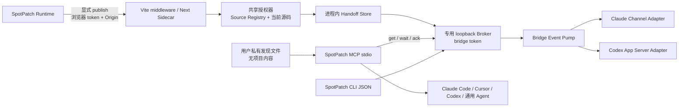

# 外部 Agent 连接：索引与决策摘要

## 文档治理

本专题同时描述规范设计和可核验的当前实现状态，但不构成对外支持声明。规范词含义如下：

- “必须 / 禁止”：进入实现后不可自行偏离的目标约束。
- “应”：默认方案，偏离时必须新增 ADR 和测试证据。
- “可以”：可选增强，不得成为首版基线依赖。
- “当前”：只指 2026-08-24 实仓可验证事实。
- “首版”：指本专题全部必需 Gate 通过后的第一个对外版本。

实现状态唯一入口为本页；其他专题页描述目标契约，不重复声明实现状态。当前公共 Inbox 和主动派发均为 `local-validation`：仓库已有 external handoff endpoint、内存 Store、loopback Broker、安全发现、MCP/CLI、Runtime 可选入口、Vite/Next 生命周期装配，以及 Active Registry、共享 Event Pump、Claude Channel adapter 和 Codex App Server adapter。主动实现已通过受控 adapter/假宿主合同测试与连续两条 Handoff 的确定性集成测试；2026-08-24 又在记录的 macOS/Next.js/Codex 0.149.0 环境完成人工连续两 revision 验证，操作方确认两次任务均完成修改并在终态后继续接收下一次派发。该证据只覆盖一个真实 Codex happy path，不等于跨宿主、跨平台或可重复 CI E2E。Claude Channels 仍是厂商 Research Preview；Codex App Server 是官方 deep-integration interface，但其命令当前仍属 experimental 且官方不建议用于 production workload；Cursor 与其他普通 MCP 宿主保持 Inbox-only。首次真实 Codex 尝试曾因把约 225 KiB MCP 交接结果整体送入模型而偏离且未达 terminal，后续实现改为有界任务投影并完成上述复测；该历史失败和修复证据见 (见 doc-id:external-agent-08-testing-delivery)。真实 Claude Code 双次点击、Ubuntu、Windows、npm 矩阵及可重复的真实宿主自动化仍未通过，因此专题整体既不是 beta，也不是 released。后续状态变化必须同时更新本页、测试证据和 Changeset；入口文档只引用本页，不能成为第二个状态源。

| 能力 | 当前实现状态 | 对外支持状态 |
| --- | --- | --- |
| Generic MCP/CLI Inbox | `local-validation` | 未发布；真实 Claude Code/Cursor/Codex 与跨平台矩阵未完成 |
| Claude Code 主动 Channel | `local-validation` | Research Preview adapter；假宿主合同测试通过，真实双次点击 `not-tested` |
| Codex 主动 App Server | `local-validation` | experimental adapter；假 App Server 合同测试与指定 macOS/Next.js 环境人工连续两 revision 通过；跨平台和自动化真实宿主 E2E 未完成 |
| Cursor / 其他 MCP 主动派发 | `unsupported` | 仅 Inbox；没有已验证入站 API 时不创建空 adapter |

## 问题拆分

“点击组件后让 Agent 快速改代码”包含五个不同问题，协议不能混为一谈：

| 问题 | 首版责任方 | 首版方案 |
| --- | --- | --- |
| 选择了什么、用户想改什么 | Runtime + 现有采集链路 | `SpotAnnotation` 多目标上下文与逐目标说明 |
| 上下文是否可信、是否属于当前项目 | Node dev-server | Source Registry 重新授权并重新读取源码 |
| 如何让不同 Agent 获得上下文 | Bridge + MCP/CLI | MCP stdio 为通用读取协议，CLI JSON 后备 |
| 如何在不占用模型 turn 时唤醒 Agent | Bridge Event Pump + 能力适配器 | Claude Channel / Codex App Server；无入站能力时诚实降级为 Inbox |
| 谁执行写入、审批、测试和撤销 | 外部 Agent 宿主或用户显式启动的 Connector | 权限在 Node/宿主侧固定；浏览器不能选择命令、cwd、sandbox 或审批策略 |

只有在这五项职责分离后，才能同时获得跨 Agent 兼容、安全边界和低延迟。

## 核心决策

| 编号 | 决策 | 理由 |
| --- | --- | --- |
| D1 | 单击只选择；“发送给 Agent”才发布 | 说明可能尚未完成，且项目内容外发必须显式 |
| D2 | 服务端重新授权，不信任浏览器源码片段 | 沿用既有安全模型，避免伪造路径和过期代码 |
| D3 | 交接快照只存当前 Node 进程内存 | 不把源码、DOM 或 Prompt 复制到临时文件 |
| D4 | 发现文件只保存有权限的连接元数据 | MCP 子进程能发现本地会话，同时减少落盘内容 |
| D5 | MCP stdio 是跨厂商上下文基线 | Claude Code、Cursor、Codex 都支持本地 MCP；它不等于通用唤醒协议 |
| D6 | CLI 是机器可读后备，不是浏览器命令执行器 | 支持脚本和不完整 MCP 宿主，不扩大前端权限 |
| D7 | `get` + 有界 `wait` 是可移植 Inbox 语义 | 标准 MCP 不能保证向活跃对话主动注入内容 |
| D8 | 厂商深度适配位于 Bridge 私有 adapter 层 | Claude Channels、Codex App Server 不污染 Runtime、dev-server 和 Handoff Schema |
| D9 | 通用 MCP Connector 仍只读；主动 Connector 必须显式启动且有独立权限契约 | 不把 `externalAgent: true` 静默升级为任意命令或全权写入 |
| D10 | Vite 与 Next 共用 dev-server 核心 | 框架包只管理装配和生命周期，不复制 handoff 逻辑 |
| D11 | 常驻 Event Pump 取代模型反复 `wait` | 本地 Connector 空闲等待不产生推理/token，每次交付后自动再次等待 |
| D12 | 每个 dev Session 首版只允许一个 SpotPatch 管理的主动 adapter | 防止同一 Session 的一次点击被主动派发给多个 writer；相同 root 的其他 dev Session 与 Generic MCP 消费者不在该内存 lease 的排他范围内 |
| D13 | 主动派发 capacity=1，Browser requestId 幂等，busy/unknown 不排队不重试 | 避免旧上下文、重复写和不确定交付被放大 |

## 运行拓扑摘要

浏览器永远不接触 bridge token；MCP/CLI 永远不接触浏览器 token。Broker 只绑定 loopback，不复用可能监听 LAN 的 Vite 公开端口。

## 规范优先级

1. 现有公共模型、Source Registry 和本地安全事实由 (见 doc-id:03-public-api-models)、(见 doc-id:09-local-protocol-security) 负责。
2. 本专题只定义外部交接的增量契约；相同字段不得复制成第二个组件模型。
3. 外部 Agent 不适用内建 Agent 的写入保证；相关对比由 (见 doc-id:16-ai-agent-execution) 提供。
4. 具体外部交接预算只在 (见 doc-id:external-agent-07-ux-performance-observability) 维护一次。
5. 安全冲突时，以 (见 doc-id:external-agent-06-security) 和既有本地协议较严格者为准。
6. 官方客户端能力变化只更新 (见 doc-id:external-agent-02-research-compatibility)，不得直接把调研结论散落到实现文档。

## 术语

| 术语 | 定义 |
| --- | --- |
| Handoff / 交接 | 用户明确发布的一次组件修改上下文，不表示 Agent 已执行 |
| Handoff revision | 同一开发会话内严格递增的不可变交接版本 |
| Cursor / 游标 | Agent 获取增量交接时使用的不透明版本标识；不是 Cursor 产品名 |
| Generic Connector / 通用连接器 | 面向 MCP 或 CLI 的只读进程，负责发现并访问本地 Broker；可以记录取件回执，但不主动启动写任务 |
| Active Connector / 主动连接器 | 用户显式启动的常驻 Bridge 进程；持有 dev Session 内的主动 lease，并通过一个已验证的宿主 adapter 触发任务 |
| Broker | dev-server 启动的专用 loopback 服务，只向持有 bridge token 的本机连接器提供交接 |
| Agent host / Agent 宿主 | Claude Code、Cursor、Codex 等拥有对话、工具、审批和编辑能力的产品 |
| Armed wait / 等待态 | Agent 已调用 `wait_for_handoff`，等待用户下一次显式发布 |
| Picked up / 已取走 | 连接器成功获得交接；不等于模型理解、开始编辑或修改成功 |
| Active adapter / 主动适配器 | Active Connector 内把新 Handoff 转成宿主事件或 turn 的窄厂商实现；同一 dev Session 只有一个 SpotPatch 管理的 active lease |
| Dispatched / 已派发 | 已取得 adapter 特定的最小证据：Claude 仅为 Channel transport write 完成，Codex 为匹配的 `turn/start` 成功响应；不自动等于 working/completed |
| Delivery unknown / 投递未知 | 任务可能已进入宿主但确认丢失；必须先核对工作区，SpotPatch 不自动重试 |

## 文档地图

| 文档 | 单一职责 |
| --- | --- |
| [01-需求与产品语义.md](./01-需求与产品语义.md) | 需求、流程、边界和失败语义 |
| [02-官方能力与兼容矩阵.md](./02-官方能力与兼容矩阵.md) | 一手调研、共同能力和厂商差异 |
| [03-总体架构与包边界.md](./03-总体架构与包边界.md) | 组件、进程、依赖、生命周期和复用 |
| [04-交接模型与本地协议.md](./04-交接模型与本地协议.md) | 状态、数据、endpoint、Broker 和并发 |
| [05-MCP与CLI设计.md](./05-MCP与CLI设计.md) | MCP tools、资源、CLI 和设置 |
| [06-安全隐私与权限边界.md](./06-安全隐私与权限边界.md) | 威胁、凭据、授权、保留和禁区 |
| [07-交互性能与可观测性.md](./07-交互性能与可观测性.md) | UI、延迟、资源预算、诊断和遥测 |
| [08-测试验收与实施计划.md](./08-测试验收与实施计划.md) | POC、测试、门禁、阶段和回滚 |
| [09-主动派发与Agent适配器.md](./09-主动派发与Agent适配器.md) | 常驻 Event Pump、Claude/Codex 主动适配、权限与扩展 Gate |

## 发布前待验证问题

首版架构不依赖下列选择；它们必须在 POC 后决定，不能提前写死：

- MCP 客户端对 25 秒工具调用的默认超时是否一致；不一致时取通过矩阵的最小值。
- MCP roots 在 Claude Code、Cursor、Codex 中的实际可用性；首版必须保留基于 `cwd` 祖先项目键的后备发现。
- 三个客户端对 MCP prompt 和 resource subscription 的真实 UI 行为；两者失败不得影响 tools 主链路。
- Windows 发现目录 ACL 与进程崩溃后的清理证据。
- 独立 `@spotpatch/bridge` 由框架入口依赖并转发后，在 npm 安装、monorepo 子目录和各目标客户端实际启动 cwd 下是否都能稳定解析。
- Claude Code 锁定版本在 legacy MCP + Channel 开关下连续两次事件/结果上报，以及组织策略、忙碌、关闭会话的真实表现。
- Codex 锁定版本 App Server 在有界任务摘要、同 Broker Session 预检和运行目录环境白名单下的双 turn、sandbox/approval、反向 request、畸形 JSONL 和进程清理真实表现。
