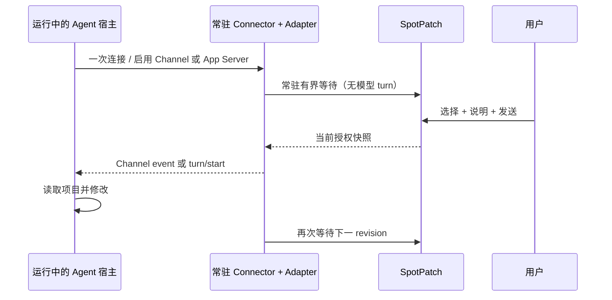

# 外部 Agent 连接：需求与产品语义

## 用户目标

开发者正在 Vite 或 Next 开发页面中定位视觉/交互问题时，应能：

1. 使用 SpotPatch 精确选中一个或多个组件；
2. 为每个目标填写具体修改说明，并预览将要交接的上下文；
3. 在不复制长 Prompt、不手工查找文件的情况下，把同一份经授权上下文交给已配置的本地 Agent；
4. 在主动 adapter 已 ready 时立即收到任务：Claude 主动模式收到交接引用并按需读取已授权上下文；Codex 主动模式直接收到相对文件、组件标签、行列和逐目标说明的有界任务投影；完整页面/DOM/CSS/源码上下文只由 Generic Inbox 或 Claude 的显式取件工具提供，Inbox 本身不承诺自动注入当前对话；
5. 让 Agent 使用自身的读取、编辑、审批和检查能力完成修改；
6. 在 SpotPatch 中看到 Inbox 的“已发布/已取走”和主动模式的“ready/dispatched/working/terminal”等有证据状态，而不是模糊的“已发送成功”。

## 关键产品原则

### 选择不等于发送

DOM 单击频繁、可能误选，用户也往往要先补充说明。单击自动发送会造成：

- 未完成说明被 Agent 读取；
- DOM 文本、样式和源码在用户未确认时被另一个进程消费；
- 多目标编辑期间出现多个过期任务；
- Agent 正在处理旧选择时被新点击无意打断。

因此单击只改变本地选择；发布必须由明确的“发送给 Agent”动作触发。可以提供快捷键，但快捷键与按钮必须共享同一确认、校验和状态机。

### 一次连接，每次点击都主动触发

便捷体验来自一次显式连接和常驻 Node Connector，而不是用一次性模型 tool call 模拟订阅：

Adapter 未连接或宿主没有正式入站能力时，发布仍保留到 TTL 到期；产品必须明确降级为 Inbox，不得将其显示为已主动触发。主动 adapter 的成立条件、宿主限制和权限边界见 (见 doc-id:external-agent-09-active-dispatch-adapters)。

### 交接不等于执行成功

通用 Inbox 只能证明：

- `published`：Node 已重新授权并保存快照；
- `picked-up`：连接器已取得快照；
- `expired`：快照超时失效；
- `superseded`：同一会话更新的交接取代旧版本。

不能从通用 MCP 推断“模型已阅读”“开始编辑”“检查通过”或“改动完成”。Claude Channel 的 transport write 也不是模型 ACK。只有 Codex App Server 等 adapter 的结构化 turn 事件，或 Agent 显式调用状态 tool，才能增加正交的 `working/completed/failed` 状态；`completed` 仍不等于代码正确或检查通过。

## 核心用例

### UC-1：读取当前交接

- 前置：开发服务正在运行，项目已配置 SpotPatch MCP，用户已发布交接。
- 动作：在 Agent 中请求“读取当前 SpotPatch 交接并按说明修改”。
- 结果：Agent 获得最新未过期 revision；内容属于当前项目且路径均为项目相对路径。
- 失败：无会话、未发布、已过期或项目不匹配时返回稳定错误及修复建议，不猜测其他项目。

### UC-2：等待下一次交接

- 前置：Agent 对话已连接 SpotPatch MCP。
- 动作：Agent 调用有界等待；用户随后在页面发布。
- 结果：等待在目标延迟内返回新 revision，并自动标记为连接器已取走。
- 失败：等待超时返回正常 `timeout` 结果，不作为工具错误，不忙轮询。

### UC-3：多目标原子交接

- 用户选择多个组件并填写每项目标说明。
- 任一目标授权失败时整次发布失败；不得发布部分目标。
- Agent 得到顺序稳定的完整目标集和共享页面上下文。
- 新增或移除目标后再次发送产生新 revision，不改写已发布 revision。

### UC-4：多项目或多开发会话

- Connector 只匹配 Agent 当前 MCP root 或进程工作目录所属的项目键。
- 同一项目有多个活跃会话时，`list_sessions` 给出不敏感的会话摘要。
- `get` 默认选择最近一次明确发布且未过期的会话；若时间相同或无法唯一判断则返回歧义错误，禁止随机选择。
- 工具结果始终包含会话、页面和 revision 摘要，便于用户核对。

### UC-5：未配置或 Agent 不在线

- SpotPatch 的 Prompt 复制、源码导航和内建 AI 不受影响。
- 入口可以发布到内存，但按钮/提示应明确降级为“发布到 Agent 收件箱”；不能谎报外部 Agent 在线或已执行。
- 页面提供一次性设置指引或复制设置命令，不在后台修改 Agent 配置。

### UC-6：连续两次主动执行

- 前置：一个经验证的主动 adapter 已连接，宿主空闲，且用户在 Node/宿主侧已确认其执行权限。
- 动作：用户发送 revision N，Agent 完成并回到 idle；随后用户发送 revision N+1。
- 结果：两次都由常驻 Connector 主动触发，中间不需要模型再次调用 `wait_for_handoff`。
- 失败：adapter 断开、宿主忙、策略阻断或交付结果未知时，UI 显示精确降级/错误，不自动重发写任务。

## 功能需求

| ID | 需求 |
| --- | --- |
| FR-01 | 复用现有目标选择、逐目标说明和 `SpotAnnotation`，不建立第二套选中组件状态 |
| FR-02 | 显式发布前显示目标数、目标文件、将包含的数据类别和外部权限提示 |
| FR-03 | Node 对全部目标执行会话、Schema、Source Registry、root、revision 和当前源码授权 |
| FR-04 | 发布生成当前会话内严格递增、不可变、可过期的 revision 和不透明 cursor |
| FR-05 | 支持读取当前、等待更新、列出当前项目会话和确认取走四种只读/回执操作 |
| FR-06 | MCP stdio 为必需通道；CLI JSON 复用同一客户端和 Schema，不复制业务逻辑 |
| FR-07 | Vite 和 Next 使用相同 handoff service；框架层只负责装配、代理和退出清理 |
| FR-08 | 连接器关闭、开发服务退出、页面刷新和 Agent 取消都必须有确定清理行为 |
| FR-09 | 配置生成器可输出 Claude Code、Cursor、Codex 的项目级配置预览，并只在显式 `--write` 后修改 |
| FR-10 | 外部 Agent 能力完全关闭时，不启动 Broker、不写发现文件、不影响 Runtime/HMR |
| FR-11 | 常驻 Event Pump 在每次交付后自动再次等待；同 Session 的 cursor invalid 可重新建立 baseline，Session 结束/重启则停止旧 Connector 并提示用户重跑 |
| FR-12 | 主动 adapter 只依赖授权 snapshot；厂商协议不进入 Runtime、dev-server、Vite 或 Next |
| FR-13 | 每个 dev Session 首版最多一个 SpotPatch 管理的主动 adapter；普通只读 Connector 可继续读取同一 Inbox，产品不得把该 lease 宣称为跨进程或跨宿主全局单 writer |
| FR-14 | 主动执行权限由用户在 Node CLI/宿主侧显式授予，Browser API 禁止提交 executable、args、cwd、thread、model、sandbox 或 approval |
| FR-15 | 每次真实点击生成随机 requestId；相同请求幂等，不确定投递不自动重试 |
| FR-16 | 主动 dispatch capacity=1；busy 时服务端拒绝且 UI 禁用，不做队列、latest-wins、广播、自动合并或 steer |
| FR-17 | Claude 的完成依赖 exact-cursor 读取与结果工具；Codex 状态只依赖匹配 thread/turn 的结构化事件 |

## 非功能需求

| 类别 | 要求 |
| --- | --- |
| 安全 | dev-only、loopback、双 token 域、项目 root 匹配、严格 Schema、无任意命令 |
| 隐私 | 默认不发布；不落盘项目内容；TTL；终端和错误不输出内容/绝对路径/token |
| 性能 | 发布和唤醒满足集中预算；无连接器时不对选择/HMR造成可测回归 |
| 兼容 | 客户端差异通过 adapter/config 描述，不改变公共 Handoff Schema |
| 可恢复 | Agent 晚启动可读取当前 revision；Broker 重启后明确失效，不恢复过期内容 |
| 可观测 | 只有本地、脱敏、可关闭的诊断；首版不发送产品遥测 |
| 可维护 | 一个交接模型、一个授权器、一个 Store、一个 Broker client、一个 Event Pump；厂商只实现窄 adapter 端口 |
| 可测试 | clock、random、filesystem、loopback server 和 client transport 可注入 |

## 数据范围

首版允许交接的内容仅限用户预览可见且经 Node 重新授权的：

- locale、页面 URL 的既有清洗表示和共享页面上下文；
- 每项目标的 instruction、组件/React 摘要、相对路径与行列；
- 有界 DOM/CSS/element/context/warnings；
- Node 从当前文件重新读取并裁剪的源码片段；

组件数据链路报告不进入首版 Handoff，避免在没有独立体积、隐私和准确性 Gate 时扩大正文。未来若需要，应引用现有只读报告 Schema 并单独评审，不能把接口原值、header/body 或第二份组件身份塞进 annotation。

禁止包含原始请求 header/body/cookie、密码字段、完整环境、绝对路径、Git 凭据、Provider Key、浏览器 token、bridge token、未授权文件、调用栈或任意命令。

## 目标成功标准

首版只有同时满足下列条件才能对外称为“已连接”：

1. Vite 和 Next 各至少一个 required fixture 完成浏览器发布到真实 MCP 客户端读取的 E2E。
2. Claude Code、Cursor、Codex 的锁定正式版本均通过 `list/get/wait/ack` 主链路；可选资源和 prompt 不计入基础成功率。
3. 跨项目、LAN、伪造发现文件、过期 token、符号链接和超限载荷均被拒绝。
4. 页面发布到已等待 Agent 的本机 p95 延迟满足集中预算。
5. 生产构建扫描不到 Runtime 发送入口、Handoff endpoint、Broker、token 或发现文件逻辑。
6. 外部 Agent 未安装或未运行时，SpotPatch 现有功能无回归。
7. 文档和 UI 从不把 `picked-up` 描述成代码已经修改成功。
8. Claude 和 Codex 主动 adapter 分别完成“发送 → 执行 → idle → 再发送 → 再执行”的锁定版本真实宿主 E2E；未通过时只标记为实验性本地验证。

## 明确范围外

- 远程浏览器、Codespaces、容器和 SSH 主机之间的跨机连接；它们需要独立身份与隧道威胁模型。
- ChatGPT 网页版直接访问本地 stdio 或 loopback。
- 自动选择模型、购买额度、管理外部 Agent 登录或 API Key。
- 同时编排或广播给多个可写 Agent 竞争修改同一交接。
- 任意 command/args 模板、动态未信任 adapter 插件或从浏览器选择执行权限。
- 通用 Agent 结果回传、聊天消息同步、终端嵌入和会话录制。
- 把外部改动自动 Apply/Revert；这些能力若需要，应复用内建 Agent worktree 或单独立项。
