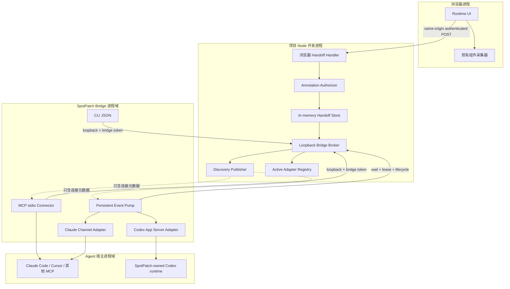

# 外部 Agent 连接：总体架构与包边界

## 架构目标

目标不是“给每个 Agent 写一个按钮”，而是建立一个框架中立、Agent 中立的授权交接核心。它必须同时满足：

- Vite 和 Next 只装配一次，不复制 endpoint、store 或 security；
- Runtime 不依赖 Node、MCP SDK 或任何厂商 CLI；
- 通用 MCP 连接器不解析 JSX、不接触 DOM，也不拥有文件写入能力；主动 Connector 只驱动用户显式启动、受宿主 sandbox 约束的专用 Agent runtime；
- 浏览器会话和本地连接器使用不同认证域；
- 外部 Agent 厂商变化不会改变 `SpotAnnotation` 和 Handoff Schema；
- 能力关闭时不启动进程、端口或发现文件。

## 四个进程边界



### 浏览器进程

负责选择、说明、预览和显式发送。它只能调用现有本地浏览器 API 域，不能：

- 打开端口或发现 MCP server；
- 接收 bridge token；
- 选择本地可执行文件、CLI 参数、cwd、root 或权限模式；
- 直接把浏览器采集的 code excerpt 当成可信事实。

### 项目 Node 开发进程

负责全部可信判断：

- 解析已启用配置和会话能力；
- 对 `SpotAnnotation` 做严格 Schema 与当前会话授权；
- 使用 Source Registry 解析 `fileId`，realpath 验证并重新读取当前源码；
- 创建不可变 revision、TTL、等待队列和回执；
- 管理本 dev Session 单一主动 adapter lease、单飞行 dispatch 状态和浏览器可见的脱敏生命周期；该内存 lease 不冒充相同 root 跨 Session 的全局锁；
- 启动专用 loopback Broker，生成独立 bridge token；
- 以原子方式发布和删除仅含连接元数据的发现文件；
- 退出时取消 waiters、关闭 Broker、删除本会话发现记录和内存快照。

### SpotPatch Bridge 进程域

Generic MCP Connector 通常由 Claude Code、Cursor 或 Codex 按配置启动。它：

- 通过 MCP roots 或 `cwd` 祖先计算项目键；
- 在用户私有运行目录发现匹配会话；
- 只连接字面 loopback endpoint，不跟随 redirect、不使用代理环境；
- 用 bridge token 调用 Broker 的 list/get/wait/ack；
- 校验响应 Schema、大小、项目键和协议版本后才返回 MCP/CLI 结果；
- 不读取任意项目文件、不写文件、不执行 Shell、不持有浏览器 token。

主动 Connector 仍复用同一 discovery 和 Broker client，但额外：

- 在 adapter 已真实 ready 后显式取得目标 dev Session 的唯一 active-adapter lease；claim 原子返回 baseline cursor，禁止 claim 后另读 current 推导基线；
- 用常驻 Event Pump 从该 baseline 等待新 revision，不重放旧写任务；多个匹配 Session 时 fail-fast，不能按“最新”猜 active 目标；
- 只把授权后的 snapshot 引用交给一个已知 adapter；
- 以固定协议驱动 Claude Channel 或专用 Codex App Server；
- 心跳、状态上报、退避、AbortSignal 和退出清理由一条公共生命周期管理；
- 不提供任意 executable/args 插件接口。

### Agent 宿主进程域

Claude Code、Cursor 和 Codex 拥有实际文件读取、编辑、模型、审批和 sandbox。SpotPatch 不把它们的厂商协议塞进 Handoff；Claude Channel 只面向已经运行的会话，Codex adapter 只管理自己启动的 App Server runtime/thread，Cursor 在没有已验证入站入口前只消费 Generic MCP Inbox。

## 目标包职责

现有 Inbox 与主动层沿用以下包边界，不新建厂商 package 或第二份核心。下表是当前实现必须继续遵守的职责约束；对外支持状态仍只以 (见 doc-id:external-agent-00-index) 为准。

| 包 | 新增职责 | 禁止职责 |
| --- | --- | --- |
| `@spotpatch/shared` | Handoff DTO、Schema、错误码、集中 limits、协议版本 | fs、HTTP server、MCP SDK、厂商配置 |
| `@spotpatch/dev-server` | Authorizer、内存 Store、浏览器 handler、loopback Broker、发现发布器、主动 lease/dispatch 事实状态 | DOM/UI、厂商 CLI、MCP host UI、启动 Agent 子进程 |
| `@spotpatch/runtime` | 交接预览、显式发布、Inbox/主动状态 UI、取消订阅 | Node API、发现文件、bridge token、命令启动、厂商分支 |
| `@spotpatch/bridge` | MCP/CLI、发现读取、Broker client、设置生成、共享 Event Pump、Claude/Codex 窄 adapter | 源码解析、直接文件修改、Git、任意 Shell/命令模板、第二份 Prompt 模型 |
| `@spotpatch/vite` | development-only 装配、共享服务生命周期、middleware 注册 | 复制 Store/Broker/MCP 实现 |
| `@spotpatch/next` | Sidecar 装配、rewrite、共享服务生命周期 | 复制 Store/Broker/MCP 实现 |

目标采用独立 `@spotpatch/bridge` 包，并由框架入口作为受控依赖和 `bridge` CLI 子命令提供；用户仍只需安装一个框架入口包，不手工协调多个 SpotPatch 版本。当前 Inbox、Active Registry、共享 Event Pump 与 Claude/Codex 窄 adapter 均有工作区实现和受控自动化证据，状态为 `local-validation`。Claude 真实双次 E2E 仍为 `not-tested`；Codex 已在记录的 macOS/Next.js/Codex 0.149.0 环境完成人工连续两 revision 验证，但跨平台与可重复真实宿主自动化尚未完成。是否进入对外发布仍由 EA-6 与 EA-7 决定。

## 依赖方向

```text
runtime ────────────────> shared
dev-server ─────────────> shared
bridge ─────────────────> shared
vite ───────────────────> dev-server + bridge + runtime artifact
next ───────────────────> dev-server + bridge + runtime artifact

bridge ──loopback protocol──> dev-server
```

禁止以下反向依赖：

- `shared -> MCP SDK / Node / runtime`；
- `runtime -> bridge / dev-server / fs / child_process`；
- `dev-server -> Claude/Cursor/Codex SDK`；
- `bridge -> runtime / compiler / analyzer`；
- `vite <-> next`；
- 任意框架包直接 import 另一个包的 `src/*` 私有实现。

## Dev-server 内部模块边界

为防止形成新的“万能 Agent manager”，当前实现保持以下窄接口；后续重构不得合并其职责：

| 模块 | 输入 | 输出/副作用 |
| --- | --- | --- |
| Handoff Authorizer | 未信任 annotation + 当前 Session | 授权后的 immutable snapshot；复用既有源码授权器 |
| Handoff Store | 授权 snapshot + requestId/fingerprint + clock | revision/cursor、TTL、wait/ack、发布幂等；仅内存 |
| Browser Handler | 已认证请求 | publish/status envelope；不直接读文件 |
| Bridge Broker | 已认证 connector request | list/get/wait/ack envelope；不做业务授权 |
| Discovery Publisher | session descriptor | 原子创建/更新/删除用户私有元数据 |
| Active Adapter Registry | 固定 kind + connector instance + lease token | 单活、心跳、单飞行状态和严格生命周期转换；仅内存 |
| Handoff Manager | 已解析 options + lifecycle | 组合上述对象并提供 `dispose()` |

Authorizer 是现有 Agent Job 授权逻辑的窄复用/提取目标，不能再写一套 fileId、displayPath、code excerpt 校验。若现有实现无法安全复用，应先重构为无执行权限的共享 Node 服务，再接 handoff。

## Broker 为什么使用专用 loopback listener

### 不复用公开 Vite 端口

Vite 可能由宿主绑定 `0.0.0.0` 或暴露在 LAN。即使有 token，把 connector endpoint 放在公开端口也扩大攻击面，并让浏览器 Origin 规则与本机进程规则混在一起。专用 listener 必须只绑定字面 `127.0.0.1`；IPv6 若支持，需要独立绑定和门禁，不能依赖 hostname 解析。

### 不用源码快照文件做邮箱

磁盘邮箱实现简单，但会把 DOM、说明和源码片段复制到临时目录，增加崩溃遗留、备份/索引和清理风险。首版只落盘短小的连接描述符；实际快照只在 Node 内存中。Agent 晚启动仍可在 TTL 内通过 Broker 获取。

### 不直接把 MCP server 嵌入 dev-server

目标 Agent 宿主普遍最稳定地启动 stdio MCP 子进程。dev-server 不能占用宿主 stdin/stdout，也不能由多个 Agent 对话共同拥有其生命周期。因此 MCP Connector 是轻量独立进程，业务状态留在 dev-server。

## Vite 生命周期

目标顺序：

1. Vite `config` 阶段解析 development-only 配置，不做 I/O。
2. `configureServer` 确认服务启动后构造 Handoff Manager。
3. 先生成 browser/bridge 两个独立随机 token，再绑定专用 loopback listener。
4. listener 成功后才原子发布发现描述符，并注册浏览器 endpoint。
5. HMR 不重建 Manager，不清除 draft 或 revision；Vite server 重启则创建全新 session/token。
6. `httpServer.close`、进程信号和插件 `dispose` 都调用同一幂等清理链。

若 Broker 绑定失败，外部能力显示 unavailable，但核心选择/Prompt 必须继续工作；不得为了外部连接阻断宿主 Vite 启动。

## Next 生命周期

Next 复用既有 Sidecar owner：

1. Sidecar 解析来自可信 IPC 的最终 SpotPatch options；
2. Handoff Manager 与 Source Registry、现有本地 API 在同一 Sidecar 生命周期中创建；
3. 浏览器 publish 通过既有受控 rewrite 到 Sidecar；
4. Connector 仍经独立 loopback Broker 访问，不通过 Next rewrite；
5. Sidecar 崩溃或整组重启会更换 session/token，旧发现记录和快照失效；
6. `next build/start` 不创建 Manager、Broker 或发现文件。

## 并发与所有权

- 每个 dev-server/Sidecar Session 只拥有一个 Handoff Manager。
- 每个 Manager 只拥有一个 Store 和一个 Broker listener。
- 多个只读 Agent Connector 可以读取同一 revision；“已取走”记录为有界 connector count，不建立编辑锁。
- 同一 dev Session 同时只有一个 SpotPatch 管理的主动 adapter lease；不同 adapter kind 或不同 `connectorInstanceId` 的第二个主动 Connector fail-fast。同 kind + 同 instance 的 claim 只是断线前请求的幂等重试：返回原 `leaseToken` 和原 `baselineCursor`，并刷新 lease 到期时间。`connectorInstanceId` 是进程内去重键，不是认证凭据；后续心跳、上报与释放仍必须持有高熵 `leaseToken`。
- 主动 lease 不能依赖 Store “唤醒全部 waiter”的广播语义驱动多个主动 writer。普通 MCP waiter 仍可能读取同一 Inbox 并由其宿主自行执行，SpotPatch 无法把 Session 内 lease 宣称为跨宿主全局单 writer；用户不应同时武装另一个自动写入的 Generic 会话。
- 主动 adapter 存在时，一个 dispatch 未进入终态前 Browser publish 返回 busy；不排队、不 latest-wins、不自动合并，也不自动 `turn/steer`。
- 每次真实点击携带 Runtime 生成的随机 requestId；同 ID/同正文幂等返回原发布，同 ID/不同正文拒绝。投递是否已发生无法确认时进入 `delivery-unknown`，禁止自动重发。
- 同一 Session 同时只保留一个 current revision 和少量历史元数据；新发布不取消已经返回给 Agent 的旧任务。
- wait 使用 Store 内事件/Promise 唤醒和 AbortSignal 取消，不做 100 ms 文件或 HTTP 忙轮询。
- Connector 重试 `get` 是幂等读取；`ack` 以 `sessionId + revision + connectorInstanceId` 幂等。

## 主动 adapter 层

adapter 只能依赖授权后的 Handoff Snapshot，不得绕过 Authorizer：

```text
Authorized Handoff
├── Generic MCP/CLI Inbox（跨宿主基线）
├── Claude Channel adapter（实验性；运行中会话）
├── Codex App Server adapter（实验性；专用 runtime/thread）
└── 其他正式入站 API adapter（逐项 Gate，当前无空实现）
```

公共内部端口只表达真实共同动作：接收一个授权 snapshot、报告结构化生命周期、关闭。`steer`、cancel、审批代理等不稳定能力不放成 optional method。每个可写/可启动 adapter 必须单独定义：用户同意、固定 executable/参数、cwd、环境策略、沙箱/审批、超时、输出上限、版本矩阵和进程树清理。公共 Runtime 不得出现 `if client === "claude"` 一类厂商分支。

## 去冗余验收

实现评审必须拒绝：

- 第二份选中组件 DTO 或 Prompt builder；
- 浏览器 handler 与 Broker 各自解析一遍 handoff Schema；
- Vite/Next 各自拥有 Store 或 token 生成逻辑；
- MCP 与 CLI 各自实现发现、HTTP、重试和响应校验；
- 单独为 Claude/Cursor/Codex 复制 `get_current_handoff`；
- Claude/Codex 各复制一套 discovery、wait、cursor 恢复或 lease 逻辑；
- 空的 Cursor adapter、未来厂商枚举或未消费 public SPI；
- 同时落盘快照又保留内存快照；
- 未被真实调用的通用 `utils.ts`、未来 adapter 空目录或预留枚举。
