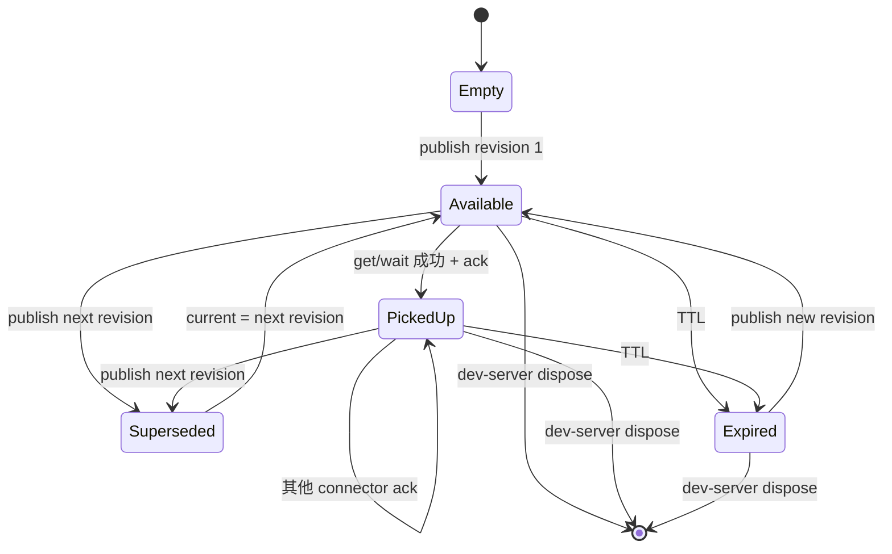

# 外部 Agent 连接：交接模型与本地协议

## 契约分层

本方案定义四个不同契约，必须分别版本化：

| 契约 | 两端 | 是否公共 | 用途 |
| --- | --- | --- | --- |
| Browser Handoff API | Runtime ↔ dev-server | SpotPatch 包内公共协议 | 显式发布、查询本会话回执 |
| Bridge Broker API | Connector ↔ dev-server loopback | 私有、版本化 | 本机 list/get/wait/ack |
| MCP/CLI contract | Agent host/脚本 ↔ Connector | 对用户公共 | 跨客户端的模型可读工具与机器 JSON |
| Active Adapter contract | 常驻 Connector ↔ Broker / 厂商宿主 | 包内私有 | 单活 lease、主动派发和有证据的生命周期 |

四层可以共享 `HandoffSnapshot` Schema 和错误码，但不能共享 token、endpoint 或网络信任规则。MCP 的参数变化不能直接改变浏览器 endpoint；Broker 的端口和 token 永远不进入公共 Handoff 数据。

## 领域对象

### HandoffSnapshot

`HandoffSnapshot` 是 Agent 能获得的唯一业务正文。目标结构如下：

| 字段 | 类型/语义 | 规则 |
| --- | --- | --- |
| `schemaVersion` | 字面量 `1` | 不兼容变更时递增 |
| `cursor` | opaque string | 仅比较是否相同或作为 `afterCursor` 回传，调用方不得解析 |
| `session.id` | 随机 session ID | 只用于核对和回执，不是认证信息 |
| `session.framework` | `vite \| next` | 来自可信框架装配，不由浏览器提交 |
| `revision` | 正整数 | Session 内从 1 严格递增，不跨重启延续 |
| `publishedAt` | ISO 时间 | 由 Node clock 生成 |
| `expiresAt` | ISO 时间 | 由集中 TTL 计算，不由客户端提供 |
| `annotation` | 授权后的 `SpotAnnotation` v3 | 沿用现有多目标和逐目标 instruction；源码由 Node 重读 |

不得增加第二份 `targets`、`prompt`、`root`、`absolutePath`、`command`、`provider`、`model`、`approvalMode` 或外部 Agent 会话字段。Agent 可以从 annotation 构造自己的工作说明，但 Connector 不维护第二份 Prompt builder。

### HandoffSummary

用于 UI 回执和 Session 列表，只包含：

- `sessionId`、`framework`、`revision`、`cursor`；
- `targetCount`、清洗后的页面 origin/path 摘要；
- `publishedAt`、`expiresAt`；
- `state: available | expired | superseded`；
- `pickupCount` 和最近一次 `pickedUpAt`，均为有界元数据。

Summary 不含 instruction、DOM、CSS、源码、路径列表或 token。`pickupCount > 0` 只表示 Connector 取得过正文。

### ConnectorReceipt

回执键为 `sessionId + revision + connectorInstanceId`，内容只包括 `pickedUpAt`。`connectorInstanceId` 每次 MCP/CLI 进程启动随机生成，不包含客户端名、用户名、机器名或对话 ID。重复 ack 幂等，不无限累积；Store 只保留集中上限内的 count 和最近时间，不保存完整消费者列表。

### ActiveAdapterSummary 与 DispatchSummary

主动状态是正交元数据，不增加到 `HandoffSnapshot`，也不复用 `activeWaitCount`/`pickupCount`：

| 对象 | 浏览器可见字段 | 明确不包含 |
| --- | --- | --- |
| `ActiveAdapterSummary` | `kind: claude-channel \| codex-app-server`、`state: ready \| busy \| blocked`、`canDispatch`、`connectedAt`、`updatedAt` | connectorInstanceId、lease token、进程 ID、thread/session ID、cwd |
| `DispatchSummary` | `adapterKind`、`revision`、`phase`、`updatedAt`、可选安全 `errorCode` | instruction、文件、模型输出、厂商 request/turn ID |

`phase` 只允许：`queued | dispatching | dispatched | working | completed | failed | delivery-unknown`。其中 `dispatched` 的证据强度由 adapter 决定；Claude Channel 只表示写入 transport，Codex 的 `working/completed` 必须来自匹配 thread/turn 的结构化事件。`completed` 只表示该宿主本轮结束，不表示代码正确、测试通过或变更可撤销。`delivery-unknown` 会把 active adapter 置为 `blocked` 且 `canDispatch: false`，直到用户显式确认已核对工作区。

`delivery-unknown` 是一个 fail-closed hazard，不是普通终态后的 ready。进入后 Connector 停止并释放 writer；Registry 保留脱敏的 blocked 摘要。用户通过浏览器明确确认工作区已核对后只清除 hazard，不重发旧 cursor，也不凭空恢复已退出的 Connector；需要主动模式时必须重新建立真实连接。

唯一允许的转换：

| 当前 phase | 允许后继 |
| --- | --- |
| `queued` | `dispatching`、`failed` |
| `dispatching` | `dispatched`、`working`、`failed`、`delivery-unknown` |
| `dispatched` | `working`、`failed`、`delivery-unknown` |
| `working` | `completed`、`failed`、`delivery-unknown` |
| `completed` / `failed` / `delivery-unknown` | 无 |

重复上报相同 phase 幂等；倒退、非法跨越、终态改写、错误 cursor 或 lease 均返回 `ACTIVE_DISPATCH_INVALID` 且状态不变。`completed/failed` 允许同一 lease 回到 ready；`delivery-unknown` 保留 hazard gate，不能仅因新 adapter claim 或心跳恢复。

## 状态模型



`superseded` 是旧 revision 的审计结果，current 始终指向新 revision。Store 可以只保留当前正文和有界旧 Summary；不得为了历史回放保留多份源码正文。

## 发布算法

发布必须是全有或全无：

1. Browser Handler 验证 method、content type、body bytes、Origin、Fetch Metadata 和 browser session token。
2. 用共享 Schema 严格解析请求，只允许 Runtime 生成的随机 `requestId` 和 `annotation`；未知字段拒绝。
3. 对同一 Browser Session 的 `requestId` 做有界幂等核对：同 ID/同请求返回原 `ExternalHandoffPublishResult`；同 ID/不同请求拒绝。fingerprint 使用 strict parse 后、排除 requestId 的 annotation，经确定性键排序序列化后做 SHA-256；不依赖原始 JSON 空白/键序。该判断在源码重读前执行，并在最终发布临界区再次核对。
4. 若存在主动 adapter 且其上一 dispatch 未终止，返回 `EXTERNAL_AGENT_BUSY`；无主动 adapter 时仍允许发布到 Inbox。
5. 验证 `SpotAnnotation.schemaVersion === 3`、目标数量、逐项目标说明和总预算。
6. 按原顺序对每个目标执行现有 Source Registry 授权；marker、fileId、displayPath、line/column 和 source revision 任一失败则整次失败。
7. realpath 验证项目 root 后，从当前文件重新读取有界源码上下文；浏览器 `CodeContext` 只是不可信提示，不能直接进入快照。
8. 运行现有 DOM/CSS/URL 清洗和响应大小限制；不得因外部 Agent 绕开敏感模式。
9. 生成 Node-owned `session/framework/revision/cursor/publishedAt/expiresAt`，冻结快照。
10. 在一个无 `await` 的同步临界区内：再次核对 requestId → 原子替换 current → 若主动 adapter ready 则预留该 cursor 的 `queued` dispatch → 保存幂等记录（fingerprint、revision/cursor、首次 delivery mode 和完整首次发布结果）→ 唤醒 waiter。重放不得再次授权、增加 revision、预留 dispatch、唤醒 waiter或调用 adapter。
11. 返回不含正文的 `ExternalHandoffPublishResult`；失败时不得增加 revision、预留 dispatch 或唤醒 waiter。

发布不要求外部 Agent 在线：无主动 adapter 时仍创建 Inbox Handoff。只有“存在主动 adapter 但正在处理上一任务”会拒绝新发布，以避免隐式队列和源码过期。

发布响应是浏览器判断本次走主动派发还是 Inbox 的唯一事实，不允许用发布前的 capability 快照推断：

```ts
type ExternalHandoffPublishResult = {
  readonly handoff: ExternalHandoffSummary;
  readonly delivery:
    | { readonly mode: "inbox" }
    | {
        readonly mode: "active";
        readonly adapter: ActiveAdapterSummary;
        readonly dispatch: DispatchSummary;
      };
  readonly replayed: boolean;
};

type ExternalHandoffStatusResult = {
  readonly handoff: ExternalHandoffSummary;
  readonly activeAdapter: ActiveAdapterSummary | null;
  readonly dispatch: DispatchSummary | null;
};
```

相同 requestId 的安全重试返回第一次保存的整个结果并把 `replayed` 设为 `true`；后来的 lease、dispatch 或 revision 变化不得把旧请求重新解释成另一种 delivery mode。
`ExternalHandoffStatusResult.dispatch` 只在请求 cursor 与该 dispatch 精确匹配时返回，不能把后来 revision 的状态挂到旧交接；`activeAdapter` 是查询时的脱敏连接快照，不改变 publish 的首次 delivery 事实。

## Browser Handoff API

### 目标公共配置

首版只增加一个顶层 opt-in，不暴露底层网络或权限旋钮：

```ts
interface SpotPatchOptions {
  readonly externalAgent?: boolean;
}
```

- 默认 `false`；只有 development phase 且显式 `true` 才装配 Runtime 入口、Store、Broker 和发现描述符。
- Vite 与 Next 使用同一字段；Next 仍受其正式支持阶段和 Sidecar 门禁限制。
- resolved Node options 使用冻结的 `{ enabled: boolean }` 形态；Runtime config 只接收 `{ enabled: boolean }`，不接收 bridge endpoint/token、发现目录或本地客户端信息。
- 不从环境变量自动开启，不与 `ai`、`dataFlow`、`debug` 或 `allowLan` 隐式联动。`allowLan` 永远不改变 Broker 的 loopback-only 规则。
- limits、端口、token、root、Agent 产品、CLI 命令和权限策略不是首版公共配置。若未来确有多个用户场景，再以真实需求扩展对象联合；现在不预留未消费字段。

目标接入形态为 `spotPatch({ externalAgent: true })` 或对应的 `withSpotPatch({ externalAgent: true })`；是否已进入公共代码以 (见 doc-id:external-agent-00-index) 的实现状态和测试证据为准。

### Endpoint

所有 endpoint 继续派生自既有 `SPOTPATCH_API_BASE`，采用 `POST`、JSON、统一 envelope、`Cache-Control: no-store`、browser session token 和强制 Origin。目标路径：

| 操作 | Endpoint | 请求 | 成功响应 |
| --- | --- | --- | --- |
| 能力 | `/__spotpatch/v1/external-handoff/capability` | 空 JSON | enabled、Broker ready、active wait、脱敏 active adapter/dispatch 与协议版本；仅表示查询时快照，不决定后续发布通道 |
| 发布 | `/__spotpatch/v1/external-handoff/publish` | `{ requestId, annotation }` | `{ handoff, delivery, replayed }`；delivery 原子说明 `inbox` 或 active adapter/queued dispatch |
| 状态 | `/__spotpatch/v1/external-handoff/status` | `{ cursor? }` | `ExternalHandoffStatusResult`：当前或指定 Summary + 精确匹配 dispatch + 查询时 adapter；正文不返回 |
| 解除未知阻断 | `/__spotpatch/v1/external-handoff/resolve-delivery` | `{ cursor, confirmation: "workspace-reviewed" }` | 只解除匹配 `delivery-unknown` 的 hazard并返回更新后的 `ExternalHandoffStatusResult`；不重发旧任务 |

路径常量只在 `@spotpatch/shared` 协议模块定义一次。`capability` 可以返回一个脱敏 `activeAdapter` 和最近 `DispatchSummary`，但不暴露 bridge port、token、发现目录、connector instance、厂商会话/turn ID 或本地进程详情。当前 middleware 保留固定路由识别；可信配置关闭时，授权请求统一返回 `EXTERNAL_HANDOFF_DISABLED`，且不创建 Store、Broker、描述符或 Runtime 扩展 chunk。

浏览器不能调用 get/wait/ack 正文接口。即使页面拿到 cursor，也不能通过 browser token 读取服务端重建后的完整快照。

## 内部 Bridge Broker API

Broker 是 Connector 专用的 loopback JSON API，不通过页面 origin。它只绑定 `127.0.0.1` 随机空闲端口，使用单独 `X-SpotPatch-Bridge-Token`，固定 `POST` 和 `application/json`。目标私有路径：

| 操作 | Path | 请求 | 语义 |
| --- | --- | --- | --- |
| 健康 | `/bridge/v1/status` | 空 JSON | 返回协议、Session 和 current Summary；不含正文 |
| 当前 | `/bridge/v1/handoff/current` | `{ cursor? }` | 返回最新未过期 snapshot；可用 cursor 做精确核对 |
| 等待 | `/bridge/v1/handoff/wait` | `{ afterCursor?, timeoutMs }` | 新 revision 可用时返回；超时返回正常 timeout result |
| 回执 | `/bridge/v1/handoff/ack` | `{ cursor, connectorInstanceId }` | 幂等记录 picked-up，返回 Summary |
| 主动占用 | `/bridge/v1/active/claim` | `{ adapterKind, connectorInstanceId }` | 同步读取 current 并创建单一短租约；返回 lease token、心跳周期与原子 `baselineCursor` |
| 主动心跳 | `/bridge/v1/active/heartbeat` | `{ leaseToken }` | 延续连接；不改变 dispatch 状态 |
| 主动上报 | `/bridge/v1/active/report` | `{ leaseToken, cursor, phase }` | 按严格状态机更新同一 dispatch |
| 主动释放 | `/bridge/v1/active/release` | `{ leaseToken }` | 幂等释放；按交付阶段确定 failed 或 delivery-unknown |

规则：

- 每个请求都验证 token constant-time comparison、Host、loopback remote address、method、content type、body bytes 和 Schema。
- token 只授权一个 Session；请求不能指定 project root、sessionId、文件、路径或 revision 正文。
- `/current` 的 cursor 若已过期或属于其他 Session，返回稳定 stale/not-found 错误，不回退到“看起来最像”的 revision。
- `/wait` 只等待 `afterCursor` 之后的新 current。缺少 `afterCursor` 且已有 current 时立即返回；没有 current 时等待第一次发布。
- timeout 由客户端请求但受集中最小/最大值裁剪；AbortSignal、socket close 或 Manager dispose 立即取消。
- Broker 不使用 cookie、CORS、redirect、compression、keep-alive 无限连接或代理信任。
- 响应必须通过共享 Schema 和字节上限；错误不含 token、绝对路径、源码或 stack。
- active lease 仅在同一 bridge token 授权域内有效，但仍使用独立高熵 lease token 防止其他只读 Connector 伪造生命周期；一个 Session 只有一个未过期 lease。
- `/active/claim` 对同 `adapterKind` + 同 `connectorInstanceId` 的重试幂等：必须返回原 `leaseToken` 和原 `baselineCursor`，只刷新 lease 到期时间；不同 kind 或 instance 在旧 lease 有效时返回 `ACTIVE_ADAPTER_CONFLICT`。`connectorInstanceId` 只是同一 Connector 实例的重试去重键，不是身份或授权证明；心跳、上报和释放均必须验证私有 `leaseToken`。
- `/active/claim` 的 baseline 与 lease 激活在同一同步临界区完成。Pump 禁止 claim 后另读 current 推导 baseline；只有 lease 激活之后的 publish 才预留 active dispatch。Claude MCP initialize 完成、Codex initialize/thread ready 且已验证本 thread 的 SpotPatch MCP tools 可用后才允许 claim。
- 心跳失效或 Connector 退出：尚未派发的 `queued` 记为 `failed`；已经开始 dispatch、已写入 transport 或 working 的任务记为 `delivery-unknown`。两者都不自动重发。
- 状态转换必须验证 lease、current/历史 cursor、revision 和允许边；乱序、重复终态、错误 cursor 或过期 lease 不改变状态。
- release/expiry 在 `queued` 判 `failed`；在 `dispatching/dispatched/working` 判 `delivery-unknown`；在 `completed/failed` 只释放连接；在 unknown 保留未解决 hazard。已经开始向厂商 transport 写入后，任何无法确认的退出只能是 unknown。

共享 `BridgeClient.current/wait` 在成功获得并校验 snapshot 后自动尝试 ack，返回 `receiptRecorded`；不得再建立第二个 Broker client 或把 ack 延迟到厂商投递之后。ack 只证明 Connector 已取得 snapshot，不是 Channel/turn 的投递证据。Generic MCP 即使 ack 失败仍可返回正文并明确 `receiptRecorded: false`；Active Event Pump 则必须在开始任何厂商 transport write 前确认 receipt 已记录，否则按可证明的 pre-dispatch failure 停止该任务。

## 发现描述符

MCP stdio 子进程需要在不知道端口的情况下找到当前项目 Broker。dev-server 在用户私有运行目录写入每 Session 一个描述符；目标字段为：

| 字段 | 说明 |
| --- | --- |
| `schemaVersion` | 发现文件 Schema，首版为 1 |
| `brokerProtocolVersion` | Broker 主版本 |
| `projectKey` | 对规范化 real root 和版本 salt 做 SHA-256；不可逆展示，不是 secret |
| `sessionId` | 随机 Session ID |
| `framework` | vite/next |
| `endpoint` | 必须是字面 `http://127.0.0.1:<port>` |
| `bridgeToken` | 至少 128 bit 随机 secret，只在该文件与 Node 内存存在 |
| `pid` | 仅用于陈旧清理提示，不能单独证明进程身份 |
| `createdAt` | 发现记录创建时间 |

描述符不含 real root、绝对路径、页面 URL、annotation、instruction、源码、DOM、用户名、CLI 配置或 browser token。

运行目录规则：

- POSIX 优先使用归当前用户所有且权限安全的 `XDG_RUNTIME_DIR`；否则在 `os.tmpdir()` 下创建随机/用户隔离目录并校验 owner，目录 `0700`、文件 `0600`。
- 同一 Connector 启动的 Codex stdio MCP 必须与 Connector 使用一致的运行目录输入。持久 Inbox 与主动 inline 配置共用固定名称白名单 `XDG_RUNTIME_DIR` / `TMPDIR` / `TMP` / `TEMP`；只由 Codex 转发当前进程中存在的值，不落盘值、不转发完整环境，Browser/Handoff 也不能覆盖。
- Windows 使用当前用户的本地应用运行目录并验证 ACL；POC 未证明 ACL 前 Windows Gate 不通过。
- 文件先写同目录临时文件、`fsync`（平台适用时）后原子 rename；禁止部分 JSON。
- Connector 对目录、文件类型、owner/ACL、symlink、大小和 Schema 全部 fail-closed。
- 正常退出删除本 Session 描述符；崩溃遗留由 Connector 在 broker 不可达且身份验证失败后做有界清理。不能只凭 PID 重用判断，因为 PID 会复用。

## 项目发现算法

Connector 使用以下顺序，不允许 Agent 模型传入 root：

1. 若 host 实现 MCP roots，读取 host 提供的本地 file root 并 realpath；只接受 file URI。
2. 否则 realpath `process.cwd()`，逐级计算祖先项目键，直到文件系统根；不读取任意仓库内容来猜项目。
3. 从安全运行目录读取有界数量描述符，只保留 `projectKey` 精确匹配者。
4. 对候选 endpoint 执行短超时 `/status`，验证 loopback、token、sessionId 和协议版本。
5. Generic get/wait：一个活跃候选直接使用；多个候选仅在存在唯一最新交接时可选择，否则返回 `SESSION_AMBIGUOUS` 并要求用户显式选择安全的 sessionId。Active claim：多个候选一律返回 `SESSION_AMBIGUOUS`，禁止按最新发布时间猜测写入目标。
6. 无候选时返回 `SESSION_NOT_FOUND`，提示启动项目开发服务和检查项目级 MCP 配置；绝不向相邻项目搜索正文。

显式 session 选择只接受 `list_sessions` 返回的 opaque sessionId，并仍限于已匹配 projectKey。

## Cursor 与版本规则

- cursor 至少包含当前 Session 的随机域和 revision 信息，但格式保持不透明；外部不得按 `.`、数字或 base64 解析。
- Session 重启后所有旧 cursor 无效；不能把 revision 1 与上次 Session 的 revision 1 混淆。
- `afterCursor` 属于其他 Session、未来 revision 或 malformed 时返回 `HANDOFF_CURSOR_INVALID`，不当作“没有新内容”。
- Snapshot Schema 与 Broker protocol 分开版本化。Broker 可在同一主版本中返回向后兼容 optional 字段；Snapshot 不兼容变化递增 `schemaVersion`。
- Connector 与 Broker 主版本不匹配时 fail-fast 并给出升级提示，不尝试字段猜测。

## 并发、重复与失效

- publish 在 Store 内串行化；并发发布按进入临界区顺序产生连续 revision。
- Runtime 为每次真实点击生成至少 128 bit 随机、22–128 位 base64url/UUID 形态 requestId。Browser→Broker 的响应丢失允许使用**同一 requestId 和同一 annotation**有界重传/查询；在结果确定前 Runtime 保留该请求。只有用户明确放弃该请求并开始新的需求时才生成新 ID。
- Broker→Agent 的派发完全不同：delivery-unknown 绝不自动重试。用户必须通过 `resolve-delivery` 明确确认已核对工作区；该动作只解除阻断，不重新执行旧 cursor。
- 幂等记录保留至少覆盖集中幂等 TTL，容量满时 fail closed；不得 LRU 淘汰仍有效记录。过期后允许清理，但 UI 不得把已过期 requestId 当安全重试凭据。同 ID/同 annotation 即使旧任务 completed 或已有后续 revision，也只返回原结果，不重新派发。
- 一个 waiter 只能返回一次；发布时复制 waiter 列表后清空，避免重复唤醒。
- 同一 Connector 多次 get 是允许的；ack 幂等。
- TTL 到期后正文立即不可读取，并在下一次 clock sweep 或访问时清除；旧 Summary 只保留不敏感元数据到集中历史上限。
- dev-server dispose 时所有 waiter 返回 `SESSION_CLOSED`，listener 关闭，正文清零，描述符删除。
- 每个 dev Session 主动 adapter 单 lease、dispatch capacity=1；busy/blocked 时不建立第二个 revision，不 FIFO、不 latest-wins、不广播、不 steer。相同 project root 的两个独立 dev Session 首版不提供跨进程单 writer 保证，UI/CLI 必须要求用户只连接目标 Session；真正 projectKey 级锁属于后续独立 Gate。
- 主动命令从启动 `cwd` 计算精确 projectKey；必须在与 dev Session 描述符相同的精确项目根运行，不会把祖先或子目录自动当成可写根。该精确根存在多个 Session 时必须使用 `--session <id>` 选择 `sessions --json` 列出的 opaque ID，不按最新任务猜测。
- `delivery-unknown` hazard 只在当前 dev-server 内存存在；dev-server 重启后无法继续强制阻断。重启不会自动重放，但用户仍必须自行核对工作区，这一 local-first 取舍不能描述成持久 exactly-once。
- lease 和 Broker dispatch 记录不复制 annotation 或 Prompt。厂商 adapter 只能依该宿主合同选择“引用元数据”或“有界任务投影”：Claude Channel 仍仅 session/revision/cursor；Codex turn 只在每个目标具有可信相对源码位置时携带相对路径、行列、仅标签名的元素标识和逐目标 instruction，不携带 DOM selector/CSS/源码摘录、页面 URL、token 或不透明厂商 ID；缺少可执行源码位置时在厂商写入前报告 failed。主动 Codex 注入的 MCP 子进程使用内部 `--session` 绑定精确 Session，模型只能看到 `spotpatch_list_sessions`；完整 snapshot tools 只存在显式 Generic Inbox/Claude active 契约中，不暴露给 Codex 主动 turn。Session 重启后 lease、dispatch、requestId 记录和旧 cursor 全部失效；旧 Connector 停止，新 Connector 以新 Session current 为 baseline，不重放旧任务。
- 系统休眠/时钟回拨使用 monotonic clock 计算内部 TTL，ISO wall clock 只用于显示。

## 目标错误码

| 错误码 | 含义 | 可恢复动作 |
| --- | --- | --- |
| `EXTERNAL_HANDOFF_DISABLED` | 未启用 | 在可信配置启用并重启开发服务 |
| `EXTERNAL_HANDOFF_UNAVAILABLE` | Broker/Store 初始化失败 | 查看本地脱敏诊断；核心功能仍可用 |
| `HANDOFF_VALIDATION_FAILED` | Annotation 或正文超限/不合法 | 回到页面修正目标/说明 |
| `HANDOFF_SOURCE_STALE` | Source Registry 或源码 revision 变化 | 重新选择后发送 |
| `HANDOFF_NOT_FOUND` | 当前无未过期交接 | 在页面显式发送 |
| `HANDOFF_EXPIRED` | 指定 cursor 已过期 | 重新发送 |
| `HANDOFF_CURSOR_INVALID` | cursor malformed/跨 Session | 重新读取当前 Summary |
| `BRIDGE_UNAUTHORIZED` | bridge token/本机检查失败 | 重新启动开发服务/Connector |
| `BRIDGE_PROTOCOL_MISMATCH` | Connector 与 Broker 主版本不兼容 | 升级同一项目的 SpotPatch 包 |
| `SESSION_NOT_FOUND` | 当前 root 无活跃会话 | 在同项目启动开发服务 |
| `SESSION_AMBIGUOUS` | 无法安全选择多个会话 | 先列出并显式选一个 Session |
| `SESSION_CLOSED` | 等待期间开发服务退出 | 重启开发服务后重新等待 |
| `HANDOFF_RESPONSE_TOO_LARGE` | 授权快照超过响应上限 | 减少目标/上下文，不截成不完整 Schema |
| `EXTERNAL_AGENT_BUSY` | 本 dev Session 的主动 adapter 正在处理上一 dispatch 或存在未解除 hazard | 等待明确终态；unknown 时核对工作区并显式解除，不自动排队 |
| `ACTIVE_ADAPTER_CONFLICT` | 已有另一个主动 adapter lease | 关闭冲突 Connector，只保留一个 writer |
| `ACTIVE_ADAPTER_LEASE_INVALID` | lease 过期、错误或已释放 | 重新显式连接；不重放当前旧任务 |
| `ACTIVE_DISPATCH_INVALID` | cursor/phase/状态转换不匹配 | 停止 adapter 并检查协议版本；不猜测状态 |

错误码必须进入共享联合类型和运行时 Schema，Browser、Broker、MCP、CLI 只做映射，不靠 message 匹配控制流程。

## 示例（说明性，不是当前实现）

授权 snapshot 的 JSON 形态：

```json
{
  "schemaVersion": 1,
  "cursor": "opaque-session-revision-token",
  "session": {
    "id": "opaque-session-id",
    "framework": "vite"
  },
  "revision": 3,
  "publishedAt": "2026-08-24T10:00:00.000Z",
  "expiresAt": "2026-08-24T10:15:00.000Z",
  "annotation": {
    "schemaVersion": 3,
    "locale": "zh-CN",
    "page": {},
    "targets": []
  }
}
```

示例故意省略现有 annotation 内部字段；其唯一结构仍由 (见 doc-id:03-public-api-models) 和代码 Schema 负责，本文不复制完整模型。
