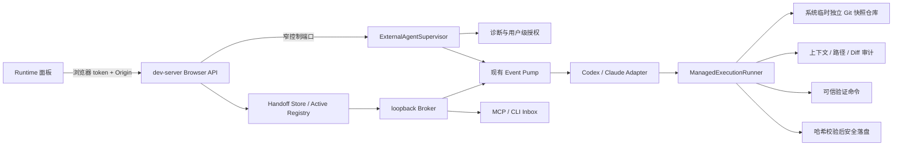

# 外部 Agent 连接：连接生命周期、受控执行与产品收敛

## 1. 文档定位

本文是 ADR-037 与 ADR-039 接受后的**规范目标、实现契约和发布 Gate**。P1–P4 已有工作区实现与本地自动化证据，但这不构成对外支持声明；当前实现状态仍只由 (见 doc-id:external-agent-00-index) 维护。

- (见 doc-id:external-agent-09-active-dispatch-adapters) 继续记录已经跑通的终端 Connector、Event Pump 和厂商 adapter 基线。
- 本文定义并约束已实现的“`init` 一次、`pnpm dev` 托管、页面选择、受控执行、验证后落盘”产品形态。
- ADR-037 只取代 ADR-036 中 Codex “独立终端 Connector + 业务仓库直接 workspace-write”的目标形态；Generic Inbox、Claude attached adapter、Broker、Registry 与 Event Pump 仍由 ADR-035/036 约束。
- legacy `connect codex` 与直接工作区写入只保留一个迁移周期作为高级回退，不能按 managed 路径对外承诺。
- 未通过某项能力 Gate 时按本文规定降级或 fail closed，不再把会改变架构的选择留给编码阶段。

## 2. 实仓结论

### 2.1 可以保留的基础

以下设计已经形成清楚的单一职责，不应推倒重写：

1. dev-server 内的 Handoff Store 是交接事实源；
2. loopback Broker 隔离浏览器 token 与 bridge token；
3. Active Registry 保证同一 dev Session 只有一个主动 writer；
4. Event Pump 常驻等待并在一次任务终态后继续接收下一条任务；
5. MCP/CLI 只承担通用 Inbox 和上下文读取，不伪装成持续唤醒协议；
6. adapter 只处理厂商协议，不能把任意命令、cwd 或权限暴露给浏览器。

因此，下一阶段不是再造 Broker 或再加一套任务状态机，而是在现有链路之上增加一个本地连接主管，并把 Codex 的写入改为 SpotPatch 可审计的受控执行。

### 2.2 收敛前已确认的实现缺口

下表记录 ADR-037 编码前的工作区基线，用于保留决策来源，不代表当前实现状态。当前状态以 (见 doc-id:external-agent-index) 的状态摘要和本文 P1–P4 Gate 为准。

| 现象 | 收敛前原因 | 结论 |
| --- | --- | --- |
| `init` 后仍需手动开启 external Agent | Next initializer 会包装配置、创建 client entry、改写 dev script，但没有写入 `externalAgent: true` | `init` 契约不完整，不能继续要求用户手改配置 |
| `check` 通过但 bootstrap 仍可 404 | 当前检查是 AST/文件计划检查；Sidecar 自检直连 Sidecar，没有穿过 Next 公共路由 | 必须补充经宿主公开 origin 的运行时 canary |
| `src/proxy.ts` 给保留接口加语言前缀 | Next Proxy 在 `beforeFiles` rewrite 之前执行 | 只检查 `next.config` rewrite 天然无法发现该冲突 |
| 每次需要额外运行 `connect codex` | adapter 生命周期由独立 CLI 进程持有 | 应改为 `pnpm dev` 进程内的本地连接主管托管 |
| 用户看不到真实模型和登录状态 | Codex adapter 没有读取 `account/read`、`model/list` | 模型和账户状态必须来自 App Server，不得硬编码或猜测 |
| 状态只有派发、工作和协议终态 | adapter 没有消费安全的 item 进度，也没有 SpotPatch 侧 diff/验证/apply 阶段 | App Server turn 结束不能等同“修改已验证完成” |
| Codex 直接以业务仓库为可写根 | 当前 thread/turn 使用原项目 root 和 `workspaceWrite` | 无法机械保证修改范围和仓库零污染 |
| 兼容性锁死单个 Codex 字符串版本 | 当前 executable 检查精确版本 | 改为集中兼容策略、语义版本范围和必需能力探测，缺一项即 fail closed |
| 面板展示固定终端命令 | Runtime 面板仍内置 `connect codex` 等说明 | 连接 UI 应消费服务端能力和状态，不维护第二份命令文案 |

### 2.3 收敛前 `.pnpm-store` 事实边界

本次只确认：

- SpotPatch 仓库当前没有 `.pnpm-store` 目录；
- SpotPatch 的 `.gitignore` 已忽略 `.pnpm-store/`；
- 在本次审阅到的连接实现中，没有发现把 pnpm store 显式重定向到 workspace 的代码；
- 当前 Codex adapter 确实允许外部 Agent 直接写原项目 root，这个权限模型无法排除 Agent 或其子命令产生缓存。

因此，不能在没有进程、环境和命令证据时断言另一个项目里的 `.pnpm-store` 由 SpotPatch 创建；也不能因为暂时没有证据就保留直接写业务仓库的架构。ADR-037 managed 实现通过“不把业务仓库交给模型写”消除该类风险，而不是依赖 Prompt 提醒或事后删除。

## 3. 目标和非目标

### 3.1 本阶段必须达到

1. 新用户只执行安装与 `init`；以后只运行项目原有的 `pnpm dev`。
2. `init` 幂等完成 Next/Vite 所需配置，识别 Proxy/Middleware 冲突并给出精确结果。
3. 页面选择 Agent；本地进程检查二进制、登录、协议、模型和连接状态。
4. 首次启用 `managed-apply` 只确认一次，并按用户、项目和 adapter 安全持久化；浏览器不接触凭证，也不能扩大授权路径。
5. 点击发送后立即进入有证据的状态流；展示真实模型、阶段、耗时、变更摘要和验证结果。
6. Codex 在隔离工作区执行，SpotPatch 审核 diff、运行可信验证并进行冲突安全的落盘。
7. 默认不安装依赖、不新增依赖、不改 lockfile、不创建无关文件、不把工具缓存写进业务仓库。
8. 一次任务结束后连接回到 ready，下一次点击不需要重新启动 Connector。
9. 主动能力不可用时明确标为 Inbox，不能显示“正在执行”。

### 3.2 本阶段明确不做

- 不创建允许第三方传入任意 command、args、cwd、model 或 sandbox 的通用 adapter API；
- 不承诺 Claude、Codex、Cursor 的编辑体验完全一致；只统一 SpotPatch 自己能够证明的状态和 UI；
- 不把 MCP long polling 重新包装成主动唤醒；
- 不在浏览器、localStorage、项目配置或发现文件中保存厂商 token；
- 不自动安装缺失依赖；
- 不自动接受超出本次任务授权路径的改动；
- 不把模型输出当成代码质量保证；质量由 diff 审计、验证和安全落盘提供；
- 不为缺少隔离快照、受限读取或进程树清理能力的平台提供 managed 模式；该平台只保留 Inbox，不用较弱实现冒充等价支持。

## 4. 目标架构



### 4.1 新增的唯一生命周期所有者

`ExternalAgentSupervisor` 是 `pnpm dev` 进程内每个项目实例唯一的连接生命周期所有者，负责：

- 读取项目级能力和用户级授权；
- 诊断 Agent 可执行文件、账户、协议和模型；
- 创建、停止和恢复 adapter；
- 把 adapter 绑定到当前 dev Session；
- 在 dev Session 重建且没有在途任务时安全重绑；
- 暴露脱敏连接状态；
- 关闭时中止 wait、子进程、临时工作区和句柄。

它不保存 Handoff，不实现第二份 Active Registry，不读取浏览器指定的命令，也不把厂商类型下沉到 dev-server。

### 4.2 包边界

| 包 | 只负责 | 禁止承担 |
| --- | --- | --- |
| `@spotpatch/shared` | 连接、能力、任务、验证结果的 Schema 和集中常量 | 子进程、文件系统、厂商 SDK、UI 文案 |
| `@spotpatch/dev-server` | Store、Broker、Active Registry、Browser HTTP；调用注入的窄连接控制端口 | import Codex/Claude adapter，持久化凭证，创建 Agent 子进程 |
| `@spotpatch/bridge` | Supervisor、诊断、用户级 grant、Event Pump、厂商 adapter；通过窄端口调用 managed runner | 项目规则实现、Git/diff/apply 实现、第二份 Handoff Store、浏览器 UI |
| `@spotpatch/agent` | 工程契约、独立临时快照、路径策略、change-set、验证和 prepared apply；导出窄 Node-only managed runner | 厂商连接状态、浏览器协议、Handoff 发布 |
| `@spotpatch/next` / `@spotpatch/vite` | 组合 dev-server 与 Supervisor，绑定框架生命周期，执行宿主运行时 canary | 复制 Broker、adapter 或执行策略 |
| `@spotpatch/runtime` | 展示能力、请求连接、发布任务、展示安全结果 | 读取凭证、启动系统命令、决定 cwd/model/写权限 |

已有 `project-conventions`、Agent 工程约束、`change-set`、路径策略、check runner 和 prepared change 应提取为 `@spotpatch/agent` 的窄 Node-only 端口供 Bridge 复用。禁止复制一份“外部 Agent 专用”的规则收集器、diff 解析器或验证器。

新增依赖方向固定为 `bridge → agent → shared`；`agent` 不反向依赖 `bridge`、`dev-server` 或框架包。`dev-server` 只依赖由框架包注入的 `ExternalAgentControlPort`，不能为了控制连接直接 import `bridge`。

### 4.3 窄端口

端口按生命周期而不是厂商方法拆分；Browser DTO 不能直接成为内部 adapter 参数：

```ts
interface ExternalAgentControlPort {
  getStatus(): ExternalAgentControlStatus;
  connect(
    request: Readonly<{
      requestId: string;
      adapterKind: "codex";
      profile: "managed-apply-v1";
    }>,
    signal: AbortSignal,
  ): Promise<ExternalAgentControlStatus>;
  disconnect(
    request: Readonly<{
      requestId: string;
      adapterKind: "codex";
      revokeGrant: boolean;
    }>,
  ): Promise<ExternalAgentControlStatus>;
  cancel(
    request: Readonly<{ requestId: string; revision: number }>,
  ): Promise<ExternalAgentControlStatus>;
  subscribe(listener: (status: ExternalAgentControlStatus) => void): () => void;
  dispose(): Promise<void>;
}

interface ManagedExecutionPort {
  prepare(
    input: AuthorizedManagedTask,
    signal: AbortSignal,
  ): Promise<PreparedManagedTask>;
  auditAndApply(
    task: PreparedManagedTask,
    signal: AbortSignal,
  ): Promise<ManagedExecutionResult>;
  dispose(): Promise<void>;
}
```

`AuthorizedManagedTask` 只能由 Node Source Registry 授权结果、可信项目配置和当前文件哈希构造；它不从 Browser body 解析。`PreparedManagedTask` 是进程内 opaque handle，不进入 shared、HTTP、日志或厂商 Prompt。adapter 只获得快照 cwd、有界工程契约和固定 App Server profile，不获得业务 root 写权限或 apply 句柄。

## 5. 安装与框架集成

### 5.1 用户命令契约

正常路径只保留：

```text
pnpm add -D @spotpatch/next@latest
pnpm exec spotpatch-next init
```

Vite 项目使用对应的 `@spotpatch/vite` 安装与 `spotpatch-vite init`；两者共享产品契约，但 AST 变换、ready 探测和 packed fixture 分开实现、分开验收，不能用 Next 证据替代 Vite。

此后的 `pnpm dev` 是宿主日常命令。`connect` 在迁移期只保留为高级诊断/回退入口，文档和页面不再要求用户执行；稳定一个发布周期后再决定是否删除，避免一次发布同时破坏旧用户恢复路径。

### 5.2 `init` 的确定性职责

Next initializer 必须以 AST 变换幂等完成：

1. 包装 `next.config`；
2. 显式写入 `externalAgent: true`；
3. 创建或合并 `instrumentation-client` 入口；
4. 让项目 `dev` script 由 SpotPatch owner 启动；
5. 检查根目录及 `src/` 下、包含自定义 `pageExtensions` 的 `proxy`/`middleware` 文件；
6. 对可证明安全的静态 matcher，加入 `__spotpatch` 排除；
7. 对动态、间接或无法证明的 matcher 不猜测改写，返回精确文件、检测到的表达式、建议片段和稳定错误码；
8. 第二次运行必须得到零 diff。

Next 官方要求 matcher 为可静态分析的常量，并说明 Proxy 在 `beforeFiles` rewrite 之前执行；因此 matcher 检查是正式集成契约，不是针对 next-intl 的特例。参考 [Next.js Proxy 官方文档](https://nextjs.org/docs/app/api-reference/file-conventions/proxy)。

### 5.3 静态检查与运行时检查分层

| 层 | 时机 | 证明内容 | 不能证明 |
| --- | --- | --- | --- |
| 静态集成检查 | `init`、`check` | 配置、client entry、dev owner、已知 Proxy matcher 和包版本一致 | 真实请求没有被动态 Proxy、认证或自定义 server 改写 |
| Sidecar 自检 | Sidecar 启动 | 内部 Handoff 服务可响应 | Next 公开路由可以到达 Sidecar |
| 公共路由 canary | `pnpm dev` ready 后 | 通过实际公开 origin 请求 bootstrap，且 session/capability 符合当前进程 | 浏览器后续永远不受宿主代码影响 |
| 浏览器健康检查 | Runtime 启动和会话变化 | 当前页面的真实 bootstrap 可用 | 其他 origin 或未来重启 |

公共路由 canary 必须走宿主 origin，不能直连 Sidecar；失败时 UI 安全关闭，终端打印冲突阶段、最终 URL、HTTP 状态和建议文件，但不得打印 token 或响应正文。

`instrumentation-client` 继续只做轻量 bootstrap，不在水合前启动 Agent、扫描仓库或等待网络；Next 官方明确该入口在 hydration 前执行并要求保持轻量。参考 [Next.js instrumentation-client 官方文档](https://nextjs.org/docs/app/api-reference/file-conventions/instrumentation-client)。

## 6. 页面连接与一次性授权

### 6.1 为什么页面不能成为写权限授权方

SpotPatch 面板与宿主页面 JavaScript 处于同一浏览器执行环境；Shadow DOM 不是安全边界。若“点击页面按钮”本身可以永久授予 workspace write，宿主页面脚本也能伪造同一请求。因此：

- 页面可以选择 adapter、发起诊断、请求连接和撤销授权；页面请求只能引用服务端枚举的固定 profile；
- 首次扩大到写权限必须由浏览器之外的本地用户动作确认；
- 首版采用**当前 `pnpm dev` 终端的一次性 challenge 确认**，确认文案固定展示 adapter、canonical project label、`managed-apply` 固定权限和撤销方式，不要求第二个终端或第二条命令；
- 终端无 TTY 时不得自动批准，连接降级为 Inbox；以后若增加原生系统确认框，必须单独做跨平台安全评审。

### 6.2 授权持久化

授权只写用户级 OS 配置目录，由集中路径解析器按平台规范计算。记录最小字段：

- Schema 版本；
- canonical project root 的不可逆 project key；
- adapter kind；
- 固定权限 profile `managed-apply-v1`；
- 创建、最近使用和撤销时间；
- SpotPatch 与 adapter 兼容策略版本。

禁止在 grant 中保存源码、Prompt、Handoff、绝对项目路径、App Server thread/session id、厂商 token 或审批答案。SpotPatch 可以在同一用户私有目录的独立、有界 cleanup journal 中保存自己创建的 opaque thread id 与创建时间，仅用于崩溃后的 `thread/delete`；清理成功即删除，过期记录不得启动任务。POSIX 使用仅当前用户可读写权限；Windows 必须在发布前用 ACL 测试证明等价约束。损坏、权限过宽、project key 不匹配或版本不兼容时 fail closed。

### 6.3 连接状态

连接状态与任务状态分离：

```text
disabled → disconnected → diagnosing → awaiting-consent → connecting → ready
                                                    ↘ degraded / error
ready → busy → ready
任意非 disabled 状态 → disconnecting → disconnected
```

UI 必须展示：adapter 名称、主动/Inbox 模式、managed/attached 执行方式、真实模型、登录状态、当前阶段、最近错误和明确下一步。不得从按钮文案推断能力。

## 7. Codex App Server 连接规范

### 7.1 协议使用

Codex 连接保持一个受 Supervisor 管理的 App Server 进程，但每个 revision 使用新的受控 thread 和隔离工作区，避免上一任务上下文、cwd 和改动污染下一任务。

连接顺序固定为：

1. 启动进程并完成一次 `initialize` / `initialized` 握手；
2. 调用 `account/read` 生成 `authenticated | auth-not-required | signed-out | unknown` readiness；不得把 `account: null` 单独解释为未登录；
3. 调用 `model/list` 读取可用模型、默认模型和 effort；记录 `requestedModel`，并以 thread/turn 返回及 `model/rerouted` 更新 `effectiveModel`；
4. 调用 `configRequirements/read` 并校验必需方法、事件、反向请求和组织策略；
5. 创建本 revision 的 thread，并立即把 opaque id 写入 cleanup journal；
6. `turn/start` 后持续读取与该 thread/turn 匹配的事件；
7. App Server 协议终态只记为“Agent turn 已结束”，之后继续 diff 审计、验证和 apply；任务终态的 `finally` 调用 `thread/delete`，失败则保留 cleanup journal 并给出脱敏 warning。

App Server 的易变官方能力事实只在 (见 doc-id:external-agent-02-research-compatibility) 维护。实现只能使用该页列出的已验证 stdio JSONL 子集；`process/*`、`thread/shellCommand` 和 WebSocket transport 全部禁用。锁定版本的 permission profile 请求要求 initialize capability `experimentalApi: true`，该能力只允许服务端固定 profile 字段，不能扩大 adapter 方法面。App Server 和 permission profiles 仍属 experimental/beta，因此 managed Codex 在完成发布 Gate 前也只能标 experimental。

### 7.2 兼容策略

删除 adapter 内的单版本字符串判断，改为一份集中、可测试的兼容策略：

- 包内声明经过验证的语义版本范围；
- 启动时执行协议握手和必需能力探测；
- 契约测试使用该版本生成/记录的协议 fixture；
- 版本超范围、方法缺失或 Schema 不兼容时全部 fail closed；
- 错误显示“检测版本、支持范围、缺失能力、升级或降级动作”，不输出原始协议正文；
- 不因版本号看似更新而自动假设兼容。

语义版本范围属于集中兼容政策，不是散落在 adapter、CLI、文档和测试中的硬编码。每次扩大范围必须同时有 packed-package 合同测试和真实双 revision 证据。

### 7.3 账户、模型和网络

- 厂商凭证继续由 Codex 自己解析和刷新。文件型登录经 owner/权限/大小校验后，只以 opaque filesystem link 挂入项目级私有 managed `CODEX_HOME`；SpotPatch 不读取文件内容，Browser/grant/日志不接触凭证，只读取脱敏账户状态。只有 keyring 且隔离 home 无法复用时诚实返回 `AGENT_AUTH_REQUIRED`，不得为了“连接成功”继承用户完整 Codex home；
- UI 分开显示请求模型和实际模型；初始化阶段可显示 App Server 默认模型，但不能冒充最终模型；
- 子进程继承用户标准代理设置，不把代理写入项目或授权文件；
- loopback 通信显式排除 `localhost`、`127.0.0.1` 和 `::1`，不能让公共代理接管 Broker；
- 错误按 `binary`、`handshake`、`auth`、`network`、`model`、`protocol` 分阶段，不用一个 `CODEX_APP_SERVER_PROTOCOL_ERROR` 包含所有失败。

### 7.4 固定 App Server 安全 profile

managed Codex 的 thread/turn 配置只能由服务端常量构造：

- `approvalPolicy: "never"`；所有已知审批反向请求以其 Schema 的拒绝/取消结果回答，未知反向请求使任务失败；
- 固定 profile id 为 `spotpatch-managed`；`thread/start` 必须通过同一请求内的完整 profile 定义选中该 id，返回的 `activePermissionProfile.id` 必须精确匹配。0.149 的后续 `turn/start` 继承 thread 设置且不得重复发送 `permissions`，否则基础配置重载时缺少内联 profile 定义并明确拒绝请求；
- profile filesystem 固定为 `:root = deny`、`:minimal = read`、`:workspace_roots "." = write`，network 固定 disabled；Browser、Handoff 和 grant 均不能覆盖；
- `runtimeWorkspaceRoots` 必须精确等于本 revision 的 canonical 系统临时独立快照根；不额外挂载业务仓库、依赖目录、用户目录或本任务根之外的 writable root；
- 当前锁定 Schema 不含 `workspaceWrite.readOnlyAccess`，严禁发送该未知字段；经典 workspace-write 的广泛读取语义不能用于 managed；
- 每个 project key 在用户私有 SpotPatch 配置目录拥有稳定 managed `CODEX_HOME`，App Server 的 `HOME/USERPROFILE` 同步指向该目录；它必须位于业务仓库和 Agent readable/writable roots 之外。不得复制用户 `config.toml`、MCP、hooks、plugins、sessions 或日志；稳定 home 用于同一身份恢复 crash cleanup thread，普通断开保留，显式撤销 grant 时精确删除；
- 不继承项目或用户配置中的其他 MCP server、hooks、plugins 或 apps。`mcp_servers={}` 会参与按键合并，不能单独证明隔离；实现必须组合空白 process home、固定 process/thread config、turn 前 `hooks/list` 空结果和分页 `mcpServerStatus/list` 零 server。任一能力缺失、Schema 异常或结果非空时，preflight 返回 `CODEX_CONFIG_ISOLATION_UNSUPPORTED` 并降级 Inbox；
- 环境变量分成两层：App Server 只接收 Codex 标准认证变量、PATH/平台/临时目录/证书/代理白名单以及指向私有 home 的 `CODEX_HOME/HOME/USERPROFILE`；模型 shell 再由固定 `shell_environment_policy` 收窄到 PATH、平台、locale、证书和临时目录名，不包含 home、代理或任何 `*KEY/*SECRET/*TOKEN`。过滤键按大小写不敏感去重；loopback 仍强制直连；
- `process/*`、`thread/shellCommand` 和 danger-full-access 永远不进入 adapter 端口；`experimentalApi` 仅作为 permission profile 所需 initialize capability 开启，不允许 Browser 控制，也不授权任何额外方法。

## 8. 受控执行契约

### 8.1 核心原则

Prompt 只能提高模型遵循概率，不能提供边界保证。Codex managed 模式必须遵循：

```text
授权 Handoff
  → 构建有界工程契约
  → 系统临时独立 Git 快照仓库
  → Agent 只写独立快照与任务临时目录
  → SpotPatch 收集并审核 change-set
  → SpotPatch 运行可信验证
  → 校验原文件哈希
  → SpotPatch 应用到业务仓库
  → 清理临时资源
```

原业务仓库在 apply 前不属于 Agent 的 writable root。这样仓库零污染依赖 OS/沙箱和变更审计，而不是“请不要创建 `.pnpm-store`”的提示词。

### 8.2 工程任务契约

每次任务只构建一份有界、服务端可信的契约：

- project key 与逻辑项目根；
- revision 和用户原始修改要求；
- 目标文件、精确源码位置和服务端重新读取的相关片段；
- 适用的 `AGENTS.md`、`CONTRIBUTING`、TypeScript/ESLint/Prettier/EditorConfig 摘要；
- 距离目标最近、已存在的同类实现；
- 包管理器、显式配置的 required checks 和可证明的本地 TypeScript 直接检查；自动发现的 package scripts 只作为用户建议，不成为自动执行计划；
- 精确 `allowedPaths`；
- 禁止新增/删除文件、依赖、lockfile、配置和无关重构；
- 最终结果所需的文件、diff 和验证摘要格式。

这些能力优先复用 `@spotpatch/agent` 现有 conventions collector 和工程约束。不得无差别把整个仓库、完整 lockfile、环境文件、历史 Handoff 或 225 KiB MCP 结果塞入模型。

### 8.3 修改范围

首版 `allowedPaths` 只包含本次选中元素经 Source Registry 重新授权得到的现有源码文件。任何以下行为直接拒绝 apply：

- 修改不在 `allowedPaths` 中的文件；
- 创建或删除文件；
- 修改 package manifest、lockfile、环境文件、密钥、Git 元数据、SpotPatch 状态；
- 产生超过单任务预算的文件数、diff 字节数或删除量；
- 路径逃逸、符号链接越界或大小写归一化冲突。

如果合理修改确实需要 CSS module、测试或共享组件，首版返回 `MANAGED_SCOPE_VIOLATION`，丢弃候选变更并建议用户改用 Inbox/attached 或重新选择能定位到所需源码的目标。首版不提供 scope expansion endpoint，也不让 Agent 或 Browser 提交任意额外路径；未来若要扩展必须单独新增 ADR 和服务端授权模型。

### 8.4 临时工作区与依赖

- managed 模式只支持 Git 项目；非 Git 项目明确降级 Inbox；
- 每个 revision 在系统临时目录创建**独立 Git 快照仓库**，不能使用指向业务仓库 `.git/worktrees` 的 linked worktree；目录名使用随机标识，不包含项目源码或用户输入；
- managed profile 使用路径级 HEAD 基线：只从可信 `HEAD` 导出文件，本次经 Source Registry 重新授权的全部目标路径必须已跟踪、仍存在且 staged/unstaged 均无修改；目标路径不干净时返回 `MANAGED_SNAPSHOT_FAILED`，且不得启动 Codex thread；
- 与目标无关的 staged、unstaged 和普通 untracked 内容不复制进快照、不进入 Prompt 或规范收集，也不阻断任务；apply 前继续复验源 HEAD、Git 操作状态和 Agent 实际触及路径哈希，因此这些无关改动必须原样保留。Git 冲突或进行中的 merge/rebase/cherry-pick/revert 仍整体 fail closed；
- 上述策略不是 `include-local-changes`。不得把内建 Agent 的逐任务本地修改同意静默复用为长期 managed grant；若未来允许 Agent 基于目标文件本身的未提交内容工作，必须新增逐任务可见确认、独立基线和故障注入 ADR；绝不 stash、reset、改 index 或 commit 业务仓库；
- 快照基线 commit、目标文件内容和原仓库基线哈希必须记录在内存任务上下文；快照仓库自身 `.git` 完全位于临时目录，Agent 不能读取或写业务仓库 Git 元数据；
- 默认网络关闭，禁止 Agent 安装依赖；
- Agent turn 期间不读取或挂载业务仓库的依赖根，也不在快照中保留指向业务仓库的 symlink/junction；Agent turn 终态后，只有经精确参数和 project-local executable 证明的直接 `tsc --noEmit --incremental false` 检查可以在执行期间临时挂载原项目 `node_modules`；挂载必须在后续 change-set 复审前移除，不得向任意配置命令开放。依赖不可用时进入 `validation-unavailable`/`review-required`，不能为提升通过率扩大 Agent profile；
- 所有模型命令、验证命令和临时缓存仅能写临时工作区或系统临时目录；
- 成功、失败、取消和进程崩溃恢复都必须有幂等清理；不得删除无法证明属于本任务的目录。

### 8.5 Diff 审计、验证和落盘

1. 复用 `collectAgentChangeSet` 能力收集 tracked、untracked 及受保护工具产物；`.gitignore` 不能让 `.pnpm-store`、日志、会话目录或其他工具缓存逃过审计；
2. 先执行路径、文件类型、diff 大小、删除量和敏感内容策略；
3. 只执行用户在可信项目配置中显式声明且已通过既有 `CheckPlan` Schema 的 required checks，或由 SpotPatch 直接解析本地 `typescript` executable 与 `tsconfig.json` 生成的固定 `tsc --noEmit --incremental false` 检查；package scripts 发现只生成建议，禁止把 `lint`、`build` 或任意脚本名猜成安全门禁；Agent 与浏览器都不能提供 shell 字符串；
4. 不使用 shell，固定 executable/args/cwd/env，设置 timeout、输出上限和 AbortSignal；
5. 不自动运行 install；依赖缺失时报告 `validation-unavailable`；
6. required checks 全部通过才允许自动 apply；没有配置、依赖缺失、检查不可运行或任一检查失败时进入 `review-required`，业务仓库保持不变；
7. apply 前重新校验每个原文件哈希；用户并发修改时返回 `WORKSPACE_CONFLICT`，不覆盖；
8. 使用 prepared change 执行 `git apply --check`、逐文件基线校验、应用和结果哈希校验；发生部分写入时只按匹配哈希补偿回滚本任务已写内容。该流程是冲突安全和可补偿的，不宣称跨文件系统、进程崩溃意义上的事务原子性；
9. 原仓库 apply 后再次收集本任务文件，证明结果与审核过的 change-set 一致。

验证结果分为 `passed`、`failed`、`not-configured`、`unavailable`。只有 `passed` 可以在 UI 显示“验证通过”并进入自动 apply；其他情况全部 `review-required` 且不落盘。这是 ADR-037 的确定决策，不留给实现自行选择。

managed 验证计划是外部 Agent 执行边界的一部分，必须独立于内建 AI 的 provider/model 配置解析；未启用内建 AI 不得清空 managed required checks。Next 和 Vite 必须共用同一项目验证解析器，不得在 adapter 入口复制发现逻辑。

## 9. 状态、进度和结果

### 9.1 状态分层

连接、投递、厂商执行和 SpotPatch 受控流水线是四条正交状态轴，禁止压成一张虚假公共状态机：

| 状态轴 | 固定值 | 证据与适用范围 |
| --- | --- | --- |
| `connectionState` | `disabled / disconnected / diagnosing / awaiting-consent / connecting / ready / busy / degraded / error / disconnecting` | Supervisor 生命周期；与某个 Handoff 是否完成无关 |
| `deliveryStatus` | `inbox / queued / dispatching / transport-written / accepted / picked-up / unknown` | 所有 adapter；Claude transport write 只能是 `transport-written`，不能伪造 `accepted` |
| `executionStatus` | `not-observable / started / terminal-succeeded / terminal-failed / interrupted / unknown` | 只表达厂商可证明的 turn/result；不表达验证或落盘 |
| `managedPhase` | `not-applicable / preparing / running / auditing / validating / applying / completed / review-required / failed / cancelled / cleanup-warning` | 只用于 SpotPatch managed runner；`completed` 必须有 apply 后一致性证明 |

每条轴都携带单调 `sequence` 和服务端时间；同 sequence 重放幂等，倒退或跨轴非法映射拒绝。UI 可根据 capability 合成一句主状态，但 DTO 必须保留原轴和证据，不能让 adapter 直接写 `completed`。

现有 `queued / dispatching / dispatched / working / completed / failed / delivery-unknown` 在迁移期只作为旧 `dispatch.phase` 兼容字段：服务端从新状态轴单向派生，Browser 不再反向提交；一个发布周期后根据弃用证据删除。

### 9.2 规范 DTO

`@spotpatch/shared` 只新增以下被真实 endpoint/UI 消费的结构；所有对象用 strict Schema 解析，未知字段拒绝：

```ts
type ManagedAdapterKind = "codex";
type ExternalAgentMode = "inbox" | "managed";
type ConnectionState =
  | "disconnected"
  | "diagnosing"
  | "awaiting-consent"
  | "connecting"
  | "ready"
  | "busy"
  | "degraded"
  | "error"
  | "disconnecting";
type AuthReadiness =
  | "authenticated"
  | "auth-not-required"
  | "signed-out"
  | "unknown";
type DeliveryStatus =
  | "queued"
  | "dispatching"
  | "accepted"
  | "unknown";
type ExecutionStatus =
  | "not-observable"
  | "started"
  | "terminal-succeeded"
  | "terminal-failed"
  | "interrupted"
  | "unknown";
type ManagedPhase =
  | "preparing"
  | "running"
  | "auditing"
  | "validating"
  | "applying"
  | "completed"
  | "review-required"
  | "failed"
  | "cancelled"
  | "cleanup-warning";
type ValidationOutcome =
  | "passed"
  | "failed"
  | "not-configured"
  | "unavailable";

interface ExternalAgentControlStatus {
  readonly schemaVersion: 1;
  readonly sequence: number;
  readonly mode: ExternalAgentMode;
  readonly adapter: {
    readonly kind: ManagedAdapterKind;
    readonly maturity: "experimental";
    readonly availability: "available" | "unavailable";
  };
  readonly connectionState: ConnectionState;
  readonly authReadiness: AuthReadiness;
  readonly grantState: "missing" | "valid" | "invalid";
  readonly requestedModel?: string;
  readonly effectiveModel?: string;
  readonly task?: ManagedTaskStatus;
  readonly error?: ExternalAgentError;
  readonly updatedAt: string;
}

interface ManagedTaskStatus {
  readonly revision: number;
  readonly deliveryStatus: DeliveryStatus;
  readonly executionStatus: ExecutionStatus;
  readonly managedPhase: ManagedPhase;
  readonly validationOutcome?: ValidationOutcome;
  readonly files: readonly ManagedFileSummary[];
  readonly checks: readonly ManagedCheckSummary[];
  readonly timings: Readonly<Partial<Record<ManagedTimingStage, number>>>;
  readonly resultExpiresAt?: string;
}

interface ManagedFileSummary {
  readonly path: string; // canonical project-relative allowed path
  readonly additions: number;
  readonly deletions: number;
}

interface ManagedCheckSummary {
  readonly id: string; // trusted project configuration id
  readonly outcome: "passed" | "failed" | "unavailable";
  readonly durationMs: number;
  readonly exitCode?: number;
}

type ManagedTimingStage =
  | "preparing"
  | "agent"
  | "auditing"
  | "validating"
  | "applying"
  | "total";

interface ExternalAgentError {
  readonly code: ExternalAgentErrorCode;
  readonly stage:
    | "integration"
    | "binary"
    | "handshake"
    | "auth"
    | "model"
    | "protocol"
    | "snapshot"
    | "audit"
    | "validation"
    | "apply"
    | "cleanup";
  readonly recoverability: "retry" | "user-action" | "reconfigure" | "none";
  readonly action: ExternalAgentAction;
}
```

`files`、`checks` 和 `timings` 始终存在为空数组/对象，不用 `null` 制造第三种语义。错误只携带枚举和 action，不携带厂商正文；本地 debug logger 可以用同一错误对象关联已脱敏的内部 cause。

### 9.3 安全进度

UI 可以展示：

- 正在准备上下文、等待 Agent、Agent 执行、审计变更、运行某个检查、应用结果；
- 真实模型；
- 阶段耗时和总耗时；
- 有界的命令名称、退出状态和耗时；
- 修改文件相对路径、增删行统计和 diff 摘要；
- 验证通过、未配置、不可用或失败；
- 完成后连接已恢复 ready。

UI 禁止展示 chain-of-thought、原始 JSONL、token、绝对用户路径、完整环境变量、未经清洗的命令输出和 Handoff 正文。所有进度由事件驱动；仅在事件通道不可用时使用带退避的状态拉取，不能固定 1 秒永久轮询。

### 9.4 能力诚实度

| adapter | delivery | execution | 可承诺终态 |
| --- | --- | --- | --- |
| Codex App Server managed | push | 独立临时快照 + SpotPatch 审计、显式 checks、冲突安全 apply | 可证明四条状态轴、验证结论和 apply 结果；无 checks 时只能 `review-required` |
| Claude Channel attached | push | 外部宿主直接执行 | 只能按 Channel/result tool 证据报告，不能冒充隔离验证 |
| Cursor / 其他 MCP | inbox | 宿主自行取件 | 只能报告 published/picked-up，不能显示 working/completed |

公共 DTO 使用这些实际能力派生 UI，不为尚不存在的厂商预建通用插件注册系统。

## 10. 错误与自动恢复

错误对象至少包含 `stage`、稳定 `code`、`recoverability`、脱敏详情和一个明确 action；相同根因不能在 CLI、UI 和日志生成三套文案。

首版 `ExternalAgentErrorCode` 和 `ExternalAgentAction` 是闭合集合；新增值必须同时更新 Schema、类型化中英文消息、负向测试和协议 minor 版本：

```ts
type ExternalAgentErrorCode =
  | "AGENT_BINARY_NOT_FOUND"
  | "AGENT_BINARY_UNTRUSTED"
  | "AGENT_VERSION_UNSUPPORTED"
  | "APP_SERVER_HANDSHAKE_FAILED"
  | "AGENT_AUTH_REQUIRED"
  | "AGENT_MODEL_UNAVAILABLE"
  | "AGENT_PROTOCOL_INCOMPATIBLE"
  | "CODEX_CONFIG_ISOLATION_UNSUPPORTED"
  | "MANAGED_GRANT_INVALID"
  | "MANAGED_PLATFORM_UNSUPPORTED"
  | "MANAGED_GIT_REQUIRED"
  | "MANAGED_SNAPSHOT_FAILED"
  | "MANAGED_SCOPE_VIOLATION"
  | "MANAGED_CHANGE_LIMIT_EXCEEDED"
  | "MANAGED_VALIDATION_FAILED"
  | "MANAGED_WORKSPACE_CONFLICT"
  | "MANAGED_APPLY_FAILED"
  | "MANAGED_CLEANUP_INCOMPLETE";

type ExternalAgentAction =
  | "install-agent"
  | "use-supported-version"
  | "sign-in"
  | "choose-available-model"
  | "use-inbox"
  | "confirm-managed-access"
  | "review-candidate-diff"
  | "review-workspace-conflict"
  | "retry"
  | "inspect-cleanup-warning";
```

| 当前问题 | 目标处理 |
| --- | --- |
| `ACTIVE_ADAPTER_CONFLICT` | 展示当前 adapter、状态、连接时长；提供显式断开。Supervisor 单实例从根源减少冲突 |
| `SESSION_NOT_FOUND` | 无在途任务、project key 相同且新 Session ready 时，由 Supervisor 创建新 lease 和新 thread；绝不复用旧 cursor/thread |
| `CODEX_APP_SERVER_PROTOCOL_ERROR` | 拆为能够从结构化证据证明的 binary/handshake/auth/model/protocol；报告检测版本、支持范围或缺失能力 |
| bootstrap 404 | 报告 public-route canary 的原始路径、最终路径、状态和最可能的 Proxy/Middleware 文件 |
| 网络或代理失败 | 保留用户代理给厂商进程，loopback 强制直连；只有锁定 Schema 提供稳定结构化原因时才能独立归类 network，当前无法证明时归入 handshake/protocol，绝不匹配厂商自由文本猜测 |
| dev server 重启 | 终止旧 wait 和任务；同项目 grant 可用于新 Session 自动连接，旧在途任务不得静默重派 |
| App Server 崩溃 | 未投递可有界重连；已可能投递进入 `delivery-unknown`，等待用户核对，不自动重试 |

取消使用独立 control endpoint。preparing 阶段直接 Abort 并清理；running 阶段先发送 `turn/interrupt`，在有界等待后仍无 interrupted/terminal 证据则终止受管 App Server 进程树。由于 Agent 只写独立快照，取消永远不 apply；进程树与临时目录均清理成功后为 `cancelled`，否则为 `cleanup-warning` 且连接不得自动回到 ready。取消 Handoff Inbox 或 attached 宿主任务不在该 endpoint 能力内。

## 11. 性能方案

性能优化不以减少安全检查为代价：

1. `pnpm dev` 启动后懒诊断已选择的 adapter，连接和 App Server 进程保持温热；
2. 每任务新 thread，不重启整个 App Server；
3. conventions 按 project config hash 和目标目录缓存，任务中重新校验涉及文件的 mtime/hash；
4. 只收集目标路径所需规则和最近同类文件，不扫描/发送整个仓库；
5. 独立快照准备、Agent turn、diff 审计、每个 check、apply 分别计时；
6. 独立阶段可以并行的只读收集允许并行，但写入、状态迁移和 apply 严格串行；
7. 首个版本不做多任务队列，capacity 保持 1，busy 时诚实拒绝，避免过期上下文。

必须先有分阶段耗时数据，再决定是否优化 App Server、上下文、独立快照或验证；不能用“模型慢”解释所有延迟。

## 12. 实施顺序与 Gate

### P0：协议与架构冻结

- 将本文关键决策写入 ADR；
- 定义四条正交状态轴、adapter capability、验证结果和错误 taxonomy；
- 确认 managed Codex 与 attached Claude 不共用虚假完成语义；
- 把 current/proposed/released 文档状态校准。

**Gate P0**：ADR-037 Accepted；Schema 评审通过，无第二份 Store/状态机/工程规则。本文达到 implementation-ready 后才开始源代码迁移。

### P1：安装与运行时可达性

- `init` 幂等写入 `externalAgent: true`；
- Proxy/Middleware 静态检查与安全 AST 修复；
- `pnpm dev` public-route canary；
- Next 开发态 Turbopack 从宿主逻辑 `node_modules` 路径解析 client export，本地链接与发布安装共用入口，不写入机器绝对路径；
- packed-package fixture 覆盖 Next 15/16、Webpack/Turbopack、根/src Proxy、next-intl 和复杂 matcher 失败提示；
- 文档、CLI help、声明文件和 npm tarball 一致性门禁。

**Gate P1**：两条安装命令后无需手改配置；真实 public route 为 200；复杂配置不误改。

### P2：Supervisor 与页面连接

- 建立窄控制端口和 Supervisor；
- 页面选择、诊断、终端一次确认、用户级 grant、撤销和自动恢复；
- account/model/compatibility preflight；
- 保留 Inbox 和旧 `connect` 迁移回退。

**Gate P2**：同项目连续三次 dev 重启可安全恢复；无 TTY、未登录、二进制缺失、网络失败和权限过宽均 fail closed；浏览器拿不到凭证。

### P3：Codex managed execution

- system-temp 独立快照仓库与固定 `spotpatch-managed` permission profile；不支持的平台 fail closed；
- 每 revision 新 thread；
- 复用工程契约、路径策略、change-set、验证和 prepared apply；
- 禁止 install、越界文件、新文件和 lockfile；
- 并发编辑冲突与崩溃清理。

**Gate P3**：故意让 Agent 创建 `.pnpm-store`、改 lockfile、改越界文件、生成新文件时，业务仓库保持不变且任务失败；合法改动只在 required checks 全部通过后冲突安全落盘；故障注入证明部分写入可补偿回滚。

路径级快照还必须证明：无关 staged/unstaged/untracked 内容既不进入独立快照也不阻断合法目标；目标路径自身有 staged/unstaged 修改、未跟踪、删除或在任务期间变化时，Codex thread 不启动或 apply 被拒绝，且业务 index 与全部无关改动保持逐字节不变。

### P4：完整状态与交互

- 消费安全 App Server 事件；
- 展示模型、阶段、耗时、文件、diff 摘要、检查与恢复 ready；
- 事件驱动替换常驻 1 秒轮询；
- 所有文案进入既有集中、类型化语言表，移除面板内第二份固定消息和连接命令。

**Gate P4**：用户不看终端也能区分排队、执行、验证、完成、失败、取消、未知和 Inbox；绝不展示思维链或敏感数据。

### P5：兼容、跨平台与发布

- macOS、Ubuntu、Windows；Node 20/22；Next 15/16；Vite 5/6/7；Webpack/Turbopack；
- Codex 已登录/未登录/代理失败/协议不兼容/反向审批/进程崩溃；
- dev server 与 connector 重启、Session 失效、双 revision、busy、delivery unknown；
- npm packed artifact E2E，不只测 workspace 源码；
- Windows ACL、process tree、临时目录和路径大小写专项；
- Changeset、升级/回滚说明、支持矩阵和真实证据同步。

**Gate P5**：所有必需矩阵通过后，状态才可从 `local-validation` 进入 beta/released；单个 macOS happy path 不能升级支持声明。

## 13. 验收清单

`[x]` 只表示当前工作区已有实现和本地自动化证据；它不替代 P5 的真实宿主、跨平台与已发布 tarball 证据。

### 安装与路由

- [x] 干净 Next 项目只用安装和 `init` 即完成配置；第二次 `init` 零 diff；
- [x] `src/proxy.ts` + next-intl 不再改写 SpotPatch 保留接口；
- [x] 静态 `check` 和 public-route canary 各自报告其能证明的事实；
- [ ] 已发布 tarball、README、CLI help、TypeScript 声明与源码能力一致。

### 连接与安全

- [x] 页面可选择 Codex，首次仅在现有 dev 终端确认一次；
- [x] 下次 `pnpm dev` 自动恢复同项目连接，撤销立即生效；
- [x] 凭证、绝对路径、Prompt 和 Handoff 不进入浏览器持久化或用户 grant；
- [x] 无主动能力时明确降级 Inbox；
- [x] 账户、模型、协议和 Session 错误使用可证明的分类与可执行动作；
- [ ] 厂商提供稳定结构化 network 原因前，不把任意握手失败猜测成独立网络错误。

### 执行质量

- [x] Agent 不直接写原业务仓库；
- [x] 任务只接收有界规则、目标上下文和最近同类实现；
- [x] 越界、新文件、删除、依赖、lockfile 和缓存变化不能通过 apply；
- [x] 不自动安装依赖；
- [x] 验证由 SpotPatch 可信计划执行，失败不落盘；
- [x] 没有显式 required checks 且无法解析可信本地 TypeScript 检查时进入 `review-required`，不自动落盘；
- [x] 用户并发修改不会被覆盖；
- [x] 无关本地修改不进入 Agent 快照且不阻断干净目标；目标路径本身不干净时在启动 Agent 前失败；
- [x] 最终报告文件、diff 摘要、验证结果和耗时。

### 生命周期与交互

- [x] 四条状态轴各自有证据地推进，不把 transport write 或 `turn/completed` 冒充产品完成；
- [x] 本地合同测试证明任务终态后 adapter 恢复 ready 并可处理下一 revision；
- [x] delivery unknown 不自动重试；
- [x] 取消和进程退出使用有界、幂等清理路径；
- [x] UI 不显示思维链、原始协议或敏感输出；
- [ ] 真实 managed Codex 连续两 revision 与取消/崩溃故障注入证据仍属于 P5。

## 14. 能力 Gate 与确定性降级

编码阶段不再有会改变产品语义的 open 选择；下列能力缺少证据时采用固定结果：

| 能力 | 通过条件 | 未通过时的固定结果 |
| --- | --- | --- |
| 独立快照与最小权限 | 当前 OS fixture 证明业务仓库、Git 元数据和认证路径不可读写，且 Agent 仅能读写精确快照根 | managed 不启动，降级 Inbox |
| TTY 外确认 | 存在经单独安全评审的本地系统确认器 | 否则无 TTY 时保持 `awaiting-consent`/Inbox，绝不自动授权 |
| Codex Schema/版本 | 集中范围、生成 Schema、真实 preflight 和合同测试同时通过 | `protocol-incompatible`，降级 Inbox |
| 配置隔离 | 能证明用户其他 MCP、hooks、plugins 不会在 managed thread 执行 | `CODEX_CONFIG_ISOLATION_UNSUPPORTED`，降级 Inbox |
| 验证 | 显式 required checks 全部可运行且通过 | `review-required`，业务仓库不变 |
| Claude completion | exact-cursor pickup 与 result tool 都有匹配证据 | 只展示 attached delivery/execution 证据，不显示 SpotPatch 验证完成 |
| Windows ACL/进程树 | packed fixture 与真实平台测试通过 | Windows managed 不进入支持矩阵，Inbox 可独立发布 |

任何人若要改变上述降级结果，必须新增 ADR；不能在 adapter、CLI 或 UI 中加入例外分支。

## 15. 最终决策摘要

本阶段采用以下方向：

1. 保留 Broker、Registry、Event Pump 和 MCP Inbox；
2. 用 `ExternalAgentSupervisor` 接管 `pnpm dev` 内连接生命周期；
3. 页面负责选择和展示，首次写权限由现有 dev 终端一次确认；
4. 用户级 grant 只存最小授权事实，不存凭证或项目内容；
5. Codex 读取 App Server 的账户和真实模型，不硬编码模型；
6. 兼容性采用集中版本策略加能力探测，不锁死一个散落字符串，也不盲目兼容 latest；
7. 每 revision 新 thread、系统临时独立 Git 快照、严格 allowed paths、显式 required checks 后冲突安全落盘；
8. `turn/completed` 只表示 Agent turn 结束，不能表示工程任务完成；
9. managed、attached 和 Inbox 按可证明能力分别展示；
10. 按 P0→P5 顺序实施；能力未通过 Gate 时执行第 14 节固定降级，不能偷偷放宽权限或状态语义。
